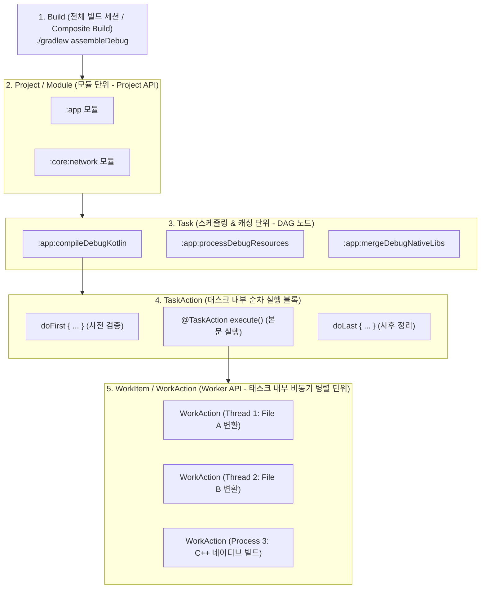
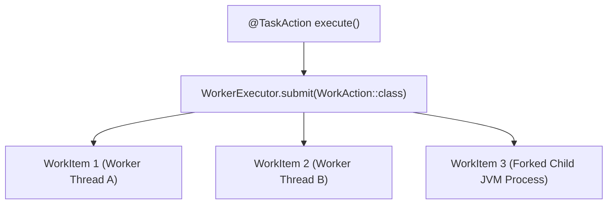

## Gradle Task 모델 및 작업 단위 계층 구조 (Task & Work Units)

### 개요

Gradle 빌드 시스템을 정확히 이해하기 위해서는 **Gradle 이 작업을 어떤 계층 구조(Hierarchy of Work Units)로 쪼개어 관리하고 실행하는지**를 파악해야 한다.

Gradle 의 작업 단위는 **"Build(빌드) ➔ Project(모듈) ➔ Task(태스크) ➔ TaskAction(액션) ➔ WorkItem(워커)"** 의 5 단계 계층으로 구성된다. 이 중 **Task**는 빌드 엔진이 [DAG(유향 비순환 그래프)](../../../../../../computer-science/directed-acyclic-graph.md) 상에서 의존성을 분석하고, 병렬로 스케줄링하며, 증분 빌드(`UP-TO-DATE`) 및 빌드 캐시(`FROM-CACHE`)를 판별하는 **최소 독립 스케줄링 및 캐싱 단위**이다.



---

### 1. Gradle 5 단계 작업 계층 모델 (Hierarchy of Work Units)

| 계층 | 작업 단위 | 담당 인터페이스 / API | 주요 역할 및 기술적 의미 |
|---|---|---|---|
| **Level 1** | **Build (빌드)** | `Gradle`, `Settings` | `./gradlew` 명령 1 회 호출로 시작되는 전체 실행 세션. `includeBuild` 를 통한 복합 빌드(Composite Build)를 포함 |
| **Level 2** | **Project (모듈)** | `Project` | [`settings.gradle.kts`](gradle-settings-dsl.md)에 선언된 개별 서브모듈. 자체 `build.gradle.kts` 와 TaskContainer 소유 |
| **Level 3** | **Task (태스크)** | `Task`, `TaskProvider<T>` | **Gradle DAG 의 노드(Node)**. 캐싱(`FROM-CACHE`), 증분 판별(`UP-TO-DATE`), 선후행 스케줄링의 기본 단위 |
| **Level 4** | **TaskAction (액션)** | `@TaskAction`, `Action<T>` | 단일 Task 내부에서 순차(Sequential) 실행되는 메서드/람다 (`doFirst`, `@TaskAction`, `doLast`) |
| **Level 5** | **WorkItem (워커)** | `WorkerExecutor`, `WorkAction<T>` | 단일 Task 내부의 수십 개 파일 가공 작업을 멀티스레드/독립 프로세스로 쪼개어 처리하는 **최소 병렬 단위** |

---

### 2. Task 등록 및 지연 생성 메커니즘 (`tasks.register`)

과거 Gradle 의 `tasks.create` 방식은 빌드 구성 단계에서 모든 태스크 인스턴스를 무조건 메모리에 생성하여 멀티 모듈 프로젝트의 초기 기동 속도를 크게 떨어뜨렸다. 현대 Gradle 은 **지연 생성(Lazy Configuration)**을 표준으로 사용한다.

| 비교 항목 | `tasks.register("myTask")` (표준 권장) | `tasks.create("myTask")` (지양) |
|---|---|---|
| **생성 시점** | **지연 생성 (Lazy)** — 실제 실행 대상일 때 인스턴스화 | **즉시 생성 (Eager)** — Configuration 단계에서 무조건 인스턴스화 |
| **반환 타입** | `TaskProvider<T>` (지연 핸들러) | `Task` (실제 인스턴스) |
| **빌드 성능** | 수천 개의 태스크가 있어도 요청된 것만 구성하므로 매우 빠름 | 요청하지 않은 태스크까지 메모리에 올려 구성 오버헤드 유발 |

```kotlin
// Lazy Task Registration 예시
val generateVersionInfo = tasks.register<GenerateVersionInfoTask>("generateVersionInfo") {
    // 💡 이 람다는 ./gradlew generateVersionInfo 또는 의존 태스크가 실행될 때만 호출된다.
    versionName.set("1.0.0")
    outputFile.set(layout.buildDirectory.file("generated/version.txt"))
}
```

---

### 3. Property & Provider API (지연 값 바인딩)

Gradle 의 `Property<T>`와 `Provider<T>` 는 태스크 간의 입출력 데이터를 결합할 때, **실제 값이 결정되는 시점(Execution Phase)까지 평가를 지연(Lazy Evaluation)**시키는 함수형 컨테이너이다.

- **`Property<T>`**: 읽기/쓰기가 가능한 컨테이너 (`set()`, `convention()`).
- **`Provider<T>`**: 읽기 전용 지연 값 공급자 (`get()`, `map()`, `flatMap()`).
- **태스크 간 자동 암시적 의존성 수립 (Implicit Dependency)**:
  - Task B 의 `@InputFile`에 Task A 의 `TaskProvider<T>.flatMap { it.outputFile }`을 대입하면, Gradle 은 명시적인 `dependsOn("taskA")` 선언 없이도 **자동으로 Task A ➔ Task B 의 DAG 의존관계를 수립**한다.

```kotlin
// Task A의 출력을 Task B의 입력으로 암시적 바인딩
val taskA = tasks.register<GenerateDocTask>("taskA") {
    outputDoc.set(layout.buildDirectory.file("docs/api.json"))
}

val taskB = tasks.register<ProcessDocTask>("taskB") {
    // 💡 Task A에 대한 DAG 의존성이 자동으로 수립됨
    inputDoc.set(taskA.flatMap { it.outputDoc })
}
```

---

### 4. 입력/출력 상태 모델과 증분 빌드 어노테이션

Gradle 은 Task 클래스의 프로퍼티에 선언된 어노테이션을 기반으로 빌드 캐시 키를 계산하고 증분 실행(`UP-TO-DATE`) 여부를 판별한다.

```kotlin
import org.gradle.api.DefaultTask
import org.gradle.api.file.RegularFileProperty
import org.gradle.api.provider.Property
import org.gradle.api.tasks.*
import org.gradle.work.Incremental
import org.gradle.work.InputChanges

@CacheableTask
abstract class TransformDataTask : DefaultTask() {

    @get:Input
    abstract val enableCompression: Property<Boolean>

    @get:Incremental
    @get:PathSensitive(PathSensitivity.RELATIVE)
    @get:InputFile
    abstract val sourceFile: RegularFileProperty

    @get:OutputFile
    abstract val targetFile: RegularFileProperty

    @TaskAction
    fun execute(inputChanges: InputChanges) {
        if (inputChanges.isIncremental) {
            println("증분 변경 파일만 처리: ${inputChanges.getFileChanges(sourceFile)}")
        } else {
            println("전체 재처리 수행 (Full Build)")
        }
        // 변환 로직
    }
}
```

- **`@CacheableTask`**: 원격/로컬 빌드 캐시 대상 태스크로 지정.
- **`@PathSensitive`**: 절대 경로가 아닌 상대 경로/파일명만 해시에 반영하여 다른 머신이나 디렉터리에서도 캐시 히트를 보장.
- **`InputChanges`**: 전체 파일을 다시 처리하지 않고 이전 빌드 대비 추가/수정/삭제된 파일 델타만 전달받아 초고속 증분 연산 수행.

---

### 5. Worker API 기반 태스크 내부 병렬 및 프로세스 격리 실행

무거운 작업(컴파일러 호출, 리소스 압축, C++ 네이티브 빌드 등)을 태스크 메인 스레드에서 순차 실행하지 않고, `WorkerExecutor` 를 통해 비동기/병렬 워커로 분할 실행한다.



#### Worker API 3 가지 격리 모드

1. **`noIsolation()`**: 현재 Gradle 데몬 JVM 스레드 풀에서 경량 비동기 병렬 실행.
2. **`classLoaderIsolation()`**: 별도의 격리된 `ClassLoader` 인스턴스를 생성하여 라이브러리 JAR 충돌(`Jar Hell`)을 차단하며 실행.
3. **`processIsolation()`**: 별도의 독립 자식 JVM 프로세스를 포크하여 대용량 힙 메모리 할당 및 네이티브 컴파일러 도구를 격리 실행.

---

### 상위 및 연관 문서

- [유향 비순환 그래프 (DAG)](../../../../../../computer-science/directed-acyclic-graph.md)
- [Gradle 코어 엔진 및 아키텍처](gradle-core.md)
- [Gradle Settings DSL 및 API (settings.gradle.kts)](gradle-settings-dsl.md)
- [Gradle Project DSL 및 빌드 스크립트 API (build.gradle.kts)](gradle-project-dsl.md)
- [Gradle 실행 생명주기](gradle-lifecycle.md)
- [Gradle 캐싱 및 빌드 최적화](gradle-caching-and-optimization.md)
