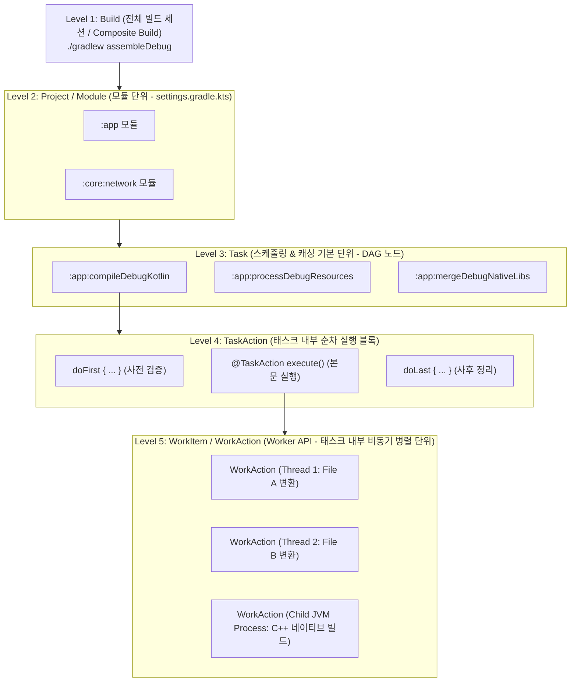

## Gradle 작업 단위 계층 구조 (Hierarchy of Work Units)

### 개요

Gradle 은 빌드 프로세스를 단일 수준에서 통째로 실행하지 않고, **"Build ➔ Project ➔ Task ➔ TaskAction ➔ WorkItem"** 이라는 **5 단계의 엄격한 작업 단위 계층 구조**로 분할하여 관리한다.

개발자가 흔히 접하는 **Task**는 전체 빌드 시스템에서 **중간 계층의 스케줄링 및 캐싱 단위**일 뿐이며, Task 위에는 전체 빌드 세션과 모듈 컨테이너가 존재하고, Task 아래에는 순차 실행 액션과 비동기 병렬 워커가 존재한다.

---

### 1. 5 단계 작업 단위별 기술적 실체와 역할

| 계층          | 작업 단위 (Unit)        | 위임/담당 API                                                                                   | 주요 역할 및 기술적 의미                                                                                                                                         |
| ----------- | ------------------- | ------------------------------------------------------------------------------------------- | ------------------------------------------------------------------------------------------------------------------------------------------------------ |
| **Level 1** | **Build (빌드)**      | `org.gradle.api.invocation.Gradle`  [`settings.gradle.kts`](gradle-settings-dsl.md) | `./gradlew` 명령 1 회 호출로 시작되는 전체 실행 세션. `includeBuild("build-logic")` 로 묶인 여러 독립 빌드들을 포함하는 **복합 빌드(Composite Build)** 전체를 포괄                             |
| **Level 2** | **Project (모듈)**    | `org.gradle.api.Project`  [`build.gradle.kts`](gradle-project-dsl.md)               | `settings.gradle.kts`에 선언된 개별 모듈(`:app`, `:core:model`). 자체적인 `build.gradle.kts`, `PluginManager`, `DependencyHandler`, `TaskContainer` 를 소유하는 구성 컨테이너 |
| **Level 3** | **Task (태스크)**      | `org.gradle.api.Task`  `TaskProvider<T>`                                            | **Gradle DAG 의 노드(Node)**.  빌드 엔진이 선후행 의존관계를 분석하고, 독립 분기를 병렬 디스패치하며, **증분 실행(`UP-TO-DATE`) 및 빌드 캐시(`FROM-CACHE`)를 판별하는 최소 독립 단위**                  |
| **Level 4** | **TaskAction (액션)** | `@TaskAction`, `Action<T>`                                                                  | 단일 Task 내부에서 **순차(Sequential) 실행**되는 메서드/람다 블록 (`doFirst`, `@TaskAction`, `doLast`)                                                                    |
| **Level 5** | **WorkItem (워커)**   | `org.gradle.workers.WorkerExecutor`  `WorkAction<T>`                                | 단일 Task 내부에서 수십~수백 개의 파일 컴파일/변환 작업을 **멀티스레드 또는 포크된 자식 프로세스에서 비동기 병렬 처리**하기 위한 **최소 병렬 분할 단위**                                                          |

---

### 2. Task 상위 단위: Build 와 Project

1. **Build 단위 (`Gradle` / `Settings`)**:
   - 사용자가 터미널에서 `./gradlew assembleRelease` 를 입력하는 순간 생성되는 최상위 빌드 컨텍스트이다.
   - 단일 루트 프로젝트뿐만 아니라, `includeBuild("build-logic")` 나 외부 라이브러리 소스를 연결한 **Included Build**들까지 포함하여 전체 빌드 생명주기를 총괄한다.
2. **Project / Module 단위 (`Project`)**:
   - `settings.gradle.kts`에서 `include(":app", ":core:network")` 로 선언된 각각의 독립 모듈이다.
   - 각 프로젝트는 독립된 `build.gradle.kts` 를 가지며, 플러그인을 적용하고 의존성을 주입받아 자신만의 태스크 컨테이너(`tasks`)를 구성한다.

---

### 3. Task 하위 단위: TaskAction 과 WorkItem

1. **TaskAction 단위 (`@TaskAction`)**:
   - 하나의 Task 가 실행될 때 호출되는 순차적 작업 단계이다.
   - Gradle 은 Task 에 등록된 `doFirst { … }` ➔ `@TaskAction` 메서드 ➔ `doLast { … }` 순서로 액션을 하나씩 차례대로 실행한다.
2. **WorkItem 단위 (`Worker API`)**:
   - 태스크 하나 안에서 수많은 독립 파일(예: 100 개의 Java/Kotlin 소스 파일, 수십 개의 이미지 리소스)을 변환해야 할 때, 이를 싱글 스레드로 처리하면 병목이 발생한다.
   - Gradle 의 `WorkerExecutor` 는 단일 태스크 내부의 작업을 여러 개의 **WorkItem**으로 쪼개어 스레드 풀 또는 별도 격리 프로세스에 비동기 병렬로 디스패치한다.

---

### 상위 및 연관 문서

- [Gradle 코어 엔진 및 아키텍처](gradle-core.md)
- [Gradle 실행 생명주기](gradle-lifecycle.md)
- [Gradle Task 모델 및 Provider API](gradle-task-api.md)
- [Gradle Settings DSL 및 API](gradle-settings-dsl.md)
- [Gradle Project DSL 및 빌드 스크립트 API](gradle-project-dsl.md)
- [Gradle 캐싱 및 빌드 최적화](gradle-caching-and-optimization.md)
