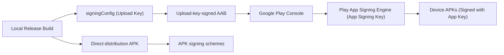

## Signing config는 로컬 서명과 Play 배포 정체성을 연결한다

상위 문서: [Gradle 빌드 계약](gradle-build.md)

### 개념 및 필요성 (What & Why)
Android OS가 설치·업데이트하는 단위는 서명된 APK다. AAB는 기기에 설치되는 파일이 아니라 앱 스토어가 기기별 APK를 생성하기 위한 게시 아티팩트다.
`signingConfigs` DSL 블록은 빌드 시 사용할 키스토어와 자격증명을 변형에 연결한다. APK에는 APK Signature Scheme이 적용되고, Google Play에 올리는 AAB는 업로드 키로 서명된다.
**Play App Signing**을 사용하면 Google Play는 업로드 인증서로 개발자의 업로드를 확인하고, 별도로 보호하는 앱 서명 키(App Signing Key)로 사용자의 기기에 전달할 APK를 서명한다. AAB를 `apksigner`로 서명하거나 AAB 자체가 기기에 설치된다고 설명하면 안 된다.

### 내부 메커니즘 (Internal Mechanism)
1. **Keystore Credentials Injection**: 보안 강화를 위해 `storeFile`, `storePassword`, `keyAlias`, `keyPassword` 값은 절대 코드에 하드코딩하지 않고 환경변수(`System.getenv()`) 또는 비밀 정보 파일(`local.properties`)에서 주입한다.
2. **산출물별 서명**: APK는 v1/v2/v3/v4 등 지원되는 APK Signature Scheme으로 서명하며 `apksigner verify`로 검사할 수 있다. AAB는 업로드 키로 서명하지만 APK Signature Scheme 대상은 아니다. Play는 AAB에서 생성한 delivery APK를 앱 서명 키로 서명한다.
3. **Debug vs Release Keystore**: Debug 빌드는 AGP가 기본 생성하는 `~/.android/debug.keystore`를 자동 사용하는 반면, Release 빌드는 반드시 엄격하게 관리되는 릴리스 키스토어와 결합되어야 한다.



### 코드 예시 (build.gradle.kts)
```kotlin
// app/build.gradle.kts
android {
    signingConfigs {
        create("release") {
            storeFile = file(System.getenv("KEYSTORE_PATH") ?: "release.keystore")
            storePassword = System.getenv("KEYSTORE_PASSWORD") ?: ""
            keyAlias = System.getenv("KEY_ALIAS") ?: ""
            keyPassword = System.getenv("KEY_PASSWORD") ?: ""
            enableV2Signing = true
            enableV3Signing = true
        }
    }

    buildTypes {
        getByName("release") {
            signingConfig = signingConfigs.getByName("release")
        }
    }
}
```

### 관측 가능 증거 (Observable Evidence)
적용된 서명 설정 및 키 SHA-256 핑거프린트를 Gradle 태스크로 관측할 수 있다:
```bash
./gradlew app:signingReport
```

관련 노트: [Play app signing은 업로드 키와 앱 서명 키를 분리한다](../../../distribution/release-distribution/play-app-signing-separates-upload-key-and-app-signing-key.md), [Gradle 빌드 계약](gradle-build.md)

공식 문서: [Sign your app](https://developer.android.com/studio/publish/app-signing), [apksigner](https://developer.android.com/tools/apksigner)

검증일: 2026-08-06. 설치 가능한 APK의 서명과 AAB 업로드 서명, Play가 생성한 APK의 앱 서명 흐름을 분리했다.
