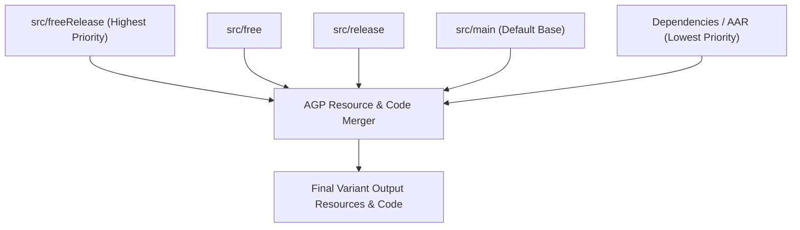

## Source set 우선순위는 variant 별 코드와 리소스 충돌을 결정한다

상위 문서: [Gradle 빌드 시스템](gradle-build.md)

### 개념 및 필요성 (What & Why)
**SourceSet(소스 세트)** 은 특정한 빌드 변형(Build Variant)이나 환경을 위해 결합되는 소스 코드, 리소스, 매니페스트 파일의 디렉터리 모음이다 (예: `src/main`, `src/debug`, `src/free`, `src/freeRelease`).
다양한 빌드 변형을 동시에 지원할 때 동일한 리소스 이름(예: `strings.xml` 내의 `app_name`)이나 코드가 여러 소스 세트에 중복 존재할 수 있다.
AGP는 명확하게 정의된 **SourceSet 우선순위 계층구조(Priority Cascade)** 를 따라 리소스를 덮어쓰고(Override) 병합함으로써 소스 충돌을 해결한다.

### 내부 메커니즘 (Internal Mechanism)
1. **우선순위 계층구조 (Cascade Rule)**:
   $$\text{Variant} (\text{freeRelease}) > \text{Flavor} (\text{free}) > \text{BuildType} (\text{release}) > \text{Main} (\text{main}) > \text{Dependencies (AAR)}$$
2. **리소스(Resource) 병합 규칙**: 높은 우선순위 소스 세트의 XML 리소스나 이미지 아셋이 낮은 우선순위의 리소스를 완전 대체(Override)한다.
3. **소스 코드(Java/Kotlin) 중복 금지 규칙**: 리소스와 달리 동일한 완전 수식 클래스명(Fully Qualified Class Name)을 갖는 `.kt` / `.java` 파일이 `main`과 `flavor`/`buildType` 소스 세트에 동시에 존재하면 **Duplicate Class 컴파일 에러**가 발생한다. 변형별 코드는 `main`에서 제거하고 해당 변형 소스 세트들에만 각각 배치해야 한다.



### 코드 예시 (Directory Hierarchy & build.gradle.kts)
```
// 소스 세트 디렉터리 구조 예시
app/src/
├── main/res/values/strings.xml       // app_name = "My App"
├── free/res/values/strings.xml       // app_name = "My App Free" (Overriding main)
└── paid/res/values/strings.xml       // app_name = "My App Paid" (Overriding main)
```

```kotlin
// app/build.gradle.kts (Custom SourceSet 경로 매핑 예시)
android {
    sourceSets {
        getByName("main") {
            java.srcDirs("src/main/kotlin")
            res.srcDirs("src/main/res-core", "src/main/res-ui")
        }
    }
}
```

### 관측 가능 증거 (Observable Evidence)
특정 빌드 변형에 최종 반영된 병합 리소스 결과를 AAPT2 태스크 출력 또는 APK 수색으로 관측할 수 있다:
```bash
./gradlew app:processFreeReleaseResources
```

관련 노트: [Build type, product flavor, build variant는 서로 다른 축이다](build-type-product-flavor-and-build-variant-are-different-axes.md), [Gradle 빌드 시스템](gradle-build.md)
