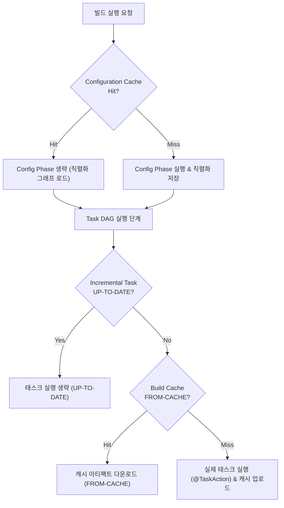

## Gradle 캐싱 및 빌드 최적화 (Caching & Optimization)

### 개요

대규모 프로젝트에서 빌드 속도는 개발자의 피드백 루프와 CI 파이프라인 처리량을 결정하는 핵심 척도이다. Gradle 은 최소한의 연산만 수행하는 **증분 빌드(Incremental Build)**, 태스크 결과를 저장하고 재사용하는 **빌드 캐시(Build Cache)**, 그래프 구축 과정을 생략하는 **구성 캐시(Configuration Cache)** 를 결합하여 다계층 빌드 최적화를 실현한다.



---

### 1. 3 계층 캐시 비교 및 동작 원리

| 캐시 계층 | 대상 단계 | 캐시 히트 조건 | 상태 표시 | 저장소 위치 |
|---|---|---|---|---|
| **증분 빌드 (Incremental)** | Execution Phase | 로컬 머신에서 이전 빌드와 `@Input`/`@Output` 해시가 완전히 동일함 | `UP-TO-DATE` | 로컬 `.gradle/` 디스크 스냅샷 |
| **빌드 캐시 (Build Cache)** | Execution Phase | 로컬/원격(CI, 타 개발자)에 동일한 태스크 입력 해시가 존재함 | `FROM-CACHE` | 로컬 디렉토리 또는 원격 HTTP/S3 노드 |
| **구성 캐시 (Configuration)** | Configuration Phase | 빌드 스크립트, 환경변수, 시스템 프로퍼티 등 빌드 입력이 불변함 | `Reusing configuration cache` | 디스크 `.gradle/configuration-cache/` |

---

### 2. 빌드 캐시 (Build Cache: Local vs Remote)

빌드 캐시는 태스크의 입력 해시값(Cache Key)을 계산하여, 이미 다른 브랜치나 CI 러너에서 빌드된 적이 있는 산출물(JAR, 클래스 파일, 변환 리소스 등)을 즉시 다운로드하여 재사용한다.

#### `settings.gradle.kts` 빌드 캐시 설정 예시

```kotlin
// settings.gradle.kts
buildCache {
    local {
        isEnabled = true
        directory = File(rootDir, ".build-cache")
        removeUnusedEntriesAfterDays = 7
    }
    remote<HttpBuildCache> {
        url = uri("https://gradle-cache.internal.company.com/cache/")
        isPush = System.getenv("CI") != null // CI 러너에서만 캐시 푸시 허용
        credentials {
            username = System.getenv("GRADLE_CACHE_USER")
            password = System.getenv("GRADLE_CACHE_PASSWORD")
        }
    }
}
```

#### 캐시 키 계산 및 Relocatability (재배치 가능성)

- **`@PathSensitive` 의 중요성**:
  - 파일의 절대 경로(`/Users/alice/repo/src/File.kt` vs `/ci/runner/repo/src/File.kt`)를 해시에 포함하면 로컬과 CI 간 캐시가 공유되지 않는다.
  - `@PathSensitive(PathSensitivity.RELATIVE)` 또는 `NAME_ONLY` 를 사용하여 **작업 경로와 무관하게 동일한 캐시 키가 생성(Relocatable)** 되도록 보장해야 한다.

---

### 3. 데몬 및 병렬 실행 최적화

Gradle 은 프로세스 기동 오버헤드를 없애고 멀티코어 하드웨어를 최대로 활용하기 위한 런타임 최적화를 제공한다.

```properties
# gradle.properties
# 1. Gradle 데몬 프로세스 상주 (JVM 웜업 및 JIT 컴파일러 최적화 유지)
org.gradle.daemon=true

# 2. 멀티프로젝트 병렬 빌드 활성화
org.gradle.parallel=true

# 3. 파일 시스템 워처 활성화 (디스크 I/O 대신 OS 이벤트로 변경 감지)
org.gradle.vfs.watch=true

# 4. JVM 힙 메모리 및 가비지 컬렉션 최적화
org.gradle.jvmargs=-Xmx4g -XX:+UseParallelGC
```

---

### 4. 테스트 최적화 및 회피 (Test Avoidance)

Gradle 은 소스 코드가 변경되지 않은 테스트 태스크를 실행하지 않으며, 실패한 테스트만 선별 재실행하는 최적화를 지원한다.

```kotlin
// build.gradle.kts
tasks.named<Test>("test") {
    // 1. 테스트 병렬 실행 (코어 수에 맞춰 포크 프로세스 분할)
    maxParallelForks = (Runtime.getRuntime().availableProcessors() / 2).coerceAtLeast(1)
    
    // 2. 변경된 클래스만 테스트 (지연 평가)
    useJUnitPlatform()
}
```

---

### 5. 관측 및 성능 프로파일링

```bash
# 빌드 캐시 히트 여부 및 태스크 상태 실시간 확인
./gradlew build --build-cache --info | grep -E "FROM-CACHE|UP-TO-DATE"

# Gradle Build Scan 리포트 발행 (성능 병목 구간 정밀 진단)
./gradlew build --scan
```

---

### 상위 및 연관 문서

- [Gradle 코어 엔진 및 아키텍처](gradle-core.md)
- [Gradle 실행 생명주기](gradle-lifecycle.md)
- [Gradle Task 모델 및 Provider API](gradle-task-api.md)
- [Gradle 플러그인 및 모듈화 구조](gradle-plugins.md)
