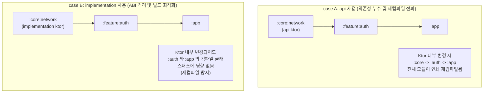

## Gradle 의존성 구성 및 클래스패스 격리 (Dependency Configurations)

### 개요

Gradle 에서 라이브러리나 모듈 의존성을 추가할 때 사용하는 **의존성 구성(Configuration)**은 단순히 파일을 다운로드하는 목록이 아니라, **컴파일 타임 [클래스패스(Classpath)](../../../../../computer-science/jvm-classpath.md), 런타임 클래스패스, 그리고 최종 배포 아티팩트(APK/AAB/JAR) 포함 여부를 결정하는 엄격한 격리 계약(Isolation Contract)**이다.

올바른 의존성 구성을 선택하면 **불필요한 재컴파일 연쇄 방지(Build Speed)**, **[API vs ABI](../../../../../computer-science/api-vs-abi.md) 캡슐화(Encapsulation)**, **릴리스 아티팩트 크기 및 보안 최적화(Binary Hygiene)**를 달성할 수 있다.

---

### 핵심 Dependency Configuration 비교표

| Configuration | Compile Classpath | Runtime Classpath | 소비자 모듈 전파 (Transitive) | 최종 Release APK 포함 | 주요 사용 목적 |
|---|---|---|---|---|---|
| **`implementation`** | O | O | **X (은닉)** | O | 모듈 내부 구현 전용 라이브러리 |
| **`api`** | O | O | **O (공개 노출)** | O | 모듈의 공개 인터페이스 반환/파라미터 타입 |
| **`compileOnly`** | O | X | X | **X (배제)** | 컴파일 시점 어노테이션, 플러그인 빌드 타입 |
| **`runtimeOnly`** | X | O | X | O | 로깅 구현체, 런타임 드라이버 |
| **`testImplementation`** | O (단위테스트) | O (단위테스트) | X | **X (배제)** | 로컬 JVM 단위 테스트 (JUnit, MockK, Coroutines Test) |
| **`androidTestImplementation`** | O (계측테스트) | O (계측테스트) | X | **X (테스트 APK 전용)** | 기기/에뮬레이터 통합 테스트 (Espresso, Compose Test) |
| **`debugImplementation`** | O (Debug 만) | O (Debug 만) | X | **X (Release 배제)** | Compose Preview 툴링, LeakCanary, Test Manifest |
| **`detektPlugins`** | X (정적분석) | X | X | **X (배제)** | Detekt 정적 분석 전용 커스텀 룰셋 플러그인 |

---

### 1. `implementation` vs `api` ([ABI](../../../../../computer-science/api-vs-abi.md) 캡슐화와 빌드 속도)



- **`implementation` (권장)**:
  - 라이브러리를 모듈 내부 구현에서만 소비하고, 이 모듈을 참조하는 상위 모듈에는 해당 타입을 노출하지 않는다.
  - 라이브러리의 구현 세부사항이 변경되어도 상위 모듈들의 컴파일 [클래스패스](../../../../../computer-science/jvm-classpath.md) 해시가 바뀌지 않아 **불필요한 연쇄 재컴파일(Recompilation Cascade)을 원천 차단**한다.
- **`api` (신중히 사용)**:
  - 현재 모듈의 `public` 함수/클래스 시그니처(반환값, 인자, 상속)에 해당 라이브러리의 타입이 직접 노출될 때만 사용한다.
  - 예: `:core:navigation` 모듈이 Navigation 3 의 `NavKey` 타입을 상속받아 외부로 공개하는 경우.

---

### 2. `debugImplementation` (릴리스 바이너리 오염 방지)

Compose 개발 시 사용하는 프리뷰 툴링이나 디버깅 인프라는 **반드시 `debugImplementation` 으로 격리**해야 한다.

```kotlin
dependencies {
    // 릴리스 APK에는 전혀 포함되지 않고, Debug 빌드 및 Android Studio Preview에만 주입됨
    debugImplementation(libs.androidx.compose.ui.tooling)
    debugImplementation(libs.androidx.compose.ui.test.manifest)
}
```

- **보안 및 용량 이점**:
  - 프로덕션 릴리스 APK/AAB 에 불필요한 테스트 Manifest 액티비티나 디버그 툴링 바이트코드가 포함되는 것을 방지하여 앱 다운로드 크기를 줄이고 공격 표면(Attack Surface)을 제거한다.

---

### 3. `detektPlugins` 및 정적 분석 클래스패스 격리

코드 품질 검사 도구의 룰셋은 앱 런타임 라이브러리가 아니므로, Gradle 의 전용 플러그인 구성(Configuration)을 통해 격리 주입한다.

```kotlin
dependencies {
    // 앱 클래스패스와 완전 분리되어 Detekt 검사 태스크 실행 시에만 로드됨
    detektPlugins(libs.detekt.compose.rules)
}
```

---

### 상위 및 연관 문서

- [JVM 클래스패스와 클래스 로딩 메커니즘](../../../../../computer-science/jvm-classpath.md)
- [API vs ABI](../../../../../computer-science/api-vs-abi.md)
- [Android 빌드 파이프라인과 핵심 빌드 용어 해설](android-build-pipeline.md)
- [Gradle 코어 엔진 및 아키텍처](gradle-core.md)
- [Gradle Project DSL 및 빌드 스크립트 API](gradle-project-dsl.md)
- [Gradle 플러그인 및 모듈화 아키텍처](gradle-plugins.md)
- [Gradle 플러그인(Plugin)과 의존성(Dependency)의 차이](gradle-plugins-vs-dependencies.md)
