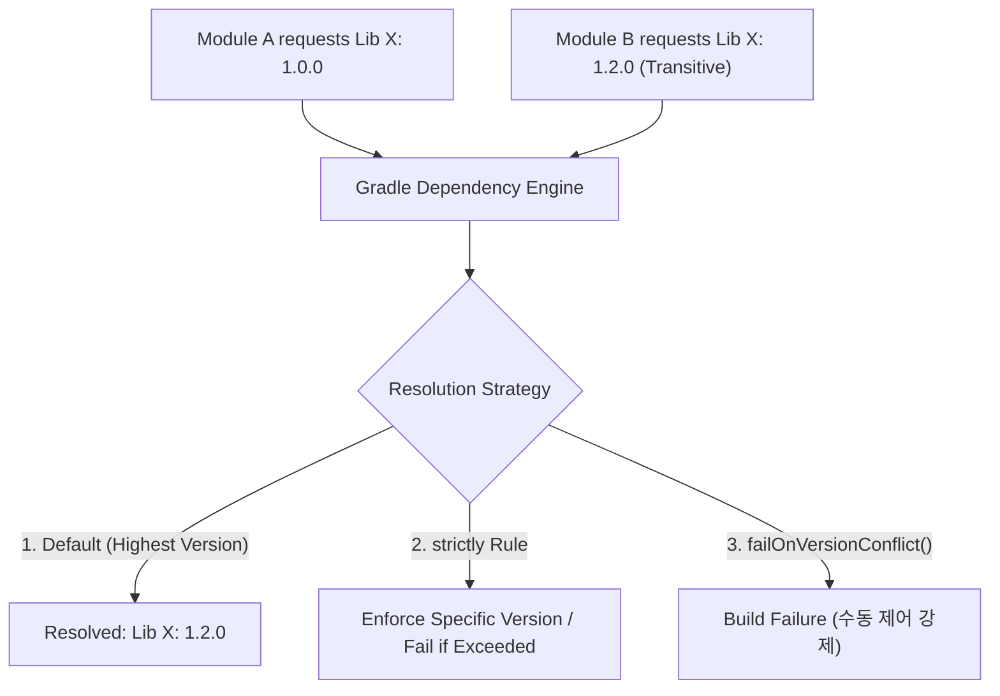

## Gradle 의존성 해소 그래프 및 버전 충돌 해결 전략 (Dependency Resolution & Conflict Strategy)

### 개요

Gradle 의존성 관리의 본질은 개발자가 스크립트에 작성한 **요청 버전(Requested Version)** 을 단순 다운로드하는 데 있지 않고, 수많은 서드파티 라이브러리들의 전이적 의존성(Transitive Dependencies)을 조율하여 모순 없는 단일한 **해소 그래프(Resolution Graph)** 를 결정하는 데 있다.

여러 라이브러리가 동일한 서드파티 모듈의 각기 다른 버전을 전이적으로 요구할 때, 적절한 충돌 해결 전략이 없으면 런타임에 `NoSuchMethodError` 나 `ClassNotFoundException` 같은 바이너리 비호환성 크래시가 유발된다.



---

### 1. Gradle 충돌 해결 알고리즘 및 제어 규칙

| 제어 방식 | 문법 및 동작 메커니즘 | 사용 시점 및 효과 |
|---|---|---|
| **기본 동작 (Highest Version)** | 버전 충돌 시 가장 높은 버전을 자동으로 승격 선택 (`1.0.0` vs `1.2.0` $\rightarrow$ `1.2.0`) | 일반적인 하위 호환 라이브러리 간 충돌 해결 |
| **`strictly` 규칙** | `version { strictly("1.1.0") }` 로 상한/하한을 고정하여 불일치 시 빌드 실패 유발 | 특정 패치 버전을 강제해야 하는 보안 취약점 격리 |
| **`constraints {}`** | 라이브러리를 직접 의존성에 추가하지 않고, 전이적 유입 시의 버전 조건만 선언 | 다중 모듈에서 서드파티 전이 라이브러리의 버전 통제 |
| **`failOnVersionConflict()`** | 자동 버전 승격을 차단하고 충돌 발생 시 즉시 빌드 에러를 발생시킴 | 엄격한 릴리스 환경에서 전이적 버전 오염 원천 차단 |

---

### 2. build.gradle.kts 실전 충돌 제어 코드

```kotlin
// app/build.gradle.kts
dependencies {
    implementation(libs.retrofit)
    
    // 특정 전이적 의존성의 제약 조건 선언 (직접 의존하지 않고 버전만 통제)
    constraints {
        implementation("org.jetbrains.kotlinx:kotlinx-coroutines-core:1.10.1") {
            because("Avoid runtime crash caused by bug in older 1.9.x bytecode")
        }
    }
}

configurations.all {
    resolutionStrategy {
        // 버전 충돌 발생 시 조용히 최상위 버전으로 올리지 않고 빌드를 중단
        failOnVersionConflict()
        
        // 특정 전이적 라이브러리 강제 고정
        force("com.google.guava:guava:33.4.0-android")
    }
}
```

---

### 3. 관측 가능 증거 (Observable Evidence)

프로젝트에서 실제로 해소된 전체 런타임 의존성 트리와 충돌 승격 내역은 다음 명령어로 관측할 수 있다:

```bash
# 1. 런타임 클래스패스의 전체 의존성 해소 트리 확인
./gradlew app:dependencies --configuration runtimeClasspath

# 2. 특정 라이브러리가 왜 그 버전으로 해소되었는지 추적 (Dependency Insight)
./gradlew app:dependencyInsight --dependency kotlinx-coroutines-core --configuration runtimeClasspath
```

---

### 상위 및 연관 문서

- [Gradle 빌드 시스템 및 의존성·플러그인 아키텍처](gradle-build.md)
- [Gradle Version Catalog (libs.versions.toml) 및 중앙 의존성 관리](gradle-version-catalog.md)
- [Gradle 의존성 구성 및 클래스패스 격리](gradle-dependency-configurations.md)
- [의존성 변경 및 서드파티 라이브러리 검토 체크리스트](dependency-change-checklist.md)
