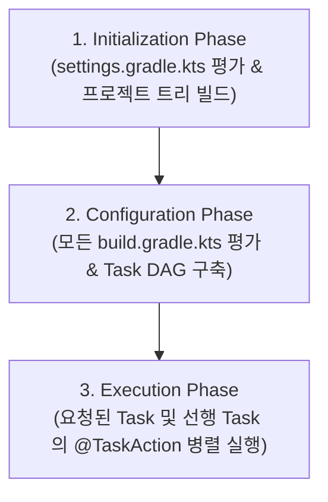
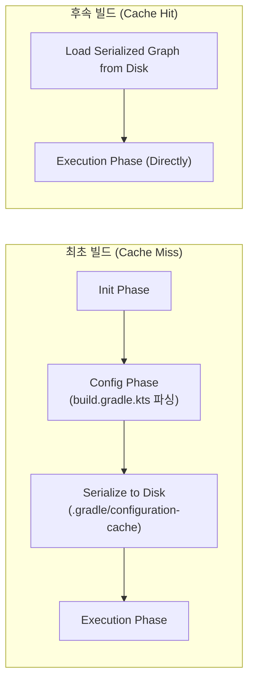

## Gradle 실행 생명주기 (Execution Lifecycle)

### 개요

Gradle 은 단순한 순차적 스크립트 실행기가 아니라, 프로젝트 계층 구조를 파싱하고 [Task](gradle-task-api.md) 간 의존성을 정적 분석하여 그래프를 구축한 후 선별적으로 작업을 디스패치하는 **3 단계(Phase) 생명주기 아키텍처**를 엄격히 준수한다.



---

### 1. 초기화 단계 (Initialization Phase)

초기화 단계의 목표는 **어떤 프로젝트들이 이번 빌드에 참여하는지 결정**하고 `ProjectDescriptor` 트리를 생성하는 것이다.

```kotlin
// settings.gradle.kts
rootProject.name = "my-application"

// 1. 빌드 대상 모듈 명시
include(":app")
include(":core:network")
include(":core:database")
include(":feature:login")

// 2. 중앙집중식 플러그인 및 의존성 저장소 관리
pluginManagement {
    repositories {
        gradlePluginPortal()
        google()
        mavenCentral()
    }
}

dependencyResolutionManagement {
    repositoriesMode.set(RepositoriesMode.FAIL_ON_PROJECT_REPOS)
    repositories {
        google()
        mavenCentral()
    }
}

// 3. Composite Build (독립 빌드 로직 또는 외부 프로젝트 소스 포함)
includeBuild("build-logic")
```

- **동작 원리**:
  - `settings.gradle.kts`를 평가하여 루트 및 서브프로젝트의 `ProjectDescriptor` 트리를 메모리에 구성한다.
  - `includeBuild(…)` 를 통해 독립된 빌드를 복합 빌드로 연결하고, 바이너리 라이브러리 의존성을 프로젝트 소스 레벨 직접 의존성으로 자동 치환한다.

---

### 2. 구성 단계 (Configuration Phase)

구성 단계의 목표는 **빌드에 참여하는 모든 프로젝트의 `build.gradle.kts` 를 평가하여 Task 객체 모델을 구성하고 Task DAG (방향성 비순환 그래프)를 완성**하는 것이다.

```kotlin
// build.gradle.kts
plugins {
    id("java-library")
}

// Configuration Phase 에 실행되는 코드 (전역 설정 & Task 인스턴스화)
println("Configuring project: ${project.name}")

// Task 간 의존성 관계 설정 -> Task DAG 구축
tasks.register("generateDocs") {
    // Configuration Block: Task DAG 생성 시 평가됨
    println("Configuring generateDocs task")
}

tasks.register("packageApp") {
    // Task DAG 상의 선후행 관계 선언
    dependsOn("generateDocs")
    
    doLast {
        // Execution Phase 에만 실행되는 액션
        println("Packaging application artifact")
    }
}
```

#### 주의 및 안티패턴: `afterEvaluate` vs `Provider API`

구성 단계에서 무거운 I/O(외부 네트워크 조회, 파일 읽기, Git 명령)를 실행하면 `./gradlew help`만 쳐도 빌드 전체가 멈추거나 느려진다. 또한 다른 플러그인의 구성을 기다리기 위해 `afterEvaluate` 를 남용하면 실행 순서의 비결정성과 Configuration Cache 위반이 발생한다.

```kotlin
// ❌ 안티패턴: afterEvaluate 남용 및 구성 단계 I/O 실행
project.afterEvaluate {
    val gitHash = "git rev-parse --short HEAD".runCommand() // 구성 단계 블로킹 I/O
    tasks.named<Jar>("jar") {
        archiveVersion.set(gitHash)
    }
}

// ✅ 권장 패턴: Provider API 기반 지연 평가
val gitHashProvider: Provider<String> = providers.exec {
    commandLine("git", "rev-parse", "--short", "HEAD")
}.standardOutput.asText.map { it.trim() }

tasks.named<Jar>("jar") {
    archiveVersion.set(gitHashProvider) // 실행 시점까지 값 평가 지연
}
```

---

### 3. Configuration Cache (구성 캐시) 메커니즘

Gradle 의 혁신적인 성능 최적화 기능인 **Configuration Cache**는 구성 단계의 결과물인 **Task DAG 그래프를 디스크에 직렬화 캡처**한다.



#### Configuration Cache 활성화 및 제약사항

```properties
# gradle.properties
org.gradle.configuration-cache=true
org.gradle.configuration-cache.problems=fail
```

1. **Task 실행 중 `Project` 인스턴스 직접 참조 금지**:
   - Task 내부 `@TaskAction`에서 `project.file(…)`, `project.property(…)`를 직접 조회하면 직렬화가 불가능하여 캐시 에러가 발생한다. 모든 입력/출력은 `@Input`, `@OutputFile` 등의 Property 로 선언해야 한다.
2. **빌드 입력(Build Inputs)의 불변성 추적**:
   - 환경변수(`providers.environmentVariable`), 시스템 프로퍼티, 빌드 스크립트가 변경되지 않으면 Configuration Phase 를 100% 생략하고 즉시 Execution Phase 로 직행한다.

---

### 4. 실행 단계 (Execution Phase)

실행 단계의 목표는 **사용자가 요청한 태스크와 DAG 상의 의존 태스크들만 스케줄링하여 실제 `@TaskAction` 작업을 수행**하는 것이다.

```bash
# 1. 다중 프로젝트 병렬 실행 (독립 모듈 태스크 동시 처리)
./gradlew build --parallel

# 2. 특정 태스크 실패 시에도 독립된 다른 태스크 계속 실행
./gradlew test --continue

# 3. 상세 프로파일 및 빌드 스캔 리포트 생성
./gradlew assemble --scan
```

- **태스크 스케줄링**: DAG 상에서 서로 의존성이 없는 독립 태스크들을 CPU 코어 수에 맞추어 병렬 스레드 풀에서 실행한다.
- **증분 실행 검증 (`UP-TO-DATE`)**: 각 태스크 실행 직전 이전 빌드 스냅샷과 현재 입력/출력 파일 해시를 비교하여 변경이 없으면 태스크 본문을 건너뛴다.

---

### 상위 및 연관 문서

- [유향 비순환 그래프 (DAG)](../../../../../computer-science/directed-acyclic-graph.md)
- [Gradle 코어 엔진 및 아키텍처](gradle-core.md)
- [Gradle Task 모델 및 Provider API](gradle-task-api.md)
- [Gradle 캐싱 및 최적화](gradle-caching-and-optimization.md)
- [Gradle 플러그인 및 모듈화 구조](gradle-plugins.md)
