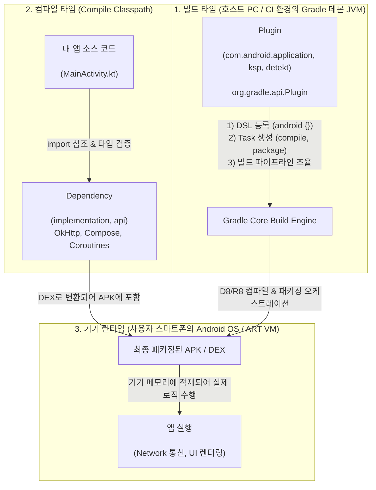
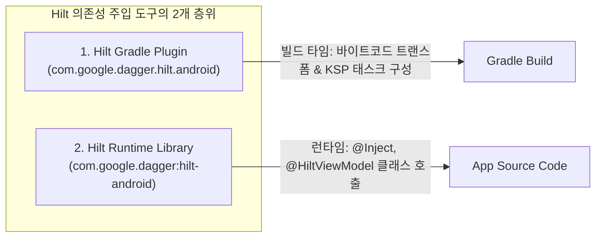

## Gradle 플러그인(Plugin)과 의존성(Dependency)의 본질적 차이

### 개요

Gradle 빌드 스크립트(`build.gradle.kts`)를 작성할 때 개발자가 가장 흔히 혼동하는 두 축이 바로 **`plugins {}`** 와 **`dependencies {}`** 이다.

둘 다 Maven Central 이나 Google 저장소에서 외부 JAR 파일을 다운로드받는다는 공통점이 있지만, **그 코드가 '누구에 의해', '언제', '어떤 [classpath](../../../../../computer-science/jvm-classpath.md) 상에서' 실행되는지**가 완전히 다른 별개의 층위이다.

- **Plugin (`plugins {}`)**: **"빌드 시스템(Gradle) 자체의 기능을 확장하고 빌드 규칙을 제어하는 프로그램"** (실행 주체: Gradle JVM).
- **Dependency (`dependencies {}`)**: **"내 애플리케이션 소스 코드가 컴파일되거나 런타임에 실행되기 위해 필요한 라이브러리 바이너리"** (실행 주체: Android OS / 기기 ART 런타임).

---

### 1. Plugin vs Dependency 핵심 5 대 비교표

| 비교 기준 | Gradle 플러그인 (Plugin) | 애플리케이션 의존성 (Dependency) |
|---|---|---|
| **선언 블록** | `plugins { id(…) }` 또는 `alias(libs.plugins….)` | `dependencies { implementation(…) }` |
| **실행 주체** | **Gradle 빌드 엔진** (개발자 PC / CI 서버의 JVM) | **사용자 기기** (Android ART 런타임 또는 테스트 JVM) |
| **동작 시점** | **빌드 타임** (Configuration 및 Execution 단계) | **앱 런타임** 또는 **소스 컴파일 타임** |
| **기술적 실체** | `org.gradle.api.Plugin<Project>` 구현체 | `.jar` 또는 `.aar` 라이브러리 바이너리 |
| **수행하는 일** | Task 등록, DSL 확장(`android {}`), 컴파일러 호출, 린트 분석, 바이트코드 변환 조율 | 앱 소스 코드에서 `import` 하여 호출하는 클래스, 함수, 리소스 제공 |
| **적재 클래스패스** | **[Buildscript Classpath](../../../../../computer-science/jvm-classpath.md)** | **[Compile / Runtime Classpath](../../../../../computer-science/jvm-classpath.md)** |
| **최종 APK 포함 여부** | ❌ **포함되지 않음** (빌드가 끝나면 버려짐) | ⭕ **DEX 로 변환되어 APK 에 번들링됨** (`compileOnly` 제외) |

---

### 2. 왜 개발자들에게 혼란을 주는가? (동일 도구의 플러그인/라이브러리 쌍)

많은 모던 안드로이드 라이브러리들이 **빌드 타임을 담당하는 '플러그인'** 과 **런타임을 담당하는 '의존성 라이브러리'** 를 한 쌍(Pair)으로 함께 제공하기 때문에 혼란이 발생한다.

#### 대표적인 플러그인 vs 라이브러리 쌍(Pair) 예시

1. **Hilt (Dependency Injection)**:
   - **Plugin (`com.google.dagger.hilt.android`)**: 빌드 타임에 바이트코드를 조작(Bytecode Weaving)하여 `@AndroidEntryPoint` 가 붙은 액티비티의 상속 구조를 바꾸고 코드 생성기를 조율한다.
   - **Dependency (`com.google.dagger:hilt-android`)**: 앱 소스 코드에서 `@Inject`, `@HiltViewModel`, `EntryPointAccessors`를 `import` 하여 사용하기 위한 런타임 클래스 라이브러리이다.
2. **Kotlinx Serialization**:
   - **Plugin (`org.jetbrains.kotlin.plugin.serialization`)**: Kotlin 컴파일러가 `@Serializable` 어노테이션을 보고 컴파일 시점에 직렬화/역직렬화 바이트코드를 자동 생성하도록 만드는 **컴파일러 플러그인**이다.
   - **Dependency (`org.jetbrains.kotlinx:kotlinx-serialization-json`)**: 앱 코드에서 `Json.decodeFromString<User>(jsonStr)` 함수를 런타임에 호출하기 위한 JSON 파서 라이브러리이다.
3. **KSP (Kotlin Symbol Processing)**:
   - **Plugin (`com.google.devtools.ksp`)**: 빌드 파이프라인에서 Kotlin 심볼 파싱 태스크를 생성하고 컴파일러와 연결하는 **빌드 플러그인** 이다.
   - **Dependency (`ksp(libs.room.compiler)`)**: Room 라이브러리의 코드 생성기 엔진 바이너리를 KSP 워커에 주입하는 **의존성** 이다.

---

### 3. 클래스패스(Classpath) 격리 관점에서의 차이

Gradle 은 클래스로더 충돌을 방지하기 위해 플러그인과 의존성의 메모리 공간을 철저히 분리한다:

1. **Buildscript Classpath**:
   - Gradle 데몬이 `settings.gradle.kts`(`pluginManagement`) 및 루트 `build.gradle.kts`(`apply false`)를 통해 로딩하는 클래스패스이다.
   - AGP, Kotlin Gradle Plugin, Detekt 등의 바이너리가 여기에 상주하며, 애플리케이션 코드에서는 이 클래스들을 `import` 할 수 없다.
2. **Application Classpath (`compileClasspath` / `runtimeClasspath`)**:
   - 모듈 `build.gradle.kts`의 `dependencies {}` 블록에 선언된 라이브러리들이 적재되는 클래스패스이다.
   - `kotlinc`/`javac`가 앱 소스를 컴파일할 때 참조하며, `R8`/`D8`을 거쳐 최종 APK 의 `classes.dex` 로 패키징된다.

---

### 상위 및 연관 문서

- [Gradle 코어 엔진 및 아키텍처](gradle-core.md)
- [Gradle 플러그인 및 모듈화 아키텍처](gradle-plugins.md)
- [Gradle 의존성 구성 및 클래스패스 격리](gradle-dependency-configurations.md)
- [Gradle Project DSL 및 빌드 스크립트 API](gradle-project-dsl.md)
- [JVM 클래스패스 (Classpath)](../../../../../computer-science/jvm-classpath.md)
- [Android Gradle Plugin (AGP) 아키텍처](android-gradle-plugin.md)
