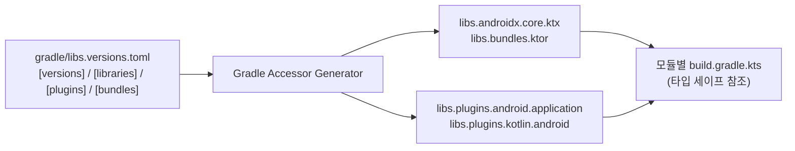

## Gradle Version Catalog (libs.versions.toml) 및 중앙 의존성 관리

### 개요

**Version Catalog(버전 카탈로그 - `gradle/libs.versions.toml`)** 는 Gradle 빌드 시스템에서 의존성과 플러그인의 좌표 및 버전을 단일 위치에서 선언하고 관리하는 Gradle 공식 표준 기능이다.

수많은 서브모듈에 하드코딩되어 파편화되던 의존성 문자열(`"com.squareup.retrofit2:retrofit:2.11.0"`)을 TOML 파일에 집중화함으로써, 프로젝트 전역의 라이브러리 일관성을 유지하고 IDE 자동완성과 타입 세이프(Type-safe) Kotlin DSL 접근자(`libs.retrofit`, `libs.plugins.android.application`)를 제공한다.



---

### 1. TOML 4대 핵심 섹션 구조

Version Catalog 는 4 가지 핵심 블록으로 구성된다:

| 섹션 이름 | 역할 및 문법 규칙 | 생성되는 Kotlin DSL 접근자 예시 |
|---|---|---|
| **`[versions]`** | 라이브러리와 플러그인이 공유할 수 있는 버전 문자열 정의 | `libs.versions.agp.get()` |
| **`[libraries]`** | `group`, `name`, `version.ref` 를 결합한 라이브러리 정의 | `libs.androidx.core.ktx` |
| **`[plugins]`** | Gradle 플러그인의 `id` 와 `version.ref` 선언 | `libs.plugins.android.application` |
| **`[bundles]`** | 연관된 라이브러리들을 묶어 한 줄로 주입하는 그룹 정의 | `libs.bundles.ktor` |

---

### 2. 코드 예시: libs.versions.toml 선언 및 build.gradle.kts 사용

```toml
# gradle/libs.versions.toml
[versions]
agp = "9.3.0"
kotlin = "2.1.0"
coreKtx = "1.15.0"
coroutines = "1.10.1"

[libraries]
androidx-core-ktx = { group = "androidx.core", name = "core-ktx", version.ref = "coreKtx" }
kotlinx-coroutines-core = { group = "org.jetbrains.kotlinx", name = "kotlinx-coroutines-core", version.ref = "coroutines" }
kotlinx-coroutines-android = { group = "org.jetbrains.kotlinx", name = "kotlinx-coroutines-android", version.ref = "coroutines" }

[bundles]
coroutines = ["kotlinx-coroutines-core", "kotlinx-coroutines-android"]

[plugins]
android-application = { id = "com.android.application", version.ref = "agp" }
kotlin-android = { id = "org.jetbrains.kotlin.android", version.ref = "kotlin" }
```

```kotlin
// app/build.gradle.kts
plugins {
    alias(libs.plugins.android.application)
    alias(libs.plugins.kotlin.android)
}

dependencies {
    implementation(libs.androidx.core.ktx)
    implementation(libs.bundles.coroutines) // 번들로 코루틴 한 번에 주입
}
```

---

### 3. Version Catalog 의 경계와 AGP 9.0+ Built-in Kotlin

1. **Version Catalog 는 버전을 명명할 뿐 강제하지 않는다**: Version Catalog 에 특정 버전을 적어도, Gradle 의존성 해소 알고리즘(Resolution Strategy)이나 서브모듈의 충돌 해결 규칙에 의해 실제 선택되는 버전은 상향 승격될 수 있다.
2. **AGP 9.0+ Built-in Kotlin 호환성**: AGP 9+ 환경에서는 Kotlin 지원이 AGP 에 내장되므로 `plugins { alias(libs.plugins.kotlin.android) }` 선언이 불필요하거나 충돌할 수 있다. Kotlin compiler plugin(Serialization, Compose)은 별도로 선언한다.

---

### 4. 관측 가능 증거 (Observable Evidence)

버전 카탈로그가 정상 인식되고 타입 세이프 접근자가 생성되었는지는 Gradle 태스크 실행 및 의존성 트리 덤프로 검증할 수 있다:

```bash
# 1. Version Catalog 파싱 및 Gradle 태스크 정상 구성 확인
./gradlew :app:tasks

# 2. 특정 라이브러리의 최종 해소 버전 확인
./gradlew :app:dependencies --configuration runtimeClasspath | grep androidx.core:core-ktx
```

---

### 상위 및 연관 문서

- [Gradle 빌드 시스템 및 의존성·플러그인 아키텍처](gradle-build.md)
- [Gradle Settings DSL 및 API (settings.gradle.kts)](gradle-settings-dsl.md)
- [Gradle 의존성 구성 및 클래스패스 격리](gradle-dependency-configurations.md)
- [Gradle 의존성 해소 그래프 및 버전 충돌 해결 전략](gradle-dependency-resolution.md)
