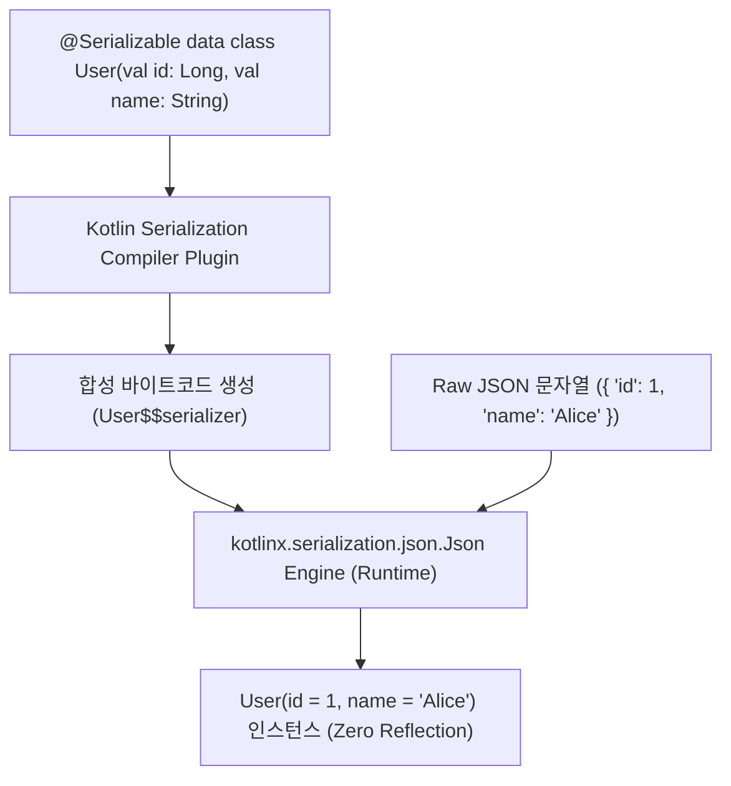

## kotlinx.serialization 컴파일러 플러그인 및 런타임 결합 아키텍처 (Kotlinx Serialization)

### 개요

**`kotlinx.serialization`** 은 Kotlin 객체를 JSON, Protocol Buffers, CBOR 등의 직렬화 포맷으로 변환하는 순수 Kotlin 공식 직렬화 프레임워크이다.

Gson 이나 Jackson 같은 묵직한 Java 리플렉션(Reflection) 기반 라이브러리와 달리, `kotlinx.serialization` 은 **컴파일 타임(Compile-Time) 바이트코드 생성**을 채택한다. 이를 위해 코드를 생성하는 **컴파일러 플러그인(`org.jetbrains.kotlin.plugin.serialization`)** 과 런타임 파싱 엔진을 제공하는 **런타임 라이브러리(`kotlinx-serialization-json`)** 가 반드시 한 쌍으로 결합되어야 한다.



---

### 1. Reflection-free 직렬화의 모바일 최적화 이점

| 비교 항목 | Java Reflection 라이브러리 (Gson) | Kotlin Serialization (`@Serializable`) |
|---|---|---|
| **필드 탐색 시점** | 런타임에 클래스 구조를 리플렉션으로 매번 스캔 | **컴파일 시점에 전용 `KSerializer` 바이트코드가 미리 생성됨** |
| **R8 / ProGuard 난독화** | 필드명이 바뀌면 깨지므로 무거운 `-keep` 룰 필수 | **바이트코드 레벨에서 직렬화되므로 R8 Full Mode 에서도 안전** |
| **성능 및 메모리** | 리플렉션 캐시 오버헤드, 느린 파싱 속도 | **매우 빠름, 메모리 할당 최소화, CPU 캐시 친화적** |
| **Kotlin 언어 지원** | 기본값(Default Arguments), 널 가능성 인식 불가 | **기본값, `null`, sealed class, value class 완벽 지원** |

---

### 2. 코드 예시: build.gradle.kts 및 Kotlin Code

```toml
# gradle/libs.versions.toml
[versions]
kotlin = "2.1.0"
serializationJson = "1.8.0"

[plugins]
kotlin-serialization = { id = "org.jetbrains.kotlin.plugin.serialization", version.ref = "kotlin" }

[libraries]
kotlinx-serialization-json = { group = "org.jetbrains.kotlinx", name = "kotlinx-serialization-json", version.ref = "serializationJson" }
```

```kotlin
// app/build.gradle.kts
plugins {
    alias(libs.plugins.android.application)
    alias(libs.plugins.kotlin.android)
    alias(libs.plugins.kotlin.serialization) // 1. 컴파일러 플러그인 적용
}

dependencies {
    implementation(libs.kotlinx.serialization.json) // 2. 런타임 JSON 엔진 주입
}
```

```kotlin
// User.kt
import kotlinx.serialization.Serializable
import kotlinx.serialization.json.Json

@Serializable
data class User(
    val id: Long,
    val name: String,
    val role: String = "member" // 기본값 완벽 지원
)

fun main() {
    val jsonString = """{"id": 100, "name": "Antigravity"}"""
    val user = Json.decodeFromString<User>(jsonString)
    println(user) // User(id=100, name=Antigravity, role=member)
}
```

---

### 3. 관측 가능 증거 (Observable Evidence)

컴파일러 플러그인이 생성한 `User$$serializer` 클래스의 존재는 `javap` 나 덱스 분석 도구로 관측할 수 있다:

```bash
# 컴파일 산출물 내에 생성된 Serializer 바이트코드 확인
./gradlew app:compileDebugKotlin
javap -c app/build/tmp/kotlin-classes/debug/com/example/User\$\$serializer.class
```

---

### 상위 및 연관 문서

- [Gradle 빌드 시스템 및 의존성·플러그인 아키텍처](gradle-build.md)
- [KSP(Kotlin Symbol Processing) 코드 생성 및 KAPT 대체 아키텍처](ksp-code-generation.md)
- [Jetpack Compose 컴파일러 플러그인 아키텍처](compose-compiler-plugin.md)
