## KSP(Kotlin Symbol Processing) 코드 생성 및 KAPT 대체 아키텍처 (KSP vs KAPT)

### 개요

**KSP(Kotlin Symbol Processing - `com.google.devtools.ksp`)** 는 Kotlin 컴파일러(`kotlinc`)에 직접 내장되어 작동하는 Kotlin 퍼스트(Kotlin-First) 차세대 소스 코드 분석 및 생성 플러그인이다.

과거 Kotlin 프로젝트에서 어노테이션 프로세싱을 위해 사용하던 **KAPT(Annotation Processing for Kotlin)** 는 Java 기반 Annotation Processor(`javac`)를 재활용하기 위해 Kotlin 코드를 더미 Java 코드로 바꾸는 비효율적인 **Java Stub 생성 단계**를 강제하여 빌드 시간을 심각하게 저하시켰다.

KSP 는 Java Stub 단계를 통째로 생략하고 Kotlin AST(Abstract Syntax Tree)를 직접 탐색하여 **빌드 속도를 2~3 배 가속**하며, Kotlin 특유의 Nullability, Sealed class, Value class 메타데이터를 손실 없이 완벽하게 인지한다.

```mermaid
flowchart TD
    subgraph KAPT_Flow ["1. Legacy KAPT (느림 & Stub 오버헤드)"]
        KT1["Kotlin Source (.kt)"] --> StubGen["Java Stub Generator (더미 .java 생성)"]
        StubGen --> JavacAPT["javac Annotation Processor"]
        JavacAPT --> GenJava["Generated Java Files"]
        GenJava --> FinalComp1["Final Kotlinc / Javac Compilation"]
    end

    subgraph KSP_Flow ["2. Modern KSP (2~3배 빠름 & 직접 AST 분석)"]
        KT2["Kotlin Source (.kt)"] --> KSPProc["KSP Processor (Kotlin AST 직접 분석)"]
        KSPProc --> GenKT["Generated Kotlin / Java Files"]
        GenKT --> FinalComp2["Direct Compilation"]
    end
```



---

### 1. KAPT vs KSP 아키텍처 비교

| 비교 항목 | 레거시 KAPT (`kapt`) | 현대 표준 KSP (`ksp`) |
|---|---|---|
| **실행 엔진** | Java `javac` Annotation Processing API 에 의존 | **Kotlin 컴파일러(`kotlinc`) 전용 심볼 프로세서 API** |
| **Java Stub 생성** | ⭕ **필수 (전체 빌드 시간의 30~50% 낭비)** | ❌ **완전 생략 (Stub 없이 AST 직접 분석)** |
| **빌드 속도** | 느림 | **KAPT 대비 최대 2~3 배 빠름 (증분 빌드 최적화)** |
| **Kotlin 메타데이터** | 자바로 변환되면서 Nullability, Value class 정보 손실 | **Kotlin 타입 시스템 및 메타데이터 100% 보존** |
| **유지보수 상태** | ⚠️ 유지보수 모드 (신규 기능 중단) | ⭕ **Google & JetBrains 공식 권장 표준** |

---

### 2. 코드 예시: build.gradle.kts 적용

```toml
# gradle/libs.versions.toml
[versions]
ksp = "2.1.0-1.0.29" # Kotlin 버전과 일치해야 함
room = "2.7.0"
hilt = "2.55"

[plugins]
google-ksp = { id = "com.google.devtools.ksp", version.ref = "ksp" }

[libraries]
androidx-room-runtime = { group = "androidx.room", name = "room-runtime", version.ref = "room" }
androidx-room-compiler = { group = "androidx.room", name = "room-compiler", version.ref = "room" }
hilt-android = { group = "com.google.dagger", name = "hilt-android", version.ref = "hilt" }
hilt-compiler = { group = "com.google.dagger", name = "hilt-compiler", version.ref = "hilt" }
```

```kotlin
// app/build.gradle.kts
plugins {
    alias(libs.plugins.android.application)
    alias(libs.plugins.kotlin.android)
    alias(libs.plugins.google.ksp) // KSP 플러그인 적용
}

dependencies {
    // 1. Room DB (KSP 프로세서 연결)
    implementation(libs.androidx.room.runtime)
    ksp(libs.androidx.room.compiler)

    // 2. Hilt 의존성 주입 (KSP 지원)
    implementation(libs.hilt.android)
    ksp(libs.hilt.compiler)
}
```

---

### 3. 관측 가능 증거 (Observable Evidence)

KSP 태스크가 생성한 소스 파일과 빌드 시간은 다음 명령어로 관측할 수 있다:

```bash
# 1. KSP 코드 생성 전용 태스크 실행
./gradlew app:kspDebugKotlin

# 2. KSP 가 생성한 파일 디렉터리 확인
ls -la app/build/generated/ksp/debug/kotlin/
```

---

### 상위 및 연관 문서

- [Gradle 빌드 시스템 및 의존성·플러그인 아키텍처](gradle-build.md)
- [Gradle 플러그인(Plugin)과 의존성(Dependency)의 본질적 차이](gradle-plugins-vs-dependencies.md)
- [kotlinx.serialization 컴파일러 플러그인 및 런타임 결합 아키텍처](kotlinx-serialization-plugin.md)
