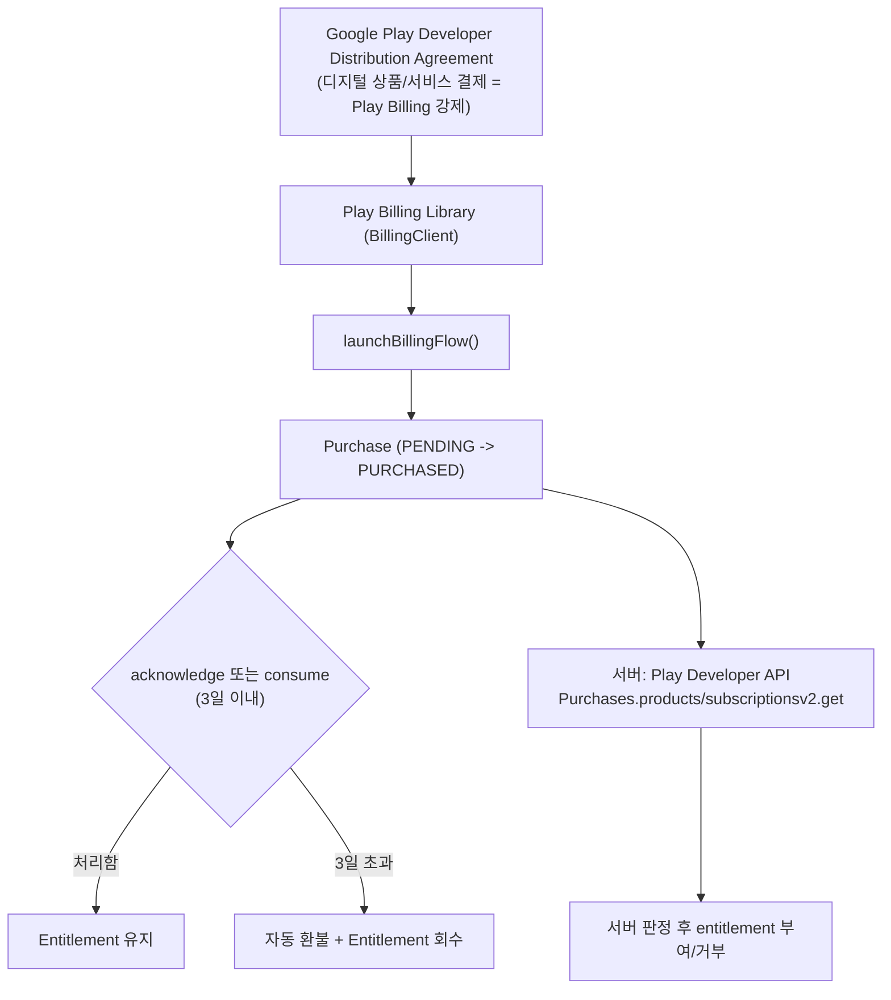

## Google Play Billing 계약

이 지도는 Android 앱이 디지털 상품과 구독을 판매할 때 지나야 하는 Google Play Billing Library 경로를 다룬다. 정책상 결제 채널이 왜 하나로 강제되는지, 상품과 구독의 purchase lifecycle 이 어떻게 다른지, `acknowledge` 를 놓쳤을 때 어떤 사고가 나는지, 그리고 클라이언트 판정을 서버가 왜 다시 확인해야 하는지를 원자 노트로 나눈다.



### 정본 노트

- [Play Billing Library는 Android 인앱 결제의 유일하게 승인된 경로다](play-billing-library-is-the-only-approved-in-app-purchase-path.md)
- [상품과 구독은 서로 다른 purchase lifecycle을 가진다](product-and-subscription-purchases-have-different-lifecycles.md)
- [3일 이내 acknowledge하지 않은 구매는 자동 환불된다](unacknowledged-purchases-are-refunded-within-three-days.md)
- [purchase token은 클라이언트가 아니라 서버에서 검증해야 한다](server-side-purchase-token-verification-is-required-not-client-judgment.md)

관련 지도: [Play 릴리스와 배포 계약](../release-distribution-contracts/release-distribution-contracts.md), [Android 패키징과 배포 지도](../../android-packaging-deployment.md)

### 관측 가능 증거 (Observable Evidence)

```bash
# 구매 상태와 acknowledge 여부를 클라이언트 로그에서 확인
adb logcat -s BillingClient:* | grep -E "PurchaseState|isAcknowledged"

# 서버에서 Play Developer API로 구매 상태 직접 조회 (일회성 상품)
curl -H "Authorization: Bearer $ACCESS_TOKEN" \
  "https://androidpublisher.googleapis.com/androidpublisher/v3/applications/com.example.app/purchases/products/premium_upgrade/tokens/$PURCHASE_TOKEN"
```
