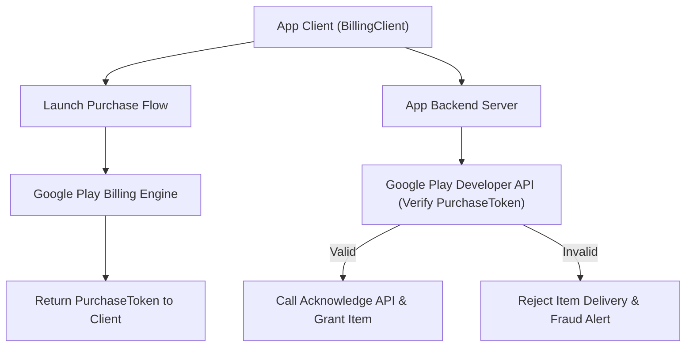

## 인앱 결제 계약

상위 문서: [Android 패키징과 배포 지도](../../android-packaging-deployment.md)

### 개념 및 필요성 (What & Why)
**인앱 결제 계약(Billing Contracts)** 은 Google Play 스토어를 통해 디지털 상품, 아이템, 정기 구독(Subscription) 서비스를 판매할 때 반드시 준수해야 하는 Google 정책 및 시스템 통합 기술 명정 규약이다.
Google Play 정책 정책상 디지털 재화 판매는 **Google Play Billing Library**를 전적으로 사용하여 처리해야 한다.
클라이언트 단에서의 단순 서명 판단에 의존할 경우 어뷰징과 위변조 결제 승인이 발생할 수 있으므로, 반드시 서버 대 서버(Server-to-Server) 결제 토큰 검증과 3일 이내 승인(Acknowledge) 보장 메커니즘을 준수해야 한다.

### 내부 메커니즘 (How / Internal Mechanism)
1. **Play Billing Library 규약**: `BillingClient` 연결, 상품 목록 조회(`queryProductDetailsAsync`), 결제 흐름 디스패치(`launchBillingFlow`).
2. **서버 대 서버 Purchase Token 검증**: 클라이언트가 전송한 Purchase Token을 백엔드 서버가 Google Play Developer API(`purchases.products.get` / `purchases.subscriptionsv2.get`)로 정밀 검증.
3. **3일 이내 승인(Acknowledge) 필수 규약**: 결제 완료 후 3일 이내에 앱 서버 또는 클라이언트가 `acknowledgePurchase()` 또는 `consumeAsync()`를 호출하지 않으면, Google Play가 결제를 강제 취소하고 사용자에게 자동 환불함.
4. **구독 라이프사이클 관리**: Grace Period(유예 기간), Account Hold(계정 정지), Pause(일시정지), RTDN(Real-Time Developer Notifications - Pub/Sub 연동) 처리.

### 관련 세부 계약 문서
1. [Play billing library는 유일하게 승인된 인앱 구매 경로다](play-billing-library-is-the-only-approved-in-app-purchase-path.md)
2. [제품과 구독 구매는 서로 다른 라이프사이클을 가진다](product-and-subscription-purchases-have-different-lifecycles.md)
3. [서버 측 purchase token 검증이 필요하며 클라이언트 판단은 안 된다](server-side-purchase-token-verification-is-required-not-client-judgment.md)
4. [승인되지 않은 구매는 3일 이내에 환불된다](unacknowledged-purchases-are-refunded-within-three-days.md)

### 관측 가능 증거 (Observable Evidence)
인앱 결제 통합 상태 및 RTDN 구독 메시지 수신 상태는 Google Cloud Pub/Sub 모니터링 로그로 확인할 수 있다.
