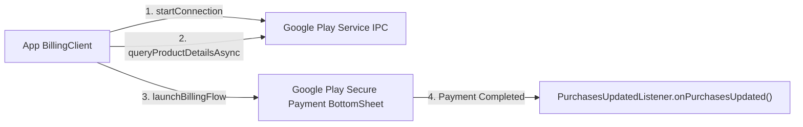

## Play billing library는 유일하게 승인된 인앱 구매 경로다

상위 문서: [인앱 결제 계약](billing-contracts.md)

### 개념 및 필요성 (What & Why)
Google Play Developer Program Policy에 따라 Google Play 스토어를 통해 배포되는 모든 안드로이드 앱 내에서 디지털 재화(게임 아사, 프리미엄 기능, 정기 구독권)를 판매할 때는 **Google Play Billing Library**가 유일하게 허용되는 정식 인앱 구매 결제 엔진이다.
외부 신용카드 결제 모듈이나 승인되지 않은 PG 결제 시스템을 임의로 결합하면 Google Play 스토어에서 앱이 즉시 거절되거나 삭제 조치(Store Removal)된다. (특정 국가의 대체 결제 시스템 정책 예외 제외).

### 내부 메커니즘 (Internal Mechanism)
1. **`BillingClient` 수명주기 관리**: `BillingClient.newBuilder(context).setListener(...).build()`로 인스턴스를 생성하고, `startConnection()`을 통해 Google Play 서비스 프로세스와 IPC 통신 채널을 바인딩함.
2. **`queryProductDetailsAsync` 상품 조회**: Play Console에 등록된 `inapp` 또는 `subs` 상품 정보를 최신 가격 및 통화 포맷으로 조회함.
3. **`launchBillingFlow` 결제 UI 디스패치**: Google Play 보안 신용카드 결제 및 신원 확인 바텀시트 UI를 호스팅함.



### 코드 예시 (build.gradle.kts & BillingClient)
```kotlin
// app/build.gradle.kts
dependencies {
    implementation("com.android.billingclient:billing-ktx:6.2.1")
}
```

```kotlin
// BillingManager.kt
val billingClient = BillingClient.newBuilder(context)
    .setListener { billingResult, purchases ->
        if (billingResult.responseCode == BillingClient.BillingResponseCode.OK && purchases != null) {
            for (purchase in purchases) {
                processPurchase(purchase)
            }
        }
    }
    .enablePendingPurchases()
    .build()
```

### 관측 가능 증거 (Observable Evidence)
결제 라이브러리 연동 동작 및 샌드박스 테스터 검증은 Google Play Console 라이선스 테스트 계정 환경에서 관측할 수 있다.

관련 노트: [서버 측 purchase token 검증이 필요하며 클라이언트 판단은 안 된다](server-side-purchase-token-verification-is-required-not-client-judgment.md), [인앱 결제 계약](billing-contracts.md)
