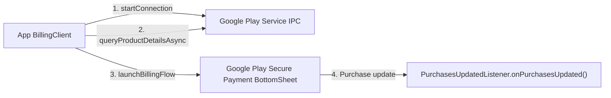

## Play billing 적용 여부는 상품, 사용자 지역, 등록 프로그램에 따라 결정된다

상위 문서: [인앱 결제 계약](billing-contracts.md)

### 개념 및 필요성 (What & Why)
Google Play의 기본 Payments 정책에서 Play 배포 앱이 앱 안에서 소비되는 디지털 콘텐츠·기능·구독을 판매하면 **Google Play billing system**을 사용해야 한다. 그러나 이 규칙은 모든 상품과 지역에 동일하게 적용되는 절대 명제가 아니다.

- 실물 상품·실물 서비스, 일부 P2P 결제·기부 등 정책이 열거한 범주는 Play Billing 대상이 아니다.
- 정책의 적용 조항과 Google이 제공하는 프로그램에 따라, 대상 지역의 적격 앱은 alternative billing, billing choice 또는 외부 결제 링크를 제공할 수 있다.
- 예외·프로그램은 자동 허용이 아니다. 앱과 사용자 지역의 자격을 확인하고 Play Console에서 해당 프로그램에 등록한 뒤, 요구되는 API·사용자 고지·거래 보고·수수료·지원 요건을 구현해야 한다.

따라서 결제 경로는 `상품 종류 → 소비 위치 → 배포 채널 → 사용자 지역 → 프로그램 자격·등록` 순서로 판정한다. 승인되지 않은 외부 결제 흐름을 임의로 넣으면 정책 위반이 될 수 있지만, 적법하게 등록한 대체 결제 흐름까지 금지된다고 설명해서도 안 된다.

### 내부 메커니즘 (Internal Mechanism)
1. **`BillingClient` 수명주기 관리**: `BillingClient.newBuilder(context).setListener(...).enablePendingPurchases(...).build()`로 인스턴스를 생성하고 `startConnection()`으로 Play Store와 연결한다.
2. **`queryProductDetailsAsync` 상품 조회**: Play Console에 등록된 `inapp` 또는 `subs` 상품 정보를 최신 가격 및 통화 포맷으로 조회함.
3. **`launchBillingFlow` 구매 UI 디스패치**: 사용 가능한 결제 수단과 인증을 포함하는 Google Play 구매 UI를 시작한다.
4. **프로그램 가용성 확인**: 대체 결제 또는 billing choice를 제공하는 앱은 현재 Play Billing Library가 제공하는 program availability API로 해당 사용자에게 프로그램을 제공할 수 있는지 확인하고, 등록한 프로그램의 전용 흐름을 사용한다.



### 코드 예시 (build.gradle.kts & BillingClient)
```kotlin
// app/build.gradle.kts
dependencies {
    implementation("com.android.billingclient:billing-ktx:9.1.0")
}
```

```kotlin
// BillingManager.kt
val pendingPurchasesParams = PendingPurchasesParams.newBuilder()
    .enableOneTimeProducts()
    .build()

val billingClient = BillingClient.newBuilder(context)
    .setListener { billingResult, purchases ->
        if (billingResult.responseCode == BillingClient.BillingResponseCode.OK && purchases != null) {
            purchases
                .filter { it.purchaseState == Purchase.PurchaseState.PURCHASED }
                .forEach(::verifyAndProcessPurchase)
        }
    }
    .enablePendingPurchases(pendingPurchasesParams)
    .build()
```

이 예시는 Play Billing 기본 흐름만 보인다. entitlement는 `PENDING` 상태에서 지급하지 않고 `PURCHASED`가 된 뒤 서버 검증과 acknowledge/consume 절차를 거쳐 지급한다. Billing choice 등 별도 프로그램을 구현한다면 해당 프로그램 API와 거래 보고 계약을 추가해야 한다.

### 관측 가능 증거 (Observable Evidence)
결제 라이브러리 연동 동작 및 샌드박스 테스터 검증은 Google Play Console 라이선스 테스트 계정 환경에서 관측할 수 있다.

관련 노트: [서버 측 purchase token 검증이 필요하며 클라이언트 판단은 안 된다](server-side-purchase-token-verification-is-required-not-client-judgment.md), [인앱 결제 계약](billing-contracts.md)

공식 문서: [Google Play Payments policy](https://support.google.com/googleplay/android-developer/answer/9858738), [Billing choice program](https://support.google.com/googleplay/android-developer/answer/17161464), [Play Billing Library release notes](https://developer.android.com/google/play/billing/release-notes), [Billing choice integration](https://developer.android.com/google/play/billing/billingchoice/integration)

검증일: 2026-08-06. Payments 정책의 상품·지역·프로그램 예외와 Play Billing Library 9.1.0 API를 기준으로 교정했다. 정책과 프로그램 가용성은 변경될 수 있으므로 출시 시점에 다시 확인한다.
