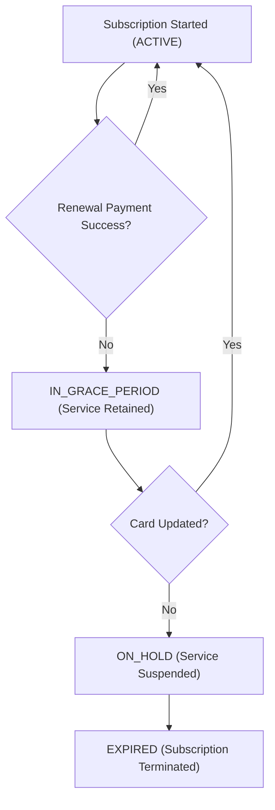

## 제품과 구독 구매는 서로 다른 라이프사이클을 가진다

상위 문서: [인앱 결제 계약](billing-contracts.md)

### 개념 및 필요성 (What & Why)
Google Play Billing 시스템에서 제공하는 재화는 단발성 제품 구매(**In-App Products**)와 정기 결제(**Subscriptions**)로 크게 분리되며, 두 재화 유형은 완전히 다른 상태 변이 라이프사이클(Lifecycle Status Transitions)을 지닌다.
소모품 결제와 달리 정기 구독은 유예 기간(Grace Period), 결제 대기 상태(Account Hold), 일시 정지(Pause), 자동 갱신(Auto-renew) 등복잡한 비동기 상태 변경이 발생하므로 각각에 부합하는 서버 이벤트를 수신하고 권한 부여 상태를 갱신해야 한다.

### 내부 메커니즘 (Internal Mechanism)
1. **In-App Products (일회성 구매 제품)**:
   - Consumable (소모성): 보석, 골드 등. 사용 후 `consumeAsync()`를 호출하여 재구매 가능한 상태로 전환.
   - Non-Consumable (비소모성): 영구 프리미엄 기능 해제 등. `acknowledgePurchase()` 호출 후 영구 유지.
2. **Subscriptions (정기 구독 라이프사이클)**:
   - `ACTIVE`: 정기 결제 정상 성공 상태.
   - `IN_GRACE_PERIOD`: 카드 잔액 부족 등으로 갱신 실패했으나 유예 기간 동안 서비스 접근을 유지해주는 상태.
   - `ON_HOLD`: 유예 기간 종료 후 추가 시도 기간. 서비스 접근을 차단함.
   - `PAUSED` / `CANCELED` / `EXPIRED`: 사용자가 구독을 일시 정지하거나 해지하여 권한 만료된 상태.



### 코드 예시 (Google Cloud RTDN Event Handling)
```json
// RTDN (Real-Time Developer Notification) JSON Payload Example
{
  "version": "1.0",
  "packageName": "com.example.myapp",
  "eventTimeMillis": "1722849000000",
  "subscriptionNotification": {
    "version": "1.0",
    "notificationType": 2, // SUBSCRIPTION_RENEWED
    "purchaseToken": "opaque_purchase_token_string",
    "subscriptionId": "premium_monthly"
  }
}
```

### 관측 가능 증거 (Observable Evidence)
구독 상태 변이 및 RTDN 메시지 수신 내역은 Google Cloud Pub/Sub 토픽 콘솔 로그로 관측할 수 있다.

관련 노트: [서버 측 purchase token 검증이 필요하며 클라이언트 판단은 안 된다](server-side-purchase-token-verification-is-required-not-client-judgment.md), [인앱 결제 계약](billing-contracts.md)
