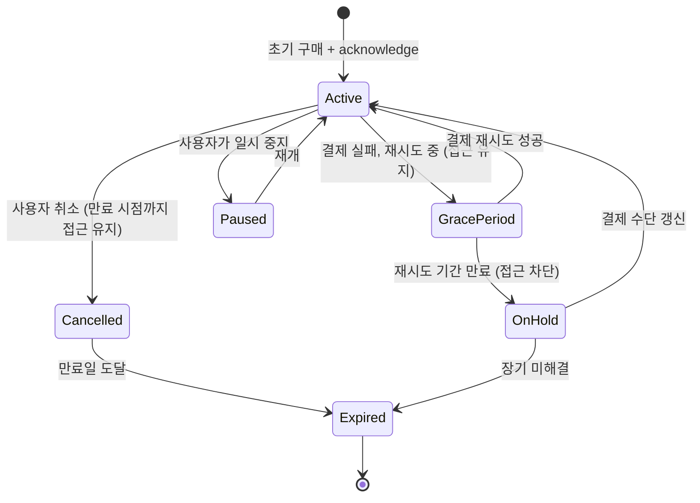

## 상품과 구독은 서로 다른 purchase lifecycle을 가진다

### 내부 메커니즘 (Internal Mechanism)

Play Billing Library 는 상품(in-app product)과 구독(subscription)을 같은 `Purchase` 객체와 `PurchasesUpdatedListener` 로 전달하지만, 두 유형은 완결되는 방식이 다르다.

**일회성 상품(one-time product)**은 다시 소비 가능한지 여부로 갈린다.

- **소비성(consumable)** 상품(게임 재화 등)은 `consumeAsync()` 로 처리한다. `consumeAsync()` 는 acknowledge 요구사항을 동시에 충족시키면서 항목을 소비 상태로 되돌려, 사용자가 동일 상품을 다시 구매할 수 있게 만든다.
- **비소비성(non-consumable)** 상품(광고 제거 등)은 `acknowledgePurchase()` 로 처리한다. 한 번 승인하면 사용자는 그 상품을 다시 구매할 수 없다 — Play는 이미 소유한 비소비성 상품의 재구매 흐름 자체를 막는다.

**구독(subscription)**은 초기 구매만 앱이 `acknowledgePurchase()` 로 승인하면 되고, 이후 갱신(renewal)은 Play가 자동으로 처리하며 앱이 매번 acknowledge 할 필요가 없다. 대신 구독은 상품에 없는 상태 전이를 갖는다.



일회성 상품은 이런 grace period/on hold/paused 상태가 없다 — 구매는 즉시 완결되거나(acknowledge) 소비되어 재구매 가능 상태로 돌아갈 뿐이다. 이 차이 때문에 상품 처리 로직을 구독에 그대로 재사용하면 갱신 실패나 유예 기간을 앱이 감지하지 못하는 버그가 생긴다.

### 코드 예시 (상품 vs 구독 처리 분기)

```kotlin
private fun handlePurchase(purchase: Purchase, isSubscription: Boolean) {
    if (purchase.purchaseState != Purchase.PurchaseState.PURCHASED) return

    scope.launch {
        if (!isSubscription && productType == BillingClient.ProductType.INAPP && isConsumable) {
            // 소비성 상품: consume이 acknowledge를 겸한다
            val params = ConsumeParams.newBuilder()
                .setPurchaseToken(purchase.purchaseToken)
                .build()
            billingClient.consumePurchase(params)
        } else if (!purchase.isAcknowledged) {
            // 비소비성 상품 또는 구독 초기 구매: acknowledge만 필요
            val params = AcknowledgePurchaseParams.newBuilder()
                .setPurchaseToken(purchase.purchaseToken)
                .build()
            billingClient.acknowledgePurchase(params)
        }
        // 구독 갱신은 여기 도달하지 않는다 — Play가 자동 처리하고
        // 앱은 RTDN 또는 queryPurchasesAsync()로 최신 상태만 동기화한다
    }
}
```

### 관측 가능 증거 (Observable Evidence)

```bash
# 앱 재시작 시 미완결 구매를 다시 조회 (프로세스가 acknowledge 전에 죽었을 경우 복구 경로)
# BillingClient.queryPurchasesAsync() 호출 후 로그로 상태 확인
adb logcat -s BillingClient:* | grep -E "PurchaseState|isAcknowledged|SubscriptionState"
```

### 경계

- `acknowledge`/`consume` 를 3일 이내에 하지 않았을 때의 자동 환불 규칙은 이 노트가 아니라 [3일 이내 acknowledge하지 않은 구매는 자동 환불된다](unacknowledged-purchases-are-refunded-within-three-days.md) 가 다룬다.
- 이 상태 전이는 클라이언트가 관측하는 표현일 뿐이며, 최종 판정은 서버가 Play Developer API로 다시 확인해야 한다. [purchase token은 클라이언트가 아니라 서버에서 검증해야 한다](server-side-purchase-token-verification-is-required-not-client-judgment.md) 참조.

관련 노트: [Play Billing Library는 Android 인앱 결제의 유일하게 승인된 경로다](play-billing-library-is-the-only-approved-in-app-purchase-path.md), [Google Play Billing 계약](billing-contracts.md)
