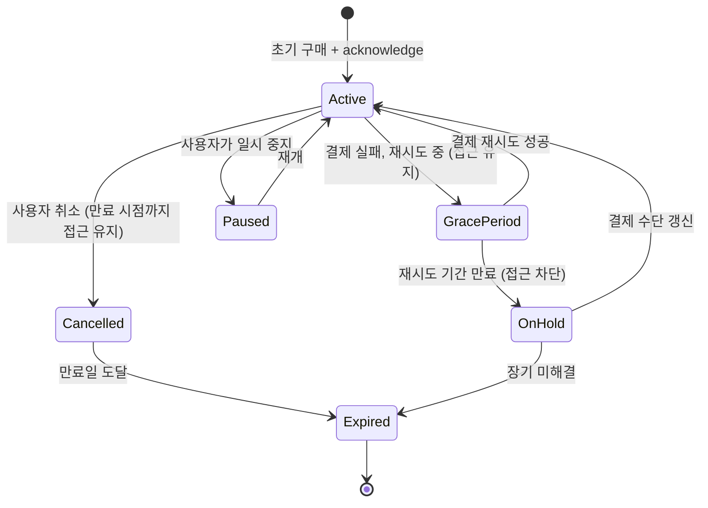

## 상품과 구독은 서로 다른 purchase lifecycle을 가진다

### 내부 메커니즘 (Internal Mechanism)

Play Billing Library는 일회성 상품(In-app Product)과 구독(Subscription) 상품을 동일한 `Purchase` 데이터 객체 및 `PurchasesUpdatedListener` 인터페이스로 앱에 반환하지만, 안드로이드 인앱 결제 생태계 내에서 두 상품 유형이 가리키는 **Purchase Lifecycle(구매 라이프사이클)** 전이 구조는 완벽히 다르다.

1. **일회성 상품 (One-Time Product)**:
   - **Consumable Product (소비성 상품)**: 게임 내 가상 화폐, 포션 등 사용 후 소진되는 상품이다. 앱은 **`consumeAsync()`** API를 호출해야 한다. `consumeAsync()`는 구매 승인(acknowledge) 처리를 겸함과 동시에 Google Play 결제 서버에서 해당 상품 소유 상태를 소진(consumed) 상태로 되돌려 사용자가 동일 상품을 다시 재구매할 수 있도록 라이프사이클을 리셋한다.
   - **Non-consumable Product (비소비성 상품)**: 광고 제거, 평생 프리미엄 기능 등 단 1회 구매로 영구 소유하는 상품이다. 앱은 **`acknowledgePurchase()`** API로 구매를 승인한다. 승인 완료 후 Google Play 서버는 해당 계정의 재구매 시도 자체를 스토어 차원에서 막는다.

2. **구독 상품 (Subscription Product)**:
   - 구독 상품은 최초 구매 시 1회만 `acknowledgePurchase()` 승인을 거치며, 이후 매 주기 발생하는 구독 자동 갱신(Renewal)은 Google Play 결제 인프라가 자율적으로 처리하므로 앱이 매번 acknowledge를 호출할 필요가 없다.
   - 대신 구독은 일회성 상품에 없는 복잡한 생태계 상태 전이를 갖는다:
     - **Grace Period (결제 유예 기간)**: 결제 카드 한도 초과 등으로 갱신 결제 실패 시, 사용자의 서비스 이용을 즉시 차단하지 않고 신용카드 수정을 유도하며 지정 기간 동안 혜택을 유지해 주는 상태다.
     - **Account Hold (계정 일시 중지)**: 유예 기간이 지나도 결제 수단이 수정되지 않아 서비스 접근 권한을 일시적으로 차단하되 결제 정상화 시 즉시 복구할 수 있는 대기 상태다.
     - **Paused / Expired (일시 정지 / 최종 만료)**: 사용자의 자의적 일시 정지 요청 또는 장기 결제 실패로 구독 권한이 완전 소멸하는 최종 상태다.



일회성 상품은 이런 grace period/on hold/paused 상태가 없다 — 구매는 즉시 완결되거나(acknowledge) 소비되어 재구매 가능 상태로 돌아갈 뿐이다. 이 차이 때문에 상품 처리 로직을 구독에 그대로 재사용하면 갱신 실패나 유예 기간을 앱이 감지하지 못하는 버그가 생긴다.

### 코드 예시 (상품 vs 구독 처리 분기)

```kotlin
private fun handlePurchase(purchase: Purchase, isSubscription: Boolean) {
    if (purchase.purchaseState != Purchase.PurchaseState.PURCHASED) return

    scope.launch {
        if (!isSubscription && productType == BillingClient.ProductType.INAPP && isConsumable) {
            // 소비성 상품: consume이 acknowledge를 겸한다
            val params = ConsumeParams.newBuilder()
                .setPurchaseToken(purchase.purchaseToken)
                .build()
            billingClient.consumePurchase(params)
        } else if (!purchase.isAcknowledged) {
            // 비소비성 상품 또는 구독 초기 구매: acknowledge만 필요
            val params = AcknowledgePurchaseParams.newBuilder()
                .setPurchaseToken(purchase.purchaseToken)
                .build()
            billingClient.acknowledgePurchase(params)
        }
        // 구독 갱신은 여기 도달하지 않는다 — Play가 자동 처리하고
        // 앱은 RTDN 또는 queryPurchasesAsync()로 최신 상태만 동기화한다
    }
}
```

### 관측 가능 증거 (Observable Evidence)

```bash
# 앱 재시작 시 미완결 구매를 다시 조회 (프로세스가 acknowledge 전에 죽었을 경우 복구 경로)
# BillingClient.queryPurchasesAsync() 호출 후 로그로 상태 확인
adb logcat -s BillingClient:* | grep -E "PurchaseState|isAcknowledged|SubscriptionState"
```

### 경계

- `acknowledge`/`consume` 를 3일 이내에 하지 않았을 때의 자동 환불 규칙은 이 노트가 아니라 [3일 이내 acknowledge하지 않은 구매는 자동 환불된다](unacknowledged-purchases-are-refunded-within-three-days.md) 가 다룬다.
- 이 상태 전이는 클라이언트가 관측하는 표현일 뿐이며, 최종 판정은 서버가 Play Developer API로 다시 확인해야 한다. [purchase token은 클라이언트가 아니라 서버에서 검증해야 한다](server-side-purchase-token-verification-is-required-not-client-judgment.md) 참조.

관련 노트: [Play Billing Library는 Android 인앱 결제의 유일하게 승인된 경로다](play-billing-library-is-the-only-approved-in-app-purchase-path.md), [Google Play Billing 계약](billing-contracts.md)
