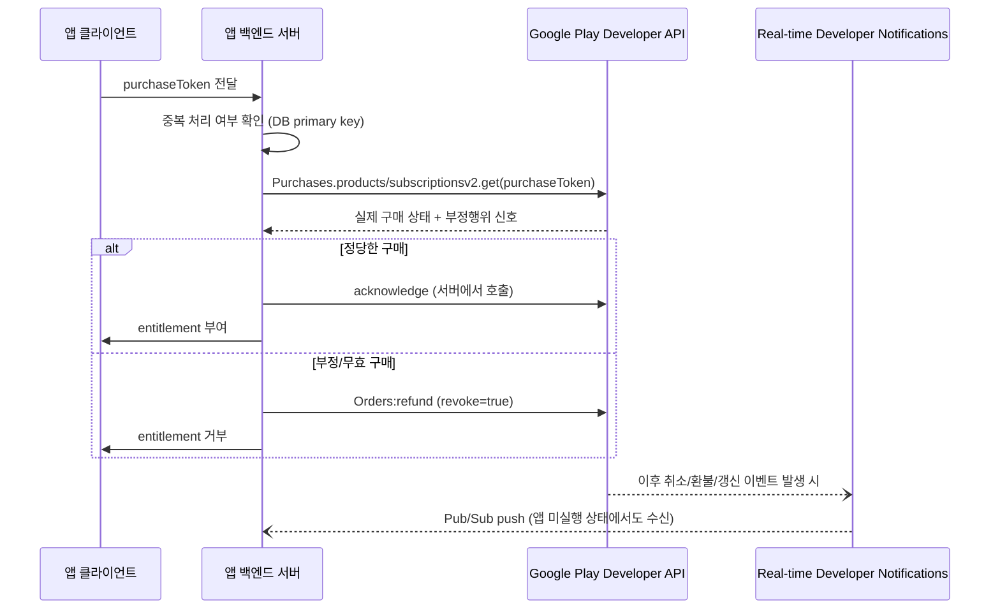

## purchase token은 클라이언트가 아니라 서버에서 검증해야 한다

### 내부 메커니즘 (Internal Mechanism)

클라이언트 앱 내부에서 `BillingClient`가 반환하는 `Purchase.PurchaseState == PURCHASED` 신호는 단지 **"클라이언트 단말 기기가 관측한 결제 결과"**일 뿐, 해당 영수증이 루팅이나 메모리 조작 패키지(Xposed, Lucky Patcher 등)에 의해 위변조되지 않았음을 보증하는 암호학적 증명이 아니다. 안드로이드 보안 가이드라인에 따라 앱의 민감한 결제 검증 및 혜택(entitlement) 지급 판정은 반드시 개발자가 직접 통제하는 백엔드 검증 서버에서 수행되어야 한다.

표준 서버 보안 검증 인과 흐름:
1. 클라이언트는 결제 직후 Google Play가 발급한 고유 암호화 토큰인 **`purchaseToken`**을 HTTPS 통신을 통해 개발자 백엔드 서버로 전송한다.
2. 서버는 DB의 Primary Key 수준으로 `purchaseToken`을 조회하여 과거 이미 처리된 토큰인지 먼저 검증함으로써, 동일 토큰을 재전송하여 이중 혜택을 얻으려는 **Replay Attack(재생 공격)**을 원천 차단한다.
3. 서버는 Google이 제공하는 공식 **Play Developer API**(`Purchases.products.get` 또는 `Purchases.subscriptionsv2.get`)를 통해 Google Play 결제 서버로 직접 서버-투-서버 인증 요청을 보내어 해당 토큰의 진위, 실제 결제 승인 여부, 그리고 부정 결제 신호를 최종 대조한다.
4. 구글 서버 응답이 정당한 결제로 확인되면 백엔드 서버가 직접 구글 서버로 `acknowledge` API를 호출하고 사용자 계정에 디지털 혜택(entitlement)을 지급한다. 부정 결제 판정 시 `Orders:refund`(`revoke=true`)를 호출하여 구매를 즉각 몰수 조치한다.

이러한 검증을 실시간으로 보완하는 시스템이 **RTDN (Real-time Developer Notifications)**이다. Google Cloud Pub/Sub 웹훅 시스템을 통해 사용자 구독의 자동 갱신, 취소, 환불 이벤트를 구글 서버가 개발자 백엔드로 즉시 밀어(push)줌으로써, 앱이 실행되어 있지 않은 유휴 상태에서도 구독 권한 박탈 및 이력을 완벽히 동기화한다.



### 코드 예시 (서버 검증 요청 스텁, Kotlin 백엔드 예시)

```kotlin
suspend fun verifyAndGrant(purchaseToken: String, productId: String): VerificationResult {
    if (purchaseRepository.existsByToken(purchaseToken)) {
        return VerificationResult.AlreadyProcessed // 재생 공격/중복 요청 차단
    }

    val remotePurchase = playDeveloperApi.getProductPurchase(
        packageName = "com.example.app",
        productId = productId,
        token = purchaseToken,
    )

    return if (remotePurchase.purchaseState == 0 /* PURCHASED */) {
        playDeveloperApi.acknowledgeProductPurchase(packageName = "com.example.app", productId, purchaseToken)
        purchaseRepository.save(purchaseToken, productId)
        VerificationResult.Granted
    } else {
        VerificationResult.Rejected
    }
}
```

### 관측 가능 증거 (Observable Evidence)

```bash
# 서버 검증 실패 시 앱 로그에서 클라이언트 판정과 서버 판정이 갈리는 지점을 구분한다
# 클라이언트: PURCHASED 로 표시되지만 서버 응답이 다른 경우가 위변조 후보다

# Play Developer API 직접 호출 (구독)
curl -H "Authorization: Bearer $ACCESS_TOKEN" \
  "https://androidpublisher.googleapis.com/androidpublisher/v3/applications/com.example.app/purchases/subscriptionsv2/tokens/$PURCHASE_TOKEN"
```

### 경계

- 이 노트는 "누가 최종 판정을 내리는가"만 다룬다. `acknowledge` 자체를 3일 이내 호출해야 한다는 시한 규칙은 [3일 이내 acknowledge하지 않은 구매는 자동 환불된다](unacknowledged-purchases-are-refunded-within-three-days.md) 를 참조한다. 서버 검증 흐름에서도 최종 `acknowledge` 호출은 이 3일 규칙의 적용을 받는다.
- RTDN 설정과 Pub/Sub 인프라 구성 자체는 이 노트의 범위가 아니며, "서버가 클라이언트 판정을 신뢰하지 않는다"는 계약만 다룬다.

배경 지식: [인증과 인가](../../../../../security/fundamentals/authentication-authorization.md), [HTTP 프로토콜](../../../../../computer-science/networking/http-protocol.md)

관련 노트: [상품과 구독은 서로 다른 purchase lifecycle을 가진다](product-and-subscription-purchases-have-different-lifecycles.md), [Google Play Billing 계약](billing-contracts.md)
