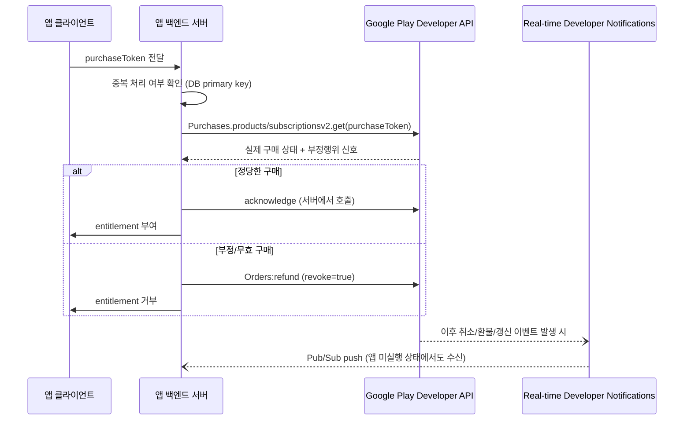

## purchase token은 클라이언트가 아니라 서버에서 검증해야 한다

### 내부 메커니즘 (Internal Mechanism)

`BillingClient` 가 클라이언트에서 반환하는 `Purchase.PurchaseState == PURCHASED` 는 **기기가 관찰한 결과**일 뿐, 위변조되지 않았다는 증명이 아니다. 기기는 루팅되거나 API 응답을 가로채는 프레임워크(Xposed 류)로 조작될 수 있어, 클라이언트 판정만으로 entitlement 를 부여하면 위조 구매를 걸러낼 수 없다. Android 공식 보안 가이드(`developer.android.com/google/play/billing/security`)는 민감한 데이터/로직을 가능한 한 앱이 통제하는 백엔드 서버로 옮기라고 명시한다 — 기기에 남는 로직이 많을수록 변조에 취약해지기 때문이다.

표준 서버 검증 흐름은 다음과 같다.

1. 클라이언트는 구매 후 `purchaseToken` 을 서버로 전달한다(HTTPS).
2. 서버는 `purchaseToken` 이 이미 처리된 적 있는지 자체 DB에서 먼저 확인한다 — `purchaseToken` 은 전역적으로 유일하므로 primary key로 쓸 수 있고, 중복 처리(재생 공격, 같은 영수증으로 두 번 entitlement 요청)를 막는다.
3. 서버는 Google Play Developer API 를 호출해 Google과 직접 통신하며 토큰의 진위와 실제 구매 상태를 확인한다. 일회성 상품은 `Purchases.products:get`, 구독은 `Purchases.subscriptionsv2:get` 을 쓴다.
4. 서버가 정당하다고 판단하면 `Purchases.products:acknowledge`/`Purchases.subscriptions:acknowledge` 를 서버에서 호출하고 entitlement 를 부여한다. 부정 구매로 판단되면 entitlement 를 부여하지 않고 `Orders:refund`(`revoke=true`)로 명시적 거절 신호를 Google Play에 보낸다.

이 검증을 실시간으로 자동화하는 보완 장치가 **Real-time Developer Notifications(RTDN)** 이다. Google Play가 구매, 취소, 환불, 구독 상태 변경 이벤트를 서버로 Pub/Sub 웹훅으로 직접 밀어주므로, 클라이언트가 앱을 다시 열지 않아도 서버가 구독 만료/환불을 즉시 알 수 있다. 클라이언트 폴링에만 의존하면 앱을 오래 열지 않는 사용자의 구독 만료를 서버가 놓친다.



### 코드 예시 (서버 검증 요청 스텁, Kotlin 백엔드 예시)

```kotlin
suspend fun verifyAndGrant(purchaseToken: String, productId: String): VerificationResult {
    if (purchaseRepository.existsByToken(purchaseToken)) {
        return VerificationResult.AlreadyProcessed // 재생 공격/중복 요청 차단
    }

    val remotePurchase = playDeveloperApi.getProductPurchase(
        packageName = "com.example.app",
        productId = productId,
        token = purchaseToken,
    )

    return if (remotePurchase.purchaseState == 0 /* PURCHASED */) {
        playDeveloperApi.acknowledgeProductPurchase(packageName = "com.example.app", productId, purchaseToken)
        purchaseRepository.save(purchaseToken, productId)
        VerificationResult.Granted
    } else {
        VerificationResult.Rejected
    }
}
```

### 관측 가능 증거 (Observable Evidence)

```bash
# 서버 검증 실패 시 앱 로그에서 클라이언트 판정과 서버 판정이 갈리는 지점을 구분한다
# 클라이언트: PURCHASED 로 표시되지만 서버 응답이 다른 경우가 위변조 후보다

# Play Developer API 직접 호출 (구독)
curl -H "Authorization: Bearer $ACCESS_TOKEN" \
  "https://androidpublisher.googleapis.com/androidpublisher/v3/applications/com.example.app/purchases/subscriptionsv2/tokens/$PURCHASE_TOKEN"
```

### 경계

- 이 노트는 "누가 최종 판정을 내리는가"만 다룬다. `acknowledge` 자체를 3일 이내 호출해야 한다는 시한 규칙은 [3일 이내 acknowledge하지 않은 구매는 자동 환불된다](unacknowledged-purchases-are-refunded-within-three-days.md) 를 참조한다. 서버 검증 흐름에서도 최종 `acknowledge` 호출은 이 3일 규칙의 적용을 받는다.
- RTDN 설정과 Pub/Sub 인프라 구성 자체는 이 노트의 범위가 아니며, "서버가 클라이언트 판정을 신뢰하지 않는다"는 계약만 다룬다.

관련 노트: [상품과 구독은 서로 다른 purchase lifecycle을 가진다](product-and-subscription-purchases-have-different-lifecycles.md), [Google Play Billing 계약](billing-contracts.md)
