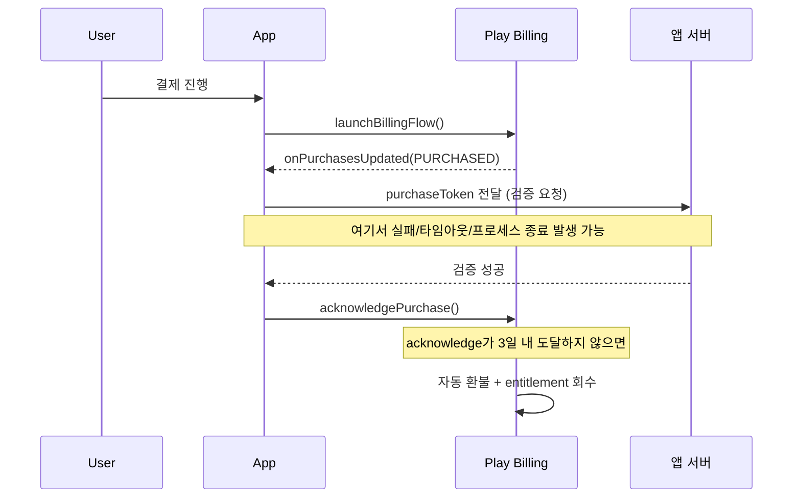

## 3일 이내 acknowledge하지 않은 구매는 자동 환불된다

### 내부 메커니즘 (Internal Mechanism)

Google Play 공식 결제 정책 규격(`developer.android.com/google/play/billing/integrate`)은 앱 또는 백엔드 서버가 사용자의 결제를 처리한 직후 **3일(72시간) 이내**에 **`acknowledgePurchase()`** 또는 **`consumeAsync()`** API를 통해 승인 통보를 구글 서버로 보전하지 않으면, Google Play가 결제를 자동으로 취소 환불 처리하고 사용자에게 부여되었던 **Entitlement (디지털 혜택/소유권)**을 강제 회수하도록 규정하고 있다.

이 미승인 자동 환불 대참사가 발생하는 주요 인과적 원인:
1. `onPurchasesUpdated()` 이벤트 수신 후 개발자 서버 결제 검증 API 호출이 타임아웃되거나 실패하여 `acknowledgePurchase()` 호출이 중간에 누실되는 경우.
2. 결제 완료 즉시 사용자가 앱을 강제 종료(Kill)하거나 OS에 의해 프로세스가 사망하여 승인 API 통신을 완료하지 못한 경우.
3. 비소비성 상품이나 구독 상품 개발 시 `consumeAsync()`만 챙기고 `acknowledgePurchase()` 승인 구현을 누락한 채 앱을 퍼블리싱한 경우.

이 문제를 차단하는 표준 설계 패턴은 앱 프로세스가 시작될 때마다 **`queryPurchasesAsync()`** API를 실행하여 미완결 구매 상태(`!isAcknowledged`)로 남아있는 모든 `Purchase` 토큰을 복구 조회하고, 서버 검증을 거쳐 `acknowledgePurchase()`를 재시도 통보하는 **미완결 결제 자가 복구 패턴**을 필수 탑재하는 것이다.



### 코드 예시 (앱 시작 시 미완결 구매 복구)

```kotlin
fun recoverUnacknowledgedPurchases() {
    val params = QueryPurchasesParams.newBuilder()
        .setProductType(BillingClient.ProductType.INAPP)
        .build()

    billingClient.queryPurchasesAsync(params) { result, purchases ->
        if (result.responseCode != BillingClient.BillingResponseCode.OK) return@queryPurchasesAsync

        purchases.filter {
            it.purchaseState == Purchase.PurchaseState.PURCHASED && !it.isAcknowledged
        }.forEach { purchase ->
            // 앱 프로세스가 죽었거나 이전 세션에서 처리가 끊긴 구매를 여기서 다시 acknowledge한다
            verifyOnServerThenAcknowledge(purchase)
        }
    }
}
```

### 관측 가능 증거 (Observable Evidence)

```bash
# Play Console > 수익 창출 > 주문 관리에서 환불 사유가
# "Google Play 정책에 따른 자동 환불(미처리 구매)"로 표시되는 항목을 확인한다.

# 클라이언트 로그에서 acknowledge 누락 패턴 확인:
# onPurchasesUpdated는 찍혔는데 이후 acknowledgePurchase 로그가 없는 구간
adb logcat -s BillingClient:* | grep -E "onPurchasesUpdated|acknowledgePurchase|consumeAsync"
```

### 경계

- 이 3일 규칙은 acknowledge 유무만 판정하며, 구매가 사기인지 아닌지는 판정하지 않는다. 부정 구매 판정과 entitlement 최종 승인은 [purchase token은 클라이언트가 아니라 서버에서 검증해야 한다](server-side-purchase-token-verification-is-required-not-client-judgment.md) 의 서버 검증 책임이다.
- 상품별로 `acknowledge` 대상 API가 다르다는 점은 [상품과 구독은 서로 다른 purchase lifecycle을 가진다](product-and-subscription-purchases-have-different-lifecycles.md) 를 먼저 확인한다.

관련 노트: [Google Play Billing 계약](billing-contracts.md)
