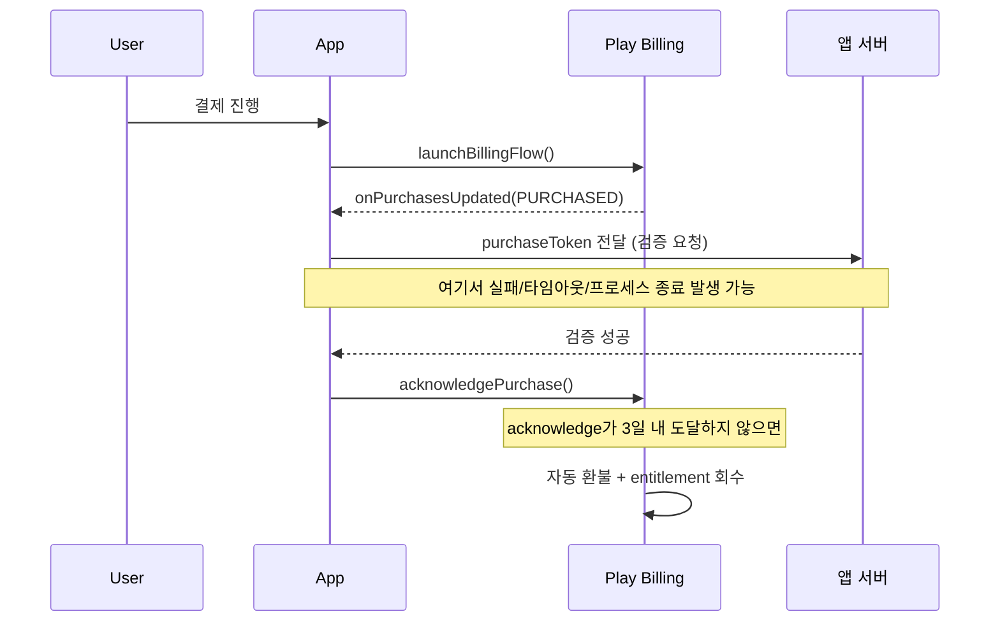

## 3일 이내 acknowledge하지 않은 구매는 자동 환불된다

### 내부 메커니즘 (Internal Mechanism)

Google Play 공식 문서(`developer.android.com/google/play/billing/integrate`)는 앱이 구매를 처리한 뒤 **3일 이내**에 `acknowledgePurchase()` 또는 `consumeAsync()` 로 승인하지 않으면 Play가 해당 구매를 자동으로 환불하고 entitlement 를 회수한다고 명시한다("purchases are refunded after 3 days if your app has not processed the purchase"). 이 규칙은 소비성 상품, 비소비성 상품, 구독의 초기 구매 모두에 동일하게 적용된다.

이 함정이 실제로 발생하는 전형적인 경로는 다음과 같다.

1. `onPurchasesUpdated()` 콜백에서 구매를 받았지만 서버 검증 호출이 실패하거나 타임아웃되어 acknowledge 를 건너뛴다.
2. 사용자가 구매 직후 앱을 강제 종료하거나 프로세스가 죽어 `acknowledgePurchase()` 호출 전에 앱이 사라진다.
3. 앱이 `consumeAsync()` 만 소비성 상품에 쓰고 비소비성 상품/구독에는 acknowledge 호출 자체를 빠뜨린 채 배포된다.

세 경우 모두 사용자는 결제했지만 앱은 3일 뒤 entitlement 를 잃고, Play Console 환불 지표에는 "미처리 구매로 인한 자동 환불"이 누적된다. 이는 사용자 과실이 아니라 앱의 acknowledge 누락이 원인이므로 일반 환불과 구분해서 모니터링해야 한다.

이 함정을 막는 표준 패턴은 `onPurchasesUpdated()` 에서만 acknowledge 를 시도하지 않고, **앱 시작 시점마다 `queryPurchasesAsync()` 로 미완결 구매를 다시 조회해 acknowledge 재시도**하는 것이다. 프로세스 death 나 네트워크 실패로 처리를 놓친 구매도 이 경로로 복구된다.



### 코드 예시 (앱 시작 시 미완결 구매 복구)

```kotlin
fun recoverUnacknowledgedPurchases() {
    val params = QueryPurchasesParams.newBuilder()
        .setProductType(BillingClient.ProductType.INAPP)
        .build()

    billingClient.queryPurchasesAsync(params) { result, purchases ->
        if (result.responseCode != BillingClient.BillingResponseCode.OK) return@queryPurchasesAsync

        purchases.filter {
            it.purchaseState == Purchase.PurchaseState.PURCHASED && !it.isAcknowledged
        }.forEach { purchase ->
            // 앱 프로세스가 죽었거나 이전 세션에서 처리가 끊긴 구매를 여기서 다시 acknowledge한다
            verifyOnServerThenAcknowledge(purchase)
        }
    }
}
```

### 관측 가능 증거 (Observable Evidence)

```bash
# Play Console > 수익 창출 > 주문 관리에서 환불 사유가
# "Google Play 정책에 따른 자동 환불(미처리 구매)"로 표시되는 항목을 확인한다.

# 클라이언트 로그에서 acknowledge 누락 패턴 확인:
# onPurchasesUpdated는 찍혔는데 이후 acknowledgePurchase 로그가 없는 구간
adb logcat -s BillingClient:* | grep -E "onPurchasesUpdated|acknowledgePurchase|consumeAsync"
```

### 경계

- 이 3일 규칙은 acknowledge 유무만 판정하며, 구매가 사기인지 아닌지는 판정하지 않는다. 부정 구매 판정과 entitlement 최종 승인은 [purchase token은 클라이언트가 아니라 서버에서 검증해야 한다](server-side-purchase-token-verification-is-required-not-client-judgment.md) 의 서버 검증 책임이다.
- 상품별로 `acknowledge` 대상 API가 다르다는 점은 [상품과 구독은 서로 다른 purchase lifecycle을 가진다](product-and-subscription-purchases-have-different-lifecycles.md) 를 먼저 확인한다.

관련 노트: [Google Play Billing 계약](billing-contracts.md)
