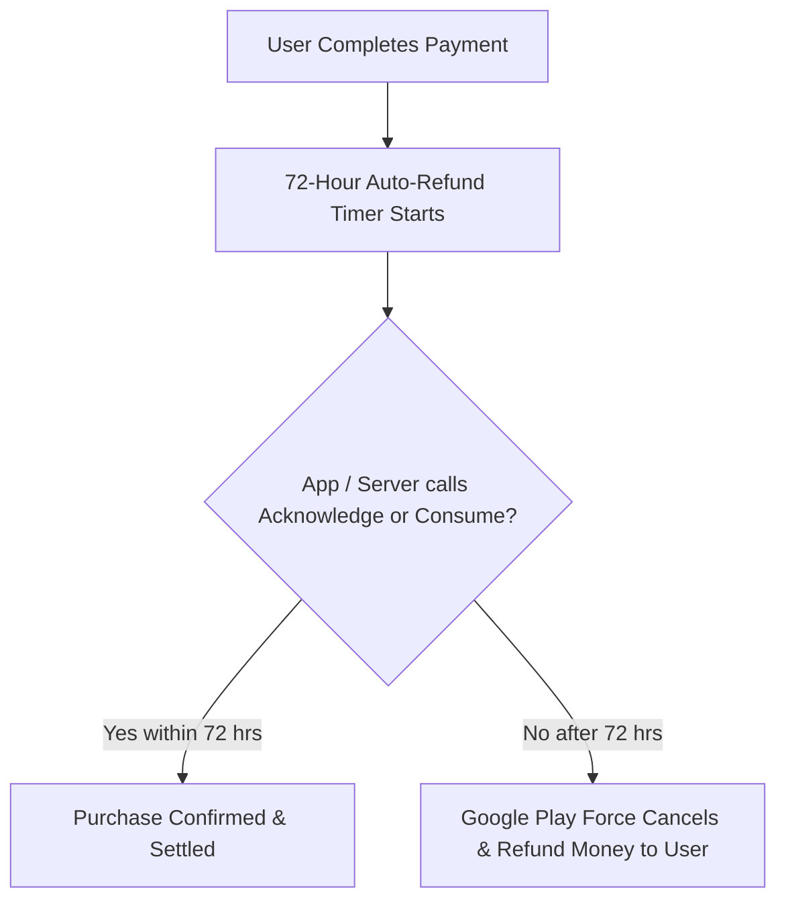

## 승인되지 않은 구매는 3일 이내에 환불된다

상위 문서: [인앱 결제 계약](billing.md)

### 개념 및 필요성 (What & Why)
Google Play Billing Library v3 이상부터 도입된 최우선 핵심 규약은 **3일 이내 구매 승인(Acknowledge Requirement)** 이다.
사용자가 결제를 마친 후 **3일(72시간)** 이내에 개발자의 애플리케이션 또는 앱 백엔드 서버가 해당 결제 건에 대해 구매 승인(`acknowledgePurchase`)이나 소모 처리(`consumeAsync`)를 Google Play에 반환하지 않으면, **Google Play는 결제를 유령 결제(Ghost Purchase)로 판단하여 자동으로 결제를 취소하고 사용자에게 전액 환불(Auto-Refund)** 처리한다.
이 규약은 결제 금액만 빠져나가고 사용자가 아이템을 지급받지 못하는 불상사를 방지하기 위한 Google의 필수 보호 조치이다.

### 내부 메커니즘 (Internal Mechanism)
1. **Acknowledge vs Consume**:
   - Non-Consumable & Subscriptions: `BillingClient.acknowledgePurchase()` 또는 백엔드 REST API `purchases.products.acknowledge` 호출.
   - Consumable (소모품): `BillingClient.consumeAsync()` 호출 시 내부적으로 자동 승인(Acknowledge) 포함 처리됨.
2. **`isAcknowledged == false` 재시도 메커니즘**: 앱 실행 시 및 `onResume()` 시점에 `queryPurchasesAsync()`를 호출하여 `isAcknowledged == false` 상태인 미승인 결제 건을 검색하고 즉시 승인 처리해야 함.



### 코드 예시 (BillingClient Acknowledge Integration)
```kotlin
// BillingManager.kt
fun handlePurchase(purchase: Purchase) {
    if (purchase.purchaseState == Purchase.PurchaseState.PURCHASED) {
        if (!purchase.isAcknowledged) {
            val acknowledgePurchaseParams = AcknowledgePurchaseParams.newBuilder()
                .setPurchaseToken(purchase.purchaseToken)
                .build()
            
            billingClient.acknowledgePurchase(acknowledgePurchaseParams) { billingResult ->
                if (billingResult.responseCode == BillingClient.BillingResponseCode.OK) {
                    println("Purchase Acknowledged Successfully!")
                }
            }
        }
    }
}
```

### 관측 가능 증거 (Observable Evidence)
미승인 결제 건의 존재 및 승인 상태는 `queryPurchasesAsync()` 호출 결과의 `isAcknowledged` 파라미터로 관측 가능하다.

관련 노트: [서버 측 purchase token 검증이 필요하며 클라이언트 판단은 안 된다](purchase-token-verification.md), [인앱 결제 계약](billing.md)
