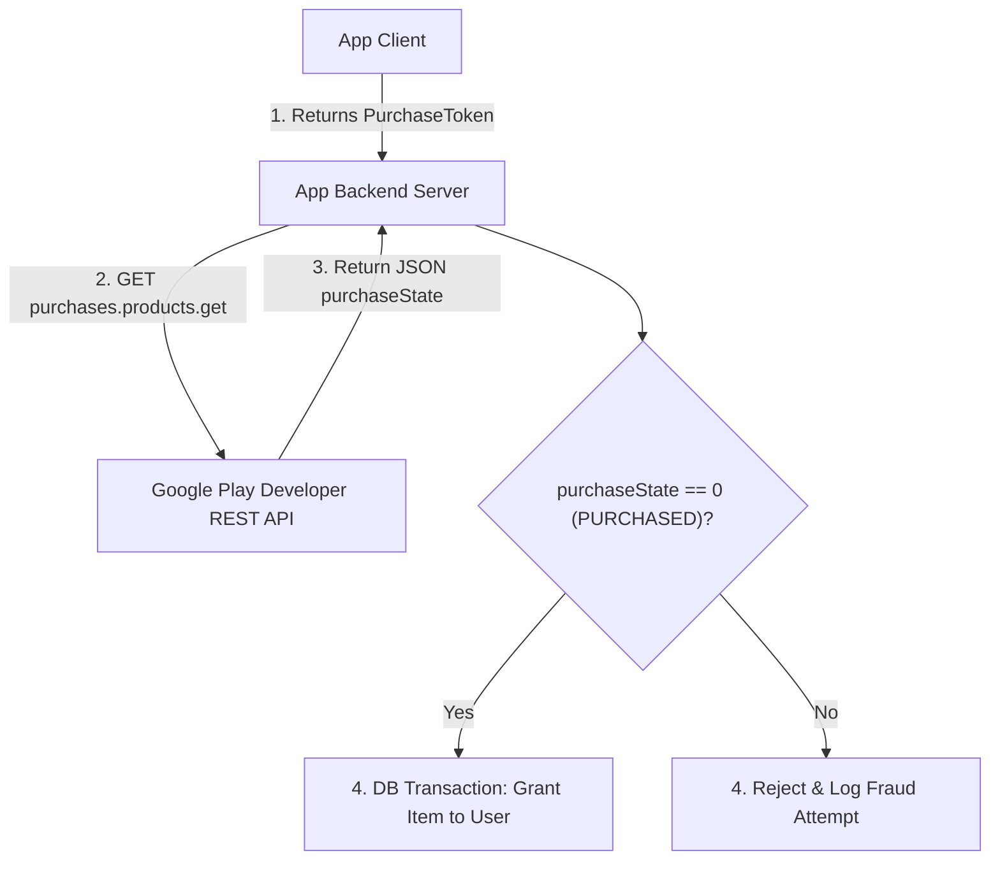

## 서버 측 purchase token 검증이 필요하며 클라이언트 판단은 안 된다

상위 문서: [인앱 결제 계약](billing.md)

### 개념 및 필요성 (What & Why)

인앱 결제 구현 시 클라이언트 스마트폰 앱(BillingClient)의 결제 완료 콜백만 믿고 서버에서 재화를 즉시 지급하는 구조는 **심각한 보안 취약점과 금융 어뷰징**을 야기한다.

루팅된 안드로이드 폰이나 변조된 럭키 패처(Lucky Patcher) 같은 메모리 훅 도구를 사용하는 해커는 클라이언트의 `PurchasesUpdatedListener` 응답 응답 값을 가짜 성공 데이터로 위조할 수 있다.

따라서 **재화 지급 여부는 절대 클라이언트가 판단해선 안 되며, 앱 백엔드 서버가 Purchase Token 을 Google Play Developer REST API 로 직접 검증(Server-Side Verification)** 해야만 한다.

### 내부 메커니즘 (Internal Mechanism)
1. **Purchase Token 전송**: 클라이언트는 결제 성공 시 발급받은 `purchaseToken`과 `productId` 문자열을 앱 전용 백엔드 서버 API 로 보안 HTTPS 전송함.
2. **Google Play Developer API 호출**:
   - 백엔드 서버는 서비스 계정 OAuth2 토큰을 이용하여 Google Play 서버 REST API 를 호출함:
   - Product: `GET https://androidpublisher.googleapis.com/androidpublisher/v3/applications/{packageName}/purchases/products/{productId}/tokens/{token}`
   - Subscription: `GET https://androidpublisher.googleapis.com/androidpublisher/v3/applications/{packageName}/purchases/subscriptionsv2/tokens/{token}`
3. **`purchaseState == 0 (PURCHASED)` 검증**: Google 서버에서 반환된 최신 JSON 의 `purchaseState` 정수값이 `0`(PURCHASED)임을 확인한 후에만 DB 에 재화를 지급함.



### 코드 예시 (Server Backend Kotlin / Node.js API Call)
```kotlin
// AppServerBackend.kt (Google Play REST API 호출 예시)
fun verifyPurchaseWithGoogle(packageName: String, productId: String, token: String): Boolean {
    val response = googlePublisherClient.purchases().products()
        .get(packageName, productId, token)
        .execute()
    
    // purchaseState: 0 (Purchased), 1 (Canceled), 2 (Pending)
    return response.purchaseState == 0
}
```

### 관측 가능 증거 (Observable Evidence)

Google Play Developer API 서버 검증 결과 및 응답 코드는 백엔드 결제 로그에서 확인할 수 있다.

관련 노트: [승인되지 않은 구매는 3일 이내에 환불된다](purchase-acknowledgement-policy.md), [인앱 결제 계약](billing.md)
