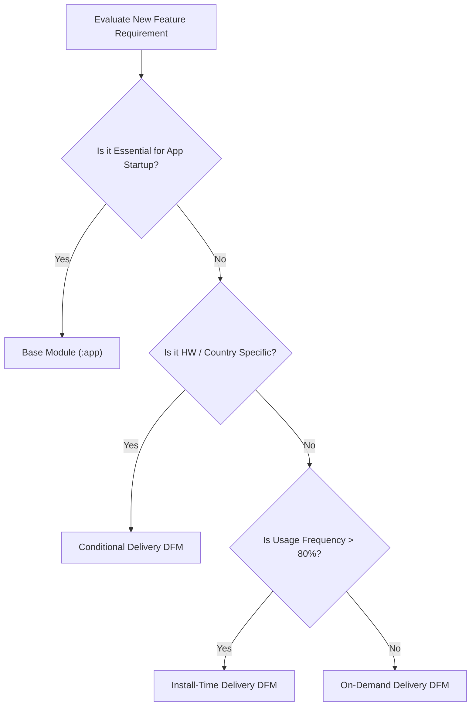

## Delivery mode는 필요성, 조건, 그리고 런타임 요청으로 선택된다

상위 문서: [Play Delivery 계약](play-delivery-contracts.md)

### 개념 및 필요성 (What & Why)
Android 앱을 개발할 때 모든 모듈을 어떤 **배포 모드(Delivery Mode)** 로 구성할 것인가에 대한 아키텍처 결정 기준을 정의한다.
배포 모드는 개발자의 자의적 선택이 아니라, 해당 기능의 **필수성(Necessity: 앱 실행 필수 여부)**, **하드웨어/지역 조건(Conditions)**, 그리고 **사용자의 런타임 요청 빈도(Runtime Request)** 에 기초한 의사결정 매트릭스에 따라 결정되어야 한다.

### 내부 메커니즘 (Internal Mechanism)
**배포 모드 의사결정 매트릭스**:
1. **Base Module (`:app`)**: 로그인, 앱 진입점, 핵심 온보딩 등 앱 실행에 즉시 필요한 100% 필수 코드.
2. **Install-Time DFM / PAD**: 모든 사용자가 자주 쓰지만 모듈 분리가 필요한 코드.
3. **Conditional DFM**: 특정 카메라 센서, 센서 하드웨어가 존재하는 기기나 특정 거주 국가 사용자에게만 필요한 기능.
4. **On-Demand DFM / PAD**: 상위 20%의 열성 사용자나 특정 메뉴(예: PDF 내보내기, AR 카메라) 진입 시에만 다운로드되는 선택 기능.



### 코드 예시 (Architecture Decision Record)
```markdown
# ADR: AR Scanner Feature Delivery Mode Decision
- Decision: On-Demand Dynamic Feature Module (:features:ar_scanner)
- Rationale: AR 스캐너 기능은 전체 사용자의 12%만 이용하며, 45MB의 ARCore 바이너리 종속성을 가짐. Base 모듈 포함 시 다운로드 이탈률 증가 위험이 크므로 On-Demand 모드 선택.
```

### 관측 가능 증거 (Observable Evidence)
모듈별 배포 모드 지정 현황은 `AndroidManifest.xml`의 `<dist:delivery>` 태그 분석으로 관측할 수 있다.

관련 노트: [Play feature delivery는 동적 기능 설치 시점을 제어한다](play-feature-delivery-controls-dynamic-feature-install-timing.md), [Play Delivery 계약](play-delivery-contracts.md)
