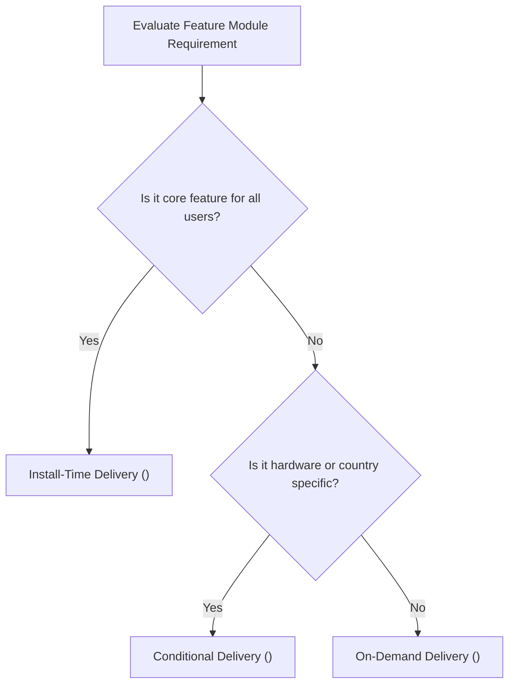

## Delivery mode는 기능 필수성, 조건, 런타임 요청으로 선택한다

### 내부 메커니즘 (Internal Mechanism)
Play Feature Delivery의 Delivery Mode는 앱 다운로드 용량 최적화와 사용자 경험을 동시에 만족하기 위해 세 가지 모드로 분류하여 결정한다:
1. **Install-Time Delivery (필수 기능)**: 모든 사용자가 최초 앱 설치 시 항상 함께 다운로드받는 모드. 초기 실행에 필수적인 핵심 모듈.
2. **Conditional Delivery (조건부 기능)**: 사용자의 국가(`user-countries`), 기기 하드웨어 특성(예: AR/VR 카메라 요구 `hardware-feature`), 또는 최소 API 레벨에 따라 자동 포함시키는 모드.
3. **On-Demand Delivery (런타임 요청 기능)**: 사용자가 특정 메뉴(예: 대용량 게임 3D 맵, 결제 모듈)를 클릭하는 시점에 Play Store 서버에서 비동기 다운로드받는 모드.



### 코드 예시 (AndroidManifest.xml)
```xml
<!-- feature/ar_camera/src/main/AndroidManifest.xml -->
<manifest xmlns:android="http://schemas.android.com/apk/res/android"
    xmlns:dist="http://schemas.android.com/apk/distribution">

    <dist:module
        dist:instant="false"
        dist:title="@string/title_ar_feature">
        <dist:delivery>
            <!-- 조건부 배포: AR 기능이 지원되는 기기 및 특정 국가에만 다운로드 -->
            <dist:conditional>
                <dist:user-countries dist:exclude="false">
                    <dist:country dist:code="US"/>
                    <dist:country dist:code="KR"/>
                </dist:user-countries>
                <dist:conditions>
                    <dist:device-feature dist:name="android.hardware.camera.ar"/>
                </dist:conditions>
            </dist:conditional>
        </dist:delivery>
        <dist:fusing dist:include="true" />
    </dist:module>
</manifest>
```

### 관측 가능 증거 (Observable Evidence)
AAB 산출물에 정의된 모듈별 배포 조건(Delivery Configuration)을 `bundletool` CLI로 검증할 수 있다:

```bash
bundletool dump manifest --bundle=app-release.aab --module=ar_camera | grep -A 5 "dist:delivery"

# Output Example:
# <dist:delivery>
#   <dist:conditional>
#     <dist:device-feature dist:name="android.hardware.camera.ar" />
#   </dist:conditional>
# </dist:delivery>
```

관련 노트: [Play Feature Delivery는 동적 기능 모듈의 설치 시점을 정한다](play-feature-delivery-controls-dynamic-feature-install-timing.md), [Play Delivery 계약](play-delivery-contracts.md)
