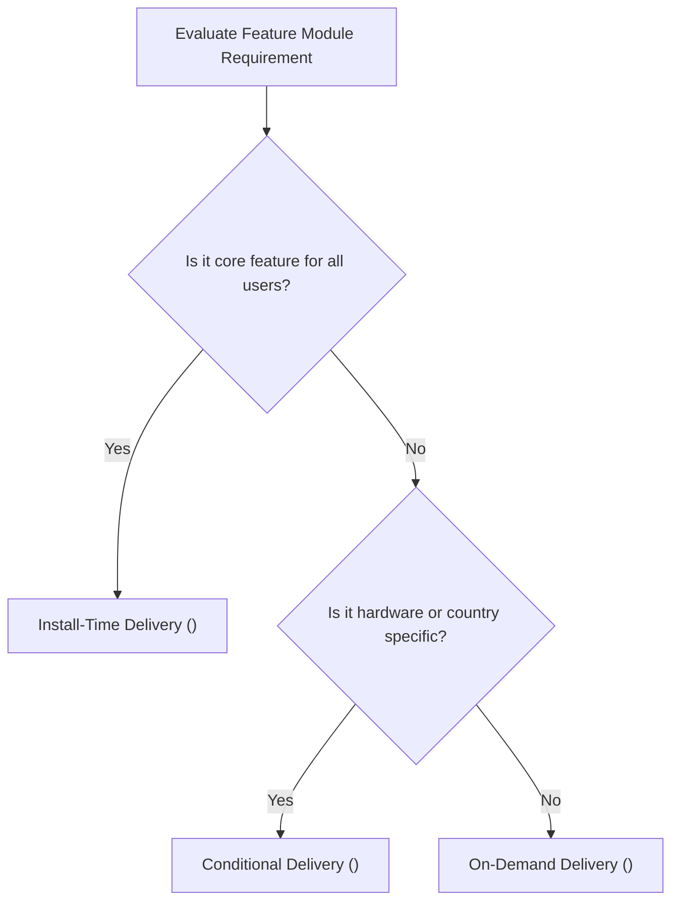

## Delivery mode는 기능 필수성, 조건, 런타임 요청으로 선택한다

### 내부 메커니즘 (Internal Mechanism)
**Play Feature Delivery(플래이 피처 딜리버리)**는 앱 전체 코드를 단일 대용량 패키지로 배포하는 대신, 기능별 모듈을 물리적으로 분리하여 용량을 최적화하고 인프라 비용을 절감하도록 돕는 프레임워크다. 독자 관점에서 각 기능 모듈의 전달 타이밍인 **Delivery Mode(배포 모드)**는 앱의 초기 다운로드 크기를 최소화하면서도 사용자 경험을 훼손하지 않도록 다음 세 가지 모드로 선택하여 설계한다:

1. **Install-Time Delivery (필수 기능 모듈)**: 사용자가 Google Play 스토어에서 앱을 처음 다운로드할 때 Base APK 세트와 함께 압축 패키징되어 즉시 동시 설치되는 모드다. 초기 실행 및 가입 흐름 등 모든 사용자에게 상시 필수적인 핵심 모듈에 적용한다.
2. **Conditional Delivery (조건부 배포 모드)**: 사용자의 국가(`user-countries`), 기기 하드웨어 센서 특성(예: AR 카메라 요구 `hardware-feature`), 또는 최소 API 레벨 조건에 발맞추어, 해당 사양을 만족하는 타겟 디바이스에만 설치 타임에 자동으로 분할 탑재시키는 모드다.
3. **On-Demand Delivery (런타임 요청 모드)**: 앱 초기 설치 시에는 포함하지 않고 사용자가 앱 실행 중 특정 기능(예: 대용량 그래픽 뷰어, 결제 샌드박스 모듈 등)을 직접 트리거하는 시점에 Google Play 서버에 비동기 네트워크 다운로드를 요청하여 로드하는 모드다.



### 코드 예시 (AndroidManifest.xml)
```xml
<!-- feature/ar_camera/src/main/AndroidManifest.xml -->
<manifest xmlns:android="http://schemas.android.com/apk/res/android"
    xmlns:dist="http://schemas.android.com/apk/distribution">

    <dist:module
        dist:instant="false"
        dist:title="@string/title_ar_feature">
        <dist:delivery>
            <!-- 조건부 배포: AR 기능이 지원되는 기기 및 특정 국가에만 다운로드 -->
            <dist:conditional>
                <dist:user-countries dist:exclude="false">
                    <dist:country dist:code="US"/>
                    <dist:country dist:code="KR"/>
                </dist:user-countries>
                <dist:conditions>
                    <dist:device-feature dist:name="android.hardware.camera.ar"/>
                </dist:conditions>
            </dist:conditional>
        </dist:delivery>
        <dist:fusing dist:include="true" />
    </dist:module>
</manifest>
```

### 관측 가능 증거 (Observable Evidence)
AAB 산출물에 정의된 모듈별 배포 조건(Delivery Configuration)을 `bundletool` CLI로 검증할 수 있다:

```bash
bundletool dump manifest --bundle=app-release.aab --module=ar_camera | grep -A 5 "dist:delivery"

# Output Example:
# <dist:delivery>
#   <dist:conditional>
#     <dist:device-feature dist:name="android.hardware.camera.ar" />
#   </dist:conditional>
# </dist:delivery>
```

관련 노트: [Play Feature Delivery는 동적 기능 모듈의 설치 시점을 정한다](play-feature-delivery-controls-dynamic-feature-install-timing.md), [Play Delivery 계약](play-delivery-contracts.md)
