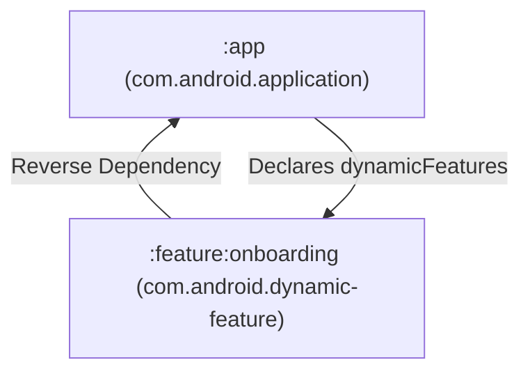

## Dynamic Feature Module은 Base 모듈에 의존하는 선택 기능 단위다

### 내부 메커니즘 (Internal Mechanism)
일반적인 Gradle 모듈 의존 관계와 달리, Dynamic Feature Module (DFM)은 **역의존성 관계(Reverse Dependency)**를 갖는다:
- **`app` (Base Module)**: `build.gradle.kts`에 `dynamicFeatures += setOf(":feature:onboarding")`를 선언한다.
- **`feature:onboarding` (DFM)**: Base 모듈인 `:app`에 의존성(`implementation(project(":app"))`)을 갖는다.
- **SplitCompat ClassLoader**: DFM 코드가 런타임에 다운로드되어 동적 탑재될 때, OS 기본 ClassLoader는 새로 로드된 APK의 DEX 클래스를 인지하지 못한다. 이를 위해 `SplitCompat.install(context)`를 애플리케이션 Context에 적용하여 ClassLoader 경로를 동적으로 병합한다.



### 코드 예시 (build.gradle.kts & SplitCompat)
```kotlin
// app/build.gradle.kts
plugins {
    id("com.android.application")
}
android {
    dynamicFeatures += setOf(":feature:onboarding")
}

// feature/onboarding/build.gradle.kts
plugins {
    id("com.android.dynamic-feature")
}
dependencies {
    implementation(project(":app"))
}

// Base Application Class
class MyBaseApplication : Application() {
    override fun attachBaseContext(base: Context) {
        super.attachBaseContext(base)
        SplitCompat.install(this) // Split ClassLoader 탑재
    }
}
```

### 관측 가능 증거 (Observable Evidence)
`bundletool` 명령을 통해 Base 모듈과 Dynamic Feature 모듈이 정상적인 Split APK 구조로 분리되어 패키징되었는지 확인할 수 있다:

```bash
bundletool build-apks --bundle=app-release.aab --output=app.apks
unzip -l app.apks | grep "splits/"

# Output Example:
# splits/base-master.apk
# splits/base-xxhdpi.apk
# splits/feature-onboarding-master.apk
```

관련 노트: [Play Feature Delivery는 동적 기능 모듈의 설치 시점을 정한다](play-feature-delivery-controls-dynamic-feature-install-timing.md), [AAB는 Play가 생성하는 APK를 위한 퍼블리싱 아티팩트다](../release-distribution-contracts/aab-is-publishing-artifact-for-play-generated-apks.md)
