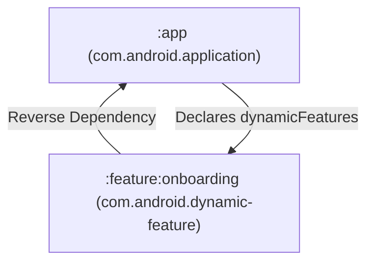

## Dynamic Feature Module은 Base 모듈에 의존하는 선택 기능 단위다

### 내부 메커니즘 (Internal Mechanism)
안드로이드의 **Dynamic Feature Module (DFM, 동적 기능 모듈)**은 앱의 초기 다운로드 용량을 줄이기 위해 특정 기능 단위를 독립된 스플릿 APK로 분리하는 구조다. 일반적인 Gradle 멀티모듈 프로젝트의 단방향 의존성 흐름과 달리 DFM은 구조적인 인과관계상 다음과 같은 특이적 메커니즘을 갖는다:

- **역의존성 관계 (Reverse Dependency)**: 일반적 모듈에서는 메인 앱 모듈이 서브 라이브러리 모듈을 참조하지만, DFM 환경에서는 서브 기능 모듈(`:feature:onboarding`)이 메인 Base 모듈(`:app`)에 대해 `implementation(project(":app"))` 의존성을 선언한다. 동시에 Base 모듈은 Gradle DSL(`dynamicFeatures += setOf(...)`)로 어떤 DFM들이 존재하는지 등록한다. 이 역구조 덕분에 DFM 내부 코드에서 Base 모듈의 공통 데이터 모델 및 디자인 시스템 리소스에 접근할 수 있게 된다.
- **ClassLoader (클래스 로더) 경로 동적 병합**: 안드로이드 OS의 기본 **ClassLoader(자바/안드로이드 바이트코드 로더)**는 앱 프로세스 시작 시 초기 설치된 DEX 파일만 메모리에 로딩한다. 런타임에 On-Demand 형태로 새 DFM APK가 새로 다운로드되면, 기존 로드된 ClassLoader는 새로 추가된 클래스를 찾지 못하고 `ClassNotFoundException`을 발생시킨다.
- **SplitCompat 라이브러리 탑재**: 이 문제를 해결하기 위해 `SplitCompat.install(context)`를 Base Application 및 Activity Context의 `attachBaseContext()` 시점에 호출한다. SplitCompat은 OS의 ClassLoader 및 AssetManager 내부 검색 경로를 런타임에 낚아채어 동적으로 다운로드된 스플릿 APK의 `.dex` 파일과 리소스 패키지 엔트리를 실시간으로 기존 ClassLoader에 합성(Inject)한다.



### 코드 예시 (build.gradle.kts & SplitCompat)
```kotlin
// app/build.gradle.kts
plugins {
    id("com.android.application")
}
android {
    dynamicFeatures += setOf(":feature:onboarding")
}

// feature/onboarding/build.gradle.kts
plugins {
    id("com.android.dynamic-feature")
}
dependencies {
    implementation(project(":app"))
}

// Base Application Class
class MyBaseApplication : Application() {
    override fun attachBaseContext(base: Context) {
        super.attachBaseContext(base)
        SplitCompat.install(this) // Split ClassLoader 탑재
    }
}
```

### 관측 가능 증거 (Observable Evidence)
`bundletool` 명령을 통해 Base 모듈과 Dynamic Feature 모듈이 정상적인 Split APK 구조로 분리되어 패키징되었는지 확인할 수 있다:

```bash
bundletool build-apks --bundle=app-release.aab --output=app.apks
unzip -l app.apks | grep "splits/"

# Output Example:
# splits/base-master.apk
# splits/base-xxhdpi.apk
# splits/feature-onboarding-master.apk
```

관련 노트: [Play Feature Delivery는 동적 기능 모듈의 설치 시점을 정한다](play-feature-delivery-controls-dynamic-feature-install-timing.md), [AAB는 Play가 생성하는 APK를 위한 퍼블리싱 아티팩트다](../release-distribution-contracts/aab-is-publishing-artifact-for-play-generated-apks.md)
