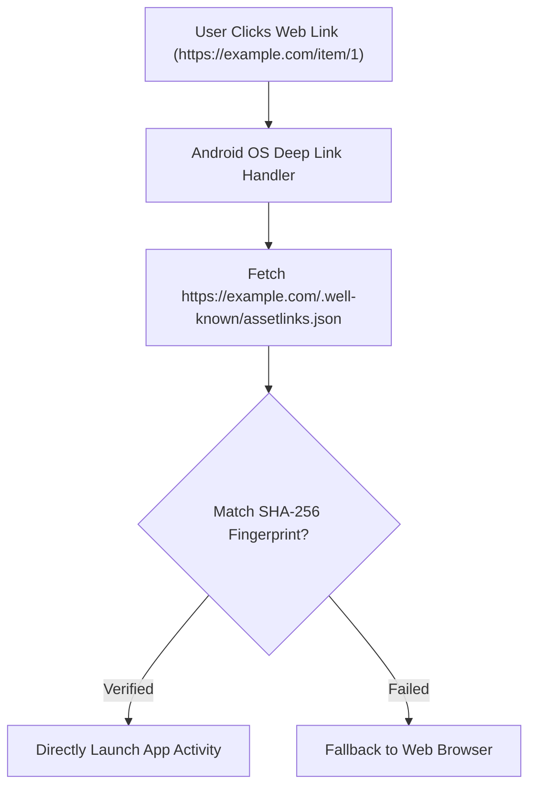

## Google Play Instant는 종료되었고 딥링크 중심 대안으로 전환한다

### 내부 메커니즘 (Internal Mechanism)
과거 앱 설치 없이 15MB 이하 가상 모듈을 즉시 실행하던 **Google Play Instant** 방식은 공식 Sunset(종료)되었으며, 현재는 **Android App Links (Verified Deep Links)** 및 경량화된 AAB 퍼블리싱 전략으로 대체되었다.
- **Android App Links (`autoVerify="true"`)**: 웹 URL (`https://example.com/product/123`)을 사용자가 클릭했을 때, 브라우저 대화상자 없이 검증된 도메인 소유권을 가진 앱이 즉시 실행된다.
- **Asset Links Verification**: 웹 서버의 `/.well-known/assetlinks.json` 파일에 지정된 앱 서명 키 핑거프린트(SHA-256)를 OS가 검증하여 보안 딥링크를 수립한다.



### 코드 예시 (AndroidManifest.xml & assetlinks.json)
```xml
<!-- AndroidManifest.xml -->
<activity android:name=".ProductDetailActivity" android:exported="true">
    <intent-filter android:autoVerify="true">
        <action android:name="android.intent.action.VIEW" />
        <category android:name="android.intent.category.DEFAULT" />
        <category android:name="android.intent.category.BROWSABLE" />

        <data
            android:scheme="https"
            android:host="example.com"
            android:pathPrefix="/product" />
    </intent-filter>
</activity>
```

```json
// https://example.com/.well-known/assetlinks.json
[{
  "relation": ["delegate_permission/common.handle_all_urls"],
  "target": {
    "namespace": "android_app",
    "package_name": "com.example.app",
    "sha256_cert_fingerprints": ["A1:B2:C3:D4:E5:F6:..."]
  }
}]
```

### 관측 가능 증거 (Observable Evidence)
Android ADB 명령으로 앱의 App Link 도메인 검증 상태를 직접 확인할 수 있다:

```bash
adb shell pm get-app-links com.example.app

# Output Example:
# com.example.app:
#   ID: 1a2b3c
#   Signatures: [A1:B2:C3...]
#   Domain verification state:
#     example.com: verified
```

관련 노트: [Delivery mode는 기능 필수성, 조건, 런타임 요청으로 선택한다](delivery-mode-is-selected-by-necessity-condition-and-runtime-request.md), [Play Delivery 계약](play-delivery-contracts.md)
