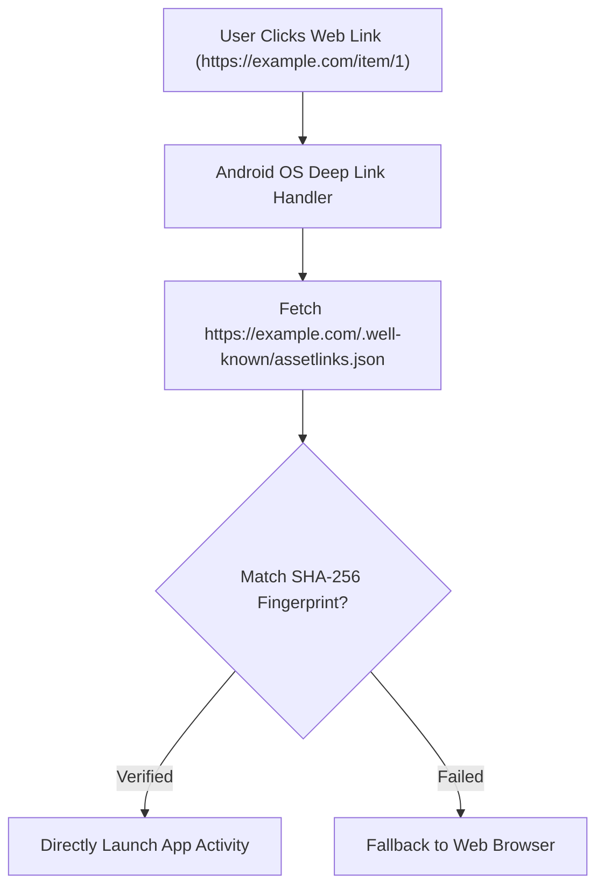

## Google Play Instant는 종료되었고 딥링크 중심 대안으로 전환한다

### 내부 메커니즘 (Internal Mechanism)
과거 앱을 설치하지 않고 스토어 상에서 15MB 이하의 가상 모듈을 즉시 실행하던 **Google Play Instant** 메커니즘은 보안 및 플랫폼 표준화에 따라 공식 Sunset(종료)되었다. 구글은 이를 웹과 앱의 심리스한 전환을 보장하는 **Android App Links (검증된 딥링크)** 및 AAB 기기 맞춤형 경량화 배포 아키텍처로 일원화하였다.

- **Android App Links (`autoVerify="true"`)**: 웹 URL(`https://example.com/product/123`)을 사용자가 웹 브라우저, 문자, 메시저 등에서 클릭했을 때 "어떤 앱으로 열 것인가"를 묻는 OS 선택 다이얼로그(Disambiguation Dialog) 없이, 도메인 소유권이 입증된 앱 액티비티를 OS 수준에서 무조건 즉시 실행시키는 표준 보안 딥링크 프로토콜이다.
- **Asset Links Verification (`assetlinks.json`)**: 웹 도메인과 앱 간의 암호학적 신뢰 사슬을 형성하는 절차다. 앱 배포자는 자사 웹 서버의 표준 HTTPS 경로(`https://example.com/.well-known/assetlinks.json`)에 앱의 빌드 서명 키 **SHA-256(256비트 보안 해시 알고리즘)** 핑거프린트와 패키지명을 기술한다. 안드로이드 OS는 앱 설치 또는 업데이트 시 해당 웹 서버로 HTTPS 통신을 수행하여 JSON 메타데이터와 설치된 앱의 인증서를 대조 verification 하고 검증 성공 시 앱 링크 자동 연결 승인을 확정한다.



### 코드 예시 (AndroidManifest.xml & assetlinks.json)
```xml
<!-- AndroidManifest.xml -->
<activity android:name=".ProductDetailActivity" android:exported="true">
    <intent-filter android:autoVerify="true">
        <action android:name="android.intent.action.VIEW" />
        <category android:name="android.intent.category.DEFAULT" />
        <category android:name="android.intent.category.BROWSABLE" />

        <data
            android:scheme="https"
            android:host="example.com"
            android:pathPrefix="/product" />
    </intent-filter>
</activity>
```

```json
// https://example.com/.well-known/assetlinks.json
[{
  "relation": ["delegate_permission/common.handle_all_urls"],
  "target": {
    "namespace": "android_app",
    "package_name": "com.example.app",
    "sha256_cert_fingerprints": ["A1:B2:C3:D4:E5:F6:..."]
  }
}]
```

### 관측 가능 증거 (Observable Evidence)
Android ADB 명령으로 앱의 App Link 도메인 검증 상태를 직접 확인할 수 있다:

```bash
adb shell pm get-app-links com.example.app

# Output Example:
# com.example.app:
#   ID: 1a2b3c
#   Signatures: [A1:B2:C3...]
#   Domain verification state:
#     example.com: verified
```

배경 지식: [암호화 기술 기초](../../../../../security/fundamentals/cryptography-basics.md), [HTTP 프로토콜](../../../../../computer-science/networking/http-protocol.md)

관련 노트: [Delivery mode는 기능 필수성, 조건, 런타임 요청으로 선택한다](delivery-mode-is-selected-by-necessity-condition-and-runtime-request.md), [Play Delivery 계약](play-delivery-contracts.md)
