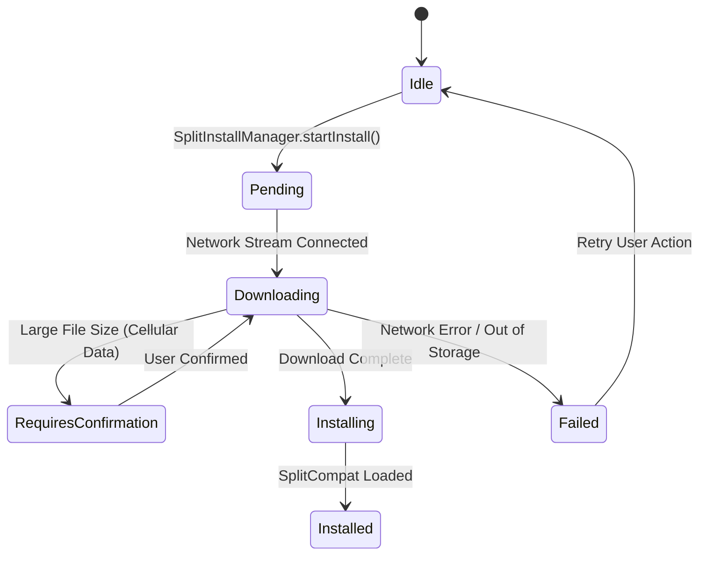

## On-demand와 conditional delivery는 설치 상태와 실패 UX를 요구한다

### 내부 메커니즘 (Internal Mechanism)
초기 앱 바이너리에 포함되지 않고 사용자 요청이나 조건에 따라 런타임에 후행 다운로드되는 **On-Demand Delivery(런타임 요청 배포)** 모듈은 네트워크 단절, 디바이스 스토리지 용량 부족, Google Play 스토어 계정 인증 실패 등 예동되지 않는 다양한 런타임 예외 노이즈에 노출된다.
따라서 클라이언트 애플리케이션은 Play Core SDK의 **SplitInstallManager(동적 모듈 설치 관리자)** 비동기 스트림 파이프라인과 상태 모니터링 이벤트 리스너인 **SplitInstallStateUpdatedListener**를 철저히 구현하여 무결한 런타임 경험을 보장해야 한다:

- **다운로드 라이프사이클 비동기 관리**: 요청 시작부터 완료까지 `PENDING`(대기) -> `DOWNLOADING`(네트워크 스트림 수신) -> `INSTALLING`(DEX/리소스 OS 검증 및 탑재) -> `INSTALLED`(SplitCompat 적용 완료) 단계의 상태 전이를 모니터링하고 진행률(Downloaded Bytes / Total Bytes)을 UI 프로그레스 바에 실시간 반영한다.
- **사용자 승인 요청 (`REQUIRES_USER_CONFIRMATION`)**: 다운로드 모듈 용량이 10MB를 초과하거나 사용자가 Wi-Fi가 아닌 셀룰러 네트워크 연결 상태일 경우, OS는 무단 데이터 소비를 막기 위해 사용자 승인 요구 상태를 반환한다. 이때 앱은 `startConfirmationDialogForResult()`를 호출하여 Play Store 표준 데이터 승인 팝업을 노출해야 한다.
- **실패 및 취소 UX 대응 (`FAILED` / `CANCELED`)**: 네트워크 손실이나 저장 공간 부족으로 설치 실패 시, 앱이 멈추거나 튕기지 않고 에러 코드를 확인하여 "네트워크 연결 재시도" 안내 버튼 및 이탈 방지 폴백 UI를 제공하도록 구현한다.



### 코드 예시 (SplitInstallManager Kotlin Implementation)
```kotlin
val splitInstallManager = SplitInstallManagerFactory.create(context)
val moduleName = "feature_onboarding"

if (splitInstallManager.installedModules.contains(moduleName)) {
    // 이미 모듈이 설치되어 있는 경우 바로 진입
    launchModuleActivity(moduleName)
} else {
    val request = SplitInstallRequest.newBuilder()
        .addModule(moduleName)
        .build()

    val listener = SplitInstallStateUpdatedListener { state ->
        when (state.status()) {
            SplitInstallSessionStatus.DOWNLOADING -> {
                val progress = (state.bytesDownloaded() * 100) / state.totalBytesToDownload()
                updateUIProgress(progress)
            }
            SplitInstallSessionStatus.INSTALLED -> {
                SplitCompat.installActivity(this)
                launchModuleActivity(moduleName)
            }
            SplitInstallSessionStatus.FAILED -> {
                showErrorDialog(errorCode = state.errorCode())
            }
        }
    }

    splitInstallManager.registerListener(listener)
    splitInstallManager.startInstall(request)
}
```

### 관측 가능 증거 (Observable Evidence)
Logcat을 통해 `SplitInstallManager`의 실시간 설치 세션 이벤트 및 진행 상태 로그를 모니터링할 수 있다:

```bash
adb logcat | grep -E "SplitInstallManager|SplitInstallListener"

# Logcat Output Example:
# D/SplitInstallManager: Status changed for session 42: DOWNLOADING (2457600 / 5120000 bytes)
# D/SplitInstallManager: Status changed for session 42: INSTALLED
```

관련 노트: [Dynamic Feature Module은 Base 모듈에 의존하는 선택 기능 단위다](dynamic-feature-module-is-optional-feature-unit-dependent-on-base.md), [Play Feature Delivery는 동적 기능 모듈의 설치 시점을 정한다](play-feature-delivery-controls-dynamic-feature-install-timing.md)
