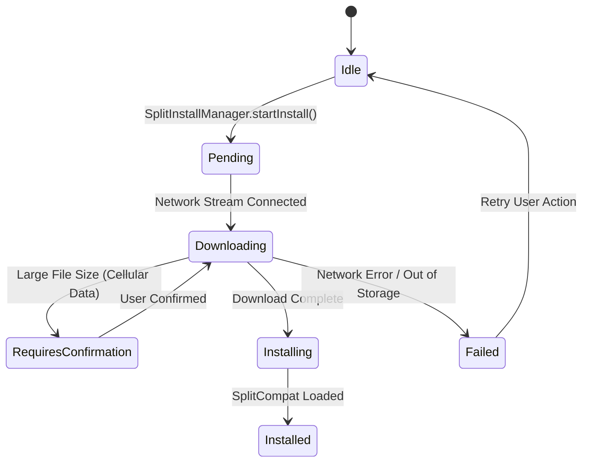

## On-demand와 conditional delivery는 설치 상태와 실패 UX를 요구한다

### 내부 메커니즘 (Internal Mechanism)
런타임에 동적으로 다운로드되는 On-demand 모듈은 네트워크 단절, 스토리지 부족, Play Store 인증 실패 등 다양한 런타임 예외가 발생할 수 있다.
따라서 `SplitInstallManager` 비동기 다운로드 파이프라인과 상태 모니터링 이벤트 리스너(`SplitInstallStateUpdatedListener`)를 구현해야 한다.
- **다운로드 상태 비동기 관리**: `PENDING` -> `DOWNLOADING` -> `INSTALLING` -> `INSTALLED`.
- **사용자 승인 요청 (`REQUIRES_USER_CONFIRMATION`)**: 다운로드 용량이 10MB 이상이거나 셀룰러 데이터 사용 시 Play Store 승인 UI 다이얼로그를 호출해야 한다.
- **실패 UX 핸들링**: `FAILED` 및 `CANCELED` 상태 발생 시 재시도 버튼 및 프로그레스 바 UX를 비동기 갱신한다.



### 코드 예시 (SplitInstallManager Kotlin Implementation)
```kotlin
val splitInstallManager = SplitInstallManagerFactory.create(context)
val moduleName = "feature_onboarding"

if (splitInstallManager.installedModules.contains(moduleName)) {
    // 이미 모듈이 설치되어 있는 경우 바로 진입
    launchModuleActivity(moduleName)
} else {
    val request = SplitInstallRequest.newBuilder()
        .addModule(moduleName)
        .build()

    val listener = SplitInstallStateUpdatedListener { state ->
        when (state.status()) {
            SplitInstallSessionStatus.DOWNLOADING -> {
                val progress = (state.bytesDownloaded() * 100) / state.totalBytesToDownload()
                updateUIProgress(progress)
            }
            SplitInstallSessionStatus.INSTALLED -> {
                SplitCompat.installActivity(this)
                launchModuleActivity(moduleName)
            }
            SplitInstallSessionStatus.FAILED -> {
                showErrorDialog(errorCode = state.errorCode())
            }
        }
    }

    splitInstallManager.registerListener(listener)
    splitInstallManager.startInstall(request)
}
```

### 관측 가능 증거 (Observable Evidence)
Logcat을 통해 `SplitInstallManager`의 실시간 설치 세션 이벤트 및 진행 상태 로그를 모니터링할 수 있다:

```bash
adb logcat | grep -E "SplitInstallManager|SplitInstallListener"

# Logcat Output Example:
# D/SplitInstallManager: Status changed for session 42: DOWNLOADING (2457600 / 5120000 bytes)
# D/SplitInstallManager: Status changed for session 42: INSTALLED
```

관련 노트: [Dynamic Feature Module은 Base 모듈에 의존하는 선택 기능 단위다](dynamic-feature-module-is-optional-feature-unit-dependent-on-base.md), [Play Feature Delivery는 동적 기능 모듈의 설치 시점을 정한다](play-feature-delivery-controls-dynamic-feature-install-timing.md)
