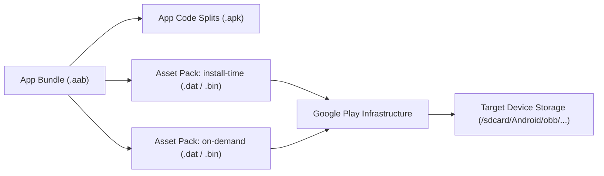

## Play Asset Delivery는 코드가 아니라 대용량 asset pack을 전달한다

### 내부 메커니즘 (Internal Mechanism)
Play Asset Delivery (PAD)는 게임 앱이나 그래픽 집약적 앱의 150MB 초과 대용량 에셋(3D 모델, 텍스처 파일, 사운드 팩 등)을 효율적으로 분할 전달하기 위한 전용 아키텍처다.
- **바이너리 코드 전무**: Asset Pack은 `.dex`나 코드 파일을 일체 포함하지 않으며 오직 에셋 데이터 리소스만 포함한다.
- **배포 모드 세 가지**:
  1. `install-time`: 앱 다운로드 시 함께 압축 설치 (asset pack 개별 최대 1.5GB, install-time asset pack 전체 합산 최대 4GB).
  2. `fast-follow`: 앱 최초 설치 직후 배경에서 자동 다운로드.
  3. `on-demand`: 실행 중 필요할 때 `AssetPackManager`로 비동기 다운로드.



### 코드 예시 (build.gradle.kts & AssetPackManager)
```kotlin
// asset_pack/build.gradle.kts
plugins {
    id("com.android.asset-pack")
}

assetPack {
    packName = "high_res_textures"
    dynamicDelivery {
        deliveryMode = "on-demand"
    }
}

// Kotlin Code
val assetPackManager = AssetPackManagerFactory.getInstance(context)
assetPackManager.fetch(listOf("high_res_textures"))
    .addOnSuccessListener { state ->
        val assetPath = assetPackManager.getAssetPackPath("high_res_textures")
        loadTexturesFromPath(assetPath)
    }
```

### 관측 가능 증거 (Observable Evidence)
에셋 팩이 다운로드되어 디바이스에 파일 형태로 저장되었는지 ADB 커맨드로 파일 경로를 직접 확인할 수 있다:

```bash
adb shell ls -la /sdcard/Android/data/com.example.app/files/assetpacks/high_res_textures/

# Output Example:
# -rw-rw---- 1 u0_a145 u0_a145 154820120 Aug 04 15:00 textures_4k.dat
```

관련 노트: [Delivery mode는 기능 필수성, 조건, 런타임 요청으로 선택한다](delivery-mode-is-selected-by-necessity-condition-and-runtime-request.md), [Play Delivery 계약](play-delivery-contracts.md)
