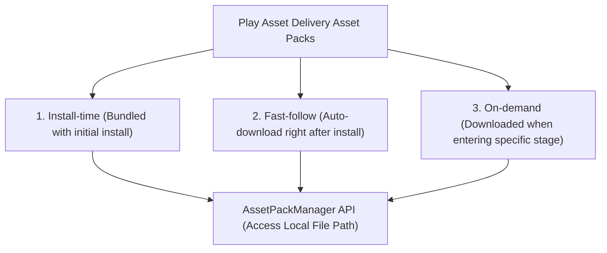

## Play asset delivery는 코드가 아닌 대용량 아셋 팩을 전달한다

상위 문서: [Play Delivery 계약](play-delivery-contracts.md)

### 개념 및 필요성 (What & Why)
**Play Asset Delivery(PAD)** 는 게임 앱의 3D 텍스처, 렌더링 맵, 튜토리얼 음성 파일 등 **코드가 아닌 대용량 바이너리 아셋 팩(Asset Packs - 개별 최대 2GB 이상)** 을 Google Play CDN을 통해 사용자에게 동적으로 배포하는 솔루션이다.
과거 게임 개발사들은 150MB APK 제한을 넘기 위해 별도의 자체 CDN 서드파티 서버를 구축하고 OBB(Opaque Binary Blob) 파일 다운로더를 구현하는 고비용의 유지보수 부담을 안고 있었다.
PAD는 Google Play 호스팅 및 델타 업데이트를 무료 활용하여 대용량 리소스를 안전하게 배포한다.

### 내부 메커니즘 (Internal Mechanism)
**PAD의 3대 아셋 팩 배포 모드**:
1. **Install-Time Asset Pack**: 앱 다운로드 시 AAB와 함께 통합 다운로드되는 아셋 (최대 1GB).
2. **Fast-Follow Asset Pack**: 앱 설치 직후 백그라운드에서 자동으로 이어서 다운로드 시작 (최대 512MB).
3. **On-Demand Asset Pack**: 앱 실행 중 사용자가 특정 스테이지/맵 진입 시 런타임에 동적 다운로드.



### 코드 예시 (AssetPackManager Integration)
```kotlin
// AssetPackHelper.kt
val assetPackManager = AssetPackManagerFactory.getInstance(context)

// On-Demand 아셋 팩 다운로드 요청
assetPackManager.fetch(listOf("level_2_textures"))
    .addOnSuccessListener { state ->
        val assetPath = assetPackManager.getAssetPackPath("level_2_textures")
        println("Asset Pack Available at: $assetPath")
    }
```

### 관측 가능 증거 (Observable Evidence)
아셋 팩 구조 및 로컬 파일 시스템 매핑 위치는 `AssetPackManager.getAssetPackPath()` 경로 스캔으로 관측할 수 있다.

관련 노트: [Play feature delivery는 동적 기능 설치 시점을 제어한다](play-feature-delivery-controls-dynamic-feature-install-timing.md), [Play Delivery 계약](play-delivery-contracts.md)
