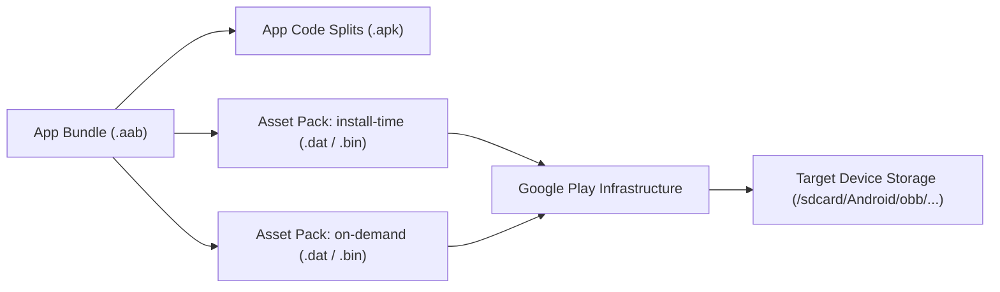

## Play Asset Delivery는 코드가 아니라 대용량 asset pack을 전달한다

### 내부 메커니즘 (Internal Mechanism)
**Play Asset Delivery (PAD, 플래이 에셋 딜리버리)**는 고사양 3D 게임이나 대용량 미디어 앱에서 150MB를 초과하는 대용량 에셋(고해상도 텍스처 패키지, 사운드트랙 데이터, 3D 모델 파일 등)을 Google Play CDN 인프라를 활용하여 최적화하여 분할 전송하는 아키텍처다.

- **바이너리 실행 코드 완전 전무**: **Asset Pack(에셋 팩)**은 executable 코드인 `.dex` 바이너리나 컴파일된 자바/코틀린 클래스를 일절 포함하지 않으며 오직 읽기 전용 미디어 데이터 리소스 파일(`assets/`)로만 구성된다.
- **유연한 세 가지 전달 유형**:
  1. `install-time`: 앱 최초 설치 시 APK와 함께 스토어에서 통합 다운로드되는 방식 (개별 에셋 팩 최대 1.5GB, install-time 에셋 팩 총 합산 최대 4GB 지원).
  2. `fast-follow`: 앱 메인 설치 완료 직후, 사용자가 앱을 여는 동안 구글 플레이 서비스가 백그라운드에서 즉시 잇달아 다운로드를 수행하는 방식.
  3. `on-demand`: 사용자가 해당 맵이나 리소스가 필요한 게임 챕터에 진입하는 순간 `AssetPackManager` API를 호출하여 비동기 다운로드 후 파일 경로(`getAssetPackPath`)를 반환받아 사용되는 방식.



### 코드 예시 (build.gradle.kts & AssetPackManager)
```kotlin
// asset_pack/build.gradle.kts
plugins {
    id("com.android.asset-pack")
}

assetPack {
    packName = "high_res_textures"
    dynamicDelivery {
        deliveryMode = "on-demand"
    }
}

// Kotlin Code
val assetPackManager = AssetPackManagerFactory.getInstance(context)
assetPackManager.fetch(listOf("high_res_textures"))
    .addOnSuccessListener { state ->
        val assetPath = assetPackManager.getAssetPackPath("high_res_textures")
        loadTexturesFromPath(assetPath)
    }
```

### 관측 가능 증거 (Observable Evidence)
에셋 팩이 다운로드되어 디바이스에 파일 형태로 저장되었는지 ADB 커맨드로 파일 경로를 직접 확인할 수 있다:

```bash
adb shell ls -la /sdcard/Android/data/com.example.app/files/assetpacks/high_res_textures/

# Output Example:
# -rw-rw---- 1 u0_a145 u0_a145 154820120 Aug 04 15:00 textures_4k.dat
```

관련 노트: [Delivery mode는 기능 필수성, 조건, 런타임 요청으로 선택한다](delivery-mode-is-selected-by-necessity-condition-and-runtime-request.md), [Play Delivery 계약](play-delivery-contracts.md)
