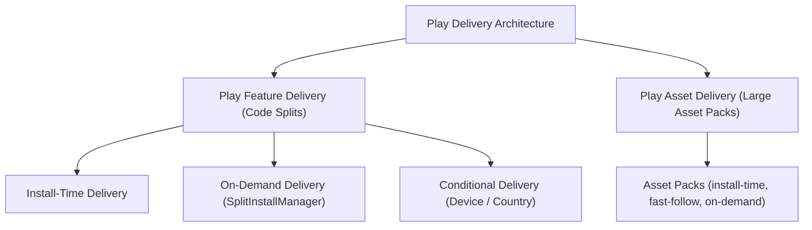

## Play Delivery 계약

이 지도는 Dynamic Feature Module, Play Feature Delivery (Install-time, On-demand, Conditional), Play Asset Delivery (PAD), Google Play Instant 대체 딥링크 흐름, 그리고 테스트/운영 검증 계약을 다룬다.



### 정본 노트
- [Dynamic Feature Module은 Base 모듈에 의존하는 선택 기능 단위다](dynamic-feature-module-is-optional-feature-unit-dependent-on-base.md)
- [Play Feature Delivery는 동적 기능 모듈의 설치 시점을 정한다](play-feature-delivery-controls-dynamic-feature-install-timing.md)
- [Delivery mode는 기능 필수성, 조건, 런타임 요청으로 선택한다](delivery-mode-is-selected-by-necessity-condition-and-runtime-request.md)
- [On-demand와 conditional delivery는 설치 상태와 실패 UX를 요구한다](on-demand-and-conditional-delivery-require-install-state-and-failure-ux.md)
- [Play Asset Delivery는 코드가 아니라 대용량 asset pack을 전달한다](play-asset-delivery-delivers-large-asset-packs-not-code.md)
- [Google Play Instant는 종료되었고 딥링크 중심 대안으로 전환한다](google-play-instant-is-sunset-and-replaced-by-deeplink-install-flows.md)
- [Play Delivery 운영은 UX, 테스트, Play 설치 경로를 함께 검증한다](play-delivery-operations-validate-ux-testing-and-play-install-path.md)

관련 지도: [Gradle 빌드 계약](../../build/gradle/gradle-build-contracts/gradle-build-contracts.md), [Play 릴리스와 배포 계약](../release-distribution-contracts/release-distribution-contracts.md)

### 관측 가능 증거 (Observable Evidence)
```bash
# bundletool을 활용한 로컬 스플릿 APK 추출 및 가상 설치 테스트
bundletool build-apks --bundle=app-release.aab --output=app.apks --local-testing
bundletool install-apks --apks=app.apks
```
