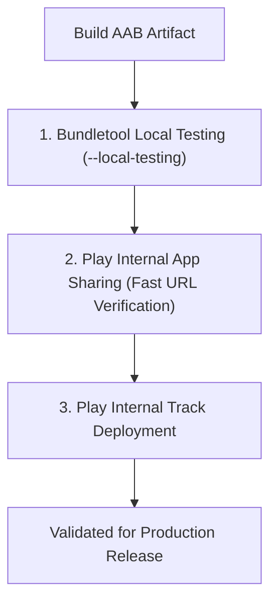

## Play Delivery 운영은 UX, 테스트, Play 설치 경로를 함께 검증한다

### 내부 메커니즘 (Internal Mechanism)
동적 기능 배포(Dynamic Delivery) 메커니즘은 로컬 개발 환경과 Google Play 인프라 서버가 유기적으로 연동되어 동작하므로, 프로덕션 상용 배포 전 다음의 세 단계 검증 경로(Verification Pipeline)를 순차적으로 통과하며 UX 안정성을 파악해야 한다:

1. **Local Testing (`--local-testing`)**: Play Store 서버 통신을 의도적으로 에뮬레이션하기 위해 **`FakeSplitInstallManager`** 클래스 또는 **`bundletool --local-testing`** 플래그를 활용한다. 네트워크 통신 없이 기기/에뮬레이터의 로컬 스토리지에 저장된 모듈 APK를 기반으로 비동기 다운로드 상태 변화 및 UI 프로그레스 바 작동, 에러 핸들링 로직을 개발 초기 빠른 피드백 루프로 검증한다.
2. **Internal App Sharing (내부 앱 공유)**: 개발된 AAB 산출물을 Play Console 내부 앱 공유 전용 수초 생성을 거쳐 고유 렌더링 URL로 발행한다. 스토어 검수 절차 및 버전 코드 규칙 제약 없이, 실제 디바이스의 Play Store 앱 클라이언트가 구글 CDN 인프라로부터 스플릿 APK를 다운로드하고 탑재하는 프로덕션 동일 인프라 흐름을 즉시 실기기 테스트한다.
3. **Play Console Internal Track (내부 테스트 트랙)**: 최대 100명의 사내 지정 테스터 집단에게 배포하여 스토어 내부 정책, 구글 플레이 라이선스 API, 그리고 인앱 결제 연동 무결성을 통합 동결 검증한다.



### 코드 예시 (Bundletool Local Testing Execution Script)
```bash
#!/usr/bin/env bash

# 1. AAB 산출물로부터 APKS 파일 생성 (로컬 테스트 플래그 지정)
bundletool build-apks   --bundle=app/build/outputs/bundle/release/app-release.aab   --output=app-release.apks   --local-testing

# 2. 에뮬레이터 또는 유선 연결 기기에 APK 패키지 설치
bundletool install-apks --apks=app-release.apks
```

### 관측 가능 증거 (Observable Evidence)
로컬 테스트 모드가 활성화된 상태에서 모듈 동적 요청 시, 로컬 mock 경로에서 스플릿 APK가 인스톨되는 디버그 로그를 관측할 수 있다:

```bash
adb logcat | grep -i "FakeSplitInstallManager"

# Logcat Output Example:
# I/FakeSplitInstallManager: Splitting and extracting APK for module: feature_onboarding
# I/FakeSplitInstallManager: Successfully copied local split APK to app data directory.
```

관련 노트: [내부 앱 공유는 릴리스 트랙이 아니라 빠른 아티팩트 공유다](../release-distribution-contracts/internal-app-sharing-is-fast-artifact-sharing-not-release-track.md), [Play Delivery 계약](play-delivery-contracts.md)
