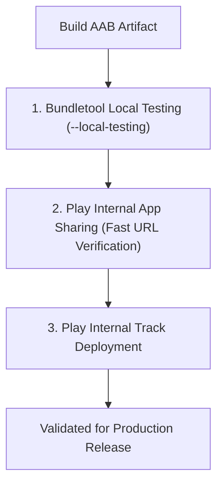

## Play Delivery 운영은 UX, 테스트, Play 설치 경로를 함께 검증한다

### 내부 메커니즘 (Internal Mechanism)
Dynamic Delivery가 정상 동작하기 위해서는 개발 및 QA 단계에서 세 가지 검증 경로(Verification Paths)를 차례로 거쳐야 한다:
1. **Local Testing (`--local-testing`)**: `FakeSplitInstallManager` 또는 `bundletool --local-testing` 옵션을 활용하여 Google Play 서버 연결 없이 기기 내부 로컬 스토리지에서 에뮬레이트된 다운로드 및 모듈 설치 흐름을 검증한다.
2. **Internal App Sharing (내부 앱 공유)**: Play Console 내부 앱 공유 전용 URL을 생성하여 실제 Play Store 클라이언트가 스플릿 APK를 다운로드하고 설치하는 프로덕션 동일 파이프라인을 검증한다.
3. **Play Console Internal Track**: 알파/베타 트랙 이전에 내부 검증 트랙에 퍼블리싱하여 권한 및 라이선스 정책을 최종 확인한다.



### 코드 예시 (Bundletool Local Testing Execution Script)
```bash
#!/usr/bin/env bash

# 1. AAB 산출물로부터 APKS 파일 생성 (로컬 테스트 플래그 지정)
bundletool build-apks   --bundle=app/build/outputs/bundle/release/app-release.aab   --output=app-release.apks   --local-testing

# 2. 에뮬레이터 또는 유선 연결 기기에 APK 패키지 설치
bundletool install-apks --apks=app-release.apks
```

### 관측 가능 증거 (Observable Evidence)
로컬 테스트 모드가 활성화된 상태에서 모듈 동적 요청 시, 로컬 mock 경로에서 스플릿 APK가 인스톨되는 디버그 로그를 관측할 수 있다:

```bash
adb logcat | grep -i "FakeSplitInstallManager"

# Logcat Output Example:
# I/FakeSplitInstallManager: Splitting and extracting APK for module: feature_onboarding
# I/FakeSplitInstallManager: Successfully copied local split APK to app data directory.
```

관련 노트: [내부 앱 공유는 릴리스 트랙이 아니라 빠른 아티팩트 공유다](../release-distribution-contracts/internal-app-sharing-is-fast-artifact-sharing-not-release-track.md), [Play Delivery 계약](play-delivery-contracts.md)
