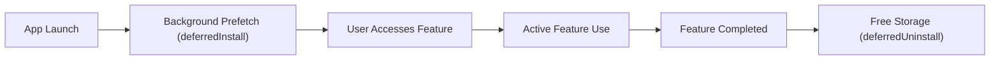

## Play Feature Delivery는 동적 기능 모듈의 설치 시점을 정한다

### 내부 메커니즘 (Internal Mechanism)
**Play Feature Delivery(플래이 피처 딜리버리)**는 동적 모듈의 다운로드뿐만 아니라, 모듈이 앱 내부에서 소비되는 사용 라이프사이클(Lifecycle Timing)에 맞춰 설치 및 삭제 시점을 동적으로 제어함으로써 사용자의 네트워크와 디바이스 스토리지를 능동 관리한다:

1. **Pre-fetching / Background Install (사전 다운로드)**: 사용자가 특정 메뉴에 진입할 확률이 높은 타이밍(예: 메인 대시보드 로딩 직후 유휴 시간)에 미리 백그라운드 다운로드를 트리거하여, 실제 클릭 시점의 대기 시간을 제어로 감소시키는 사전 탑재 패턴이다.
2. **Deferred Installation (`deferredInstall`, 지연 설치 예약)**: 지금 당장 사용자 화면에 팝업을 띄워 흐름을 방해하지 않고, 디바이스가 Wi-Fi 네트워크에 연결되고 화면이 꺼진 유휴(Idle) 상태일 때 Google Play 서비스가 백그라운드에서 동적 모듈을 다운로드하고 설치하도록 시스템에 작업을 예약하는 메커니즘이다.
3. **Deferred Uninstallation (`deferredUninstall`, 지연 삭제 요청)**: 이벤트 등록, 튜토리얼, 연말정산 모듈 등 일회성으로 사용이 완료된 동적 기능 모듈을 지정하여 삭제 요청을 예약하는 기능이다. 구글 플레이 서비스는 유휴 시간에 해당 모듈의 APK 파일과 로컬 자원을 제거함으로써 디바이스의 무의미한 저장 공간 점유를 지속적으로 확보한다.



### 코드 예시 (Kotlin Implementation)
```kotlin
val splitInstallManager = SplitInstallManagerFactory.create(context)

// 1. 배경 지연 설치 예약 (Deferred Install)
splitInstallManager.deferredInstall(listOf("feature_heavy_analytics"))

// 2. 미사용 동적 모듈 제거 예약 (Deferred Uninstall)
splitInstallManager.deferredUninstall(listOf("feature_onboarding_tutorial"))
```

### 관측 가능 증거 (Observable Evidence)
Play Store 서비스가 수신한 Deferred 작업 세션 요청 로그를 ADB 관측할 수 있다:

```bash
adb logcat | grep -E "SplitInstallManager|PlayStoreService"

# Logcat Output Example:
# D/SplitInstallManager: Deferred install requested for modules: [feature_heavy_analytics]
# I/PlayStoreService: Scheduled deferred background installation task #104
```

관련 노트: [On-demand와 conditional delivery는 설치 상태와 실패 UX를 요구한다](on-demand-and-conditional-delivery-require-install-state-and-failure-ux.md), [Play Delivery 계약](play-delivery-contracts.md)
