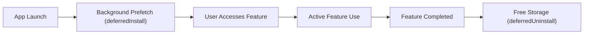

## Play Feature Delivery는 동적 기능 모듈의 설치 시점을 정한다

### 내부 메커니즘 (Internal Mechanism)
Play Feature Delivery는 앱 모듈의 라이프사이클에 맞춰 설치 및 제거 시점(Lifecycle Timing)을 동적으로 제어한다:
1. **Pre-fetching / Background Install**: 사용자가 특정 기능을 사용할 확률이 높은 시점(예: 메인 화면 진입 후 유휴 시간)에 배경에서 다운로드를 미리 시작한다.
2. **Deferred Installation (`deferredInstall`)**: 사용자의 현재 작업을 방해하지 않고 네트워크가 안정된 유휴 상태일 때 Play Store가 배경에서 설치하도록 요청을 예약한다.
3. **Deferred Uninstallation (`deferredUninstall`)**: 일회성 기능(예: 이벤트/연말 정산 모듈) 사용 완료 후 디바이스 스토리지 공간을 확보하기 위해 모듈 삭제를 예약한다.



### 코드 예시 (Kotlin Implementation)
```kotlin
val splitInstallManager = SplitInstallManagerFactory.create(context)

// 1. 배경 지연 설치 예약 (Deferred Install)
splitInstallManager.deferredInstall(listOf("feature_heavy_analytics"))

// 2. 미사용 동적 모듈 제거 예약 (Deferred Uninstall)
splitInstallManager.deferredUninstall(listOf("feature_onboarding_tutorial"))
```

### 관측 가능 증거 (Observable Evidence)
Play Store 서비스가 수신한 Deferred 작업 세션 요청 로그를 ADB 관측할 수 있다:

```bash
adb logcat | grep -E "SplitInstallManager|PlayStoreService"

# Logcat Output Example:
# D/SplitInstallManager: Deferred install requested for modules: [feature_heavy_analytics]
# I/PlayStoreService: Scheduled deferred background installation task #104
```

관련 노트: [On-demand와 conditional delivery는 설치 상태와 실패 UX를 요구한다](on-demand-and-conditional-delivery-require-install-state-and-failure-ux.md), [Play Delivery 계약](play-delivery-contracts.md)
