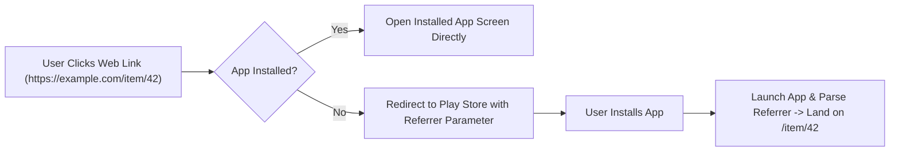

## Google Play Instant는 sunset 되었으며 딥링크 설치 흐름으로 대체된다

상위 문서: [Play Delivery 계약](play-delivery.md)

### 개념 및 필요성 (What & Why)
**Google Play Instant(구 인스턴트 앱)** 는 사용자가 앱을 스마트폰에 설치하지 않고도 웹 URL 클릭 한 번으로 앱의 특정 기능을 즉시 체험하게 해주는 기능이었다.
과거에는 독립된 Instant 전용 feature 모듈 구조를 복잡하게 구성해야 하는 높은 개발 공수가 요구되었다.
현재 구형 Google Play Instant 모듈 구조는 공식적으로 **Sunset(지원 종료 및 유지보수 이관)** 되었으며, 현대 안드로이드 생태계에서는 **표준 App Links/Deep Links 및 온디맨드 딥링크 설치 흐름(Deep-link Install Flows)** 으로 전면 대체되었다.

### 내부 메커니즘 (Internal Mechanism)
1. **구형 Instant 모듈 폐지**: `dist:instant="true"` 모듈 구조 및 용량 제한(15MB) 전용 별도 빌드 체계 대신, 표준 AAB 기반 동적 배포로 단일화함.
2. **Android App Links 기반 마찰 없는 사용자 경험**: 웹 URL 클릭 시 안드로이드 OS가 앱 설치 유무를 인지하고, 미설치 시 Play Store 설치 딥링크 패치로 자연스럽게 유도함.
3. **Play Install Referrer API 연동**: 사용자가 웹 딥링크를 눌러 앱을 설치했을 때, 설치 완료 후 딥링크 경로(예: `/products/123`)를 전달받아 해당 대상 화면으로 직접 랜딩시킴.



### 코드 예시 (App Links Intent Filter)
```xml
<!-- app/src/main/AndroidManifest.xml -->
<activity android:name=".MainActivity" android:exported="true">
    <intent-filter android:autoVerify="true">
        <action android:name="android.intent.action.VIEW" />
        <category android:name="android.intent.category.DEFAULT" />
        <category android:name="android.intent.category.BROWSABLE" />
        <data android:scheme="https" android:host="example.com" android:pathPrefix="/item" />
    </intent-filter>
</activity>
```

### 관측 가능 증거 (Observable Evidence)
딥링크 검증 및 도메인 검증 상태는 `adb` 쉘 명령으로 확인할 수 있다:
```bash
adb shell pm get-app-links com.example.myapp
```

관련 노트: [Delivery mode는 필요성, 조건, 그리고 런타임 요청으로 선택된다](play-delivery-modes.md), [Play Delivery 계약](play-delivery.md)
