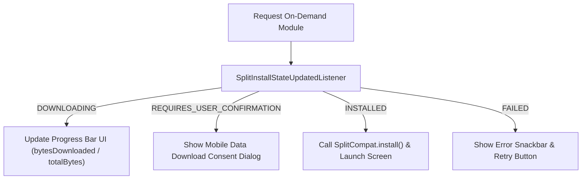

## On-demand 및 conditional delivery는 설치 상태와 실패 UX를 요구한다

상위 문서: [Play Delivery 계약](play-delivery.md)

### 개념 및 필요성 (What & Why)
온디맨드(On-Demand) 동적 모듈 및 조건부(Conditional) 모듈을 운용할 때는 다운로드 대기 시간, 모바일 셀룰러 데이터 요금 안내, 네트워크 끊김, 저장공간 부족 등 다양한 예외 상황이 발생한다.
동적 다운로드 요청 시 아무런 UI 반응이 없거나 다운로드 실패 시 앱이 무반응/크래시되면 사용자 경험이 극도로 마비된다.
반드시 **설치 상태 모니터링(`SplitInstallStateUpdatedListener`)** 과 **다운로드 용량 안내 및 네트워크 실패 UX 처리**를 완비해야 한다.

### 내부 메커니즘 (Internal Mechanism)
1. **`SplitInstallStateUpdatedListener` 상태 기계**:
   - `PENDING` $\rightarrow$ `DOWNLOADING` $\rightarrow$ `INSTALLING` $\rightarrow$ `INSTALLED` 상태 변경을 추적하고 프로그레스 바 UI를 갱신함.
2. **대용량 다운로드 모바일 데이터 승인**: 다운로드 용량이 클 경우 Google Play 표준 네트워크 승인 다이얼로그(`startConfirmationDialogForResult`)를 띄워 대용량 다운로드 동의를 구함.
3. **다운로드 실패 에러 핸들링**: `REQUIRES_USER_CONFIRMATION`, `NETWORK_ERROR`, `INSUFFICIENT_STORAGE` 에러 발생 시 재시도 버튼 및 대안 안내 화면을 제공함.



### 코드 예시 (SplitInstallManager Listener)
```kotlin
// DynamicModuleLoader.kt
val splitInstallManager = SplitInstallManagerFactory.create(context)

val listener = SplitInstallStateUpdatedListener { state ->
    when (state.status()) {
        SplitInstallSessionStatus.DOWNLOADING -> {
            val progress = (state.bytesDownloaded() * 100 / state.totalBytesToDownload()).toInt()
            println("Downloading Dynamic Module: $progress%")
        }
        SplitInstallSessionStatus.INSTALLED -> {
            println("Dynamic Module Installed Successfully!")
        }
        SplitInstallSessionStatus.FAILED -> {
            println("Download Failed Error Code: ${state.errorCode()}")
        }
    }
}

splitInstallManager.registerListener(listener)
```

### 관측 가능 증거 (Observable Evidence)
설치 상태 수신기 동작은 `FakeSplitInstallManager`를 이용한 유닛 테스트로 관측 가능하다.

관련 노트: [Play feature delivery는 동적 기능 설치 시점을 제어한다](play-feature-delivery.md), [Play Delivery 계약](play-delivery.md)
