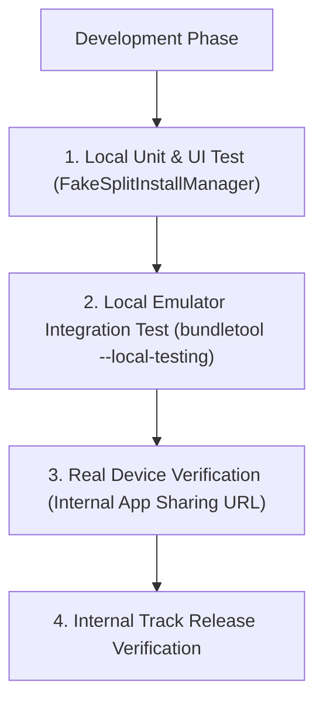

## Play delivery 검증은 UX, 테스트, 그리고 Play 설치 경로를 확인한다

상위 문서: [Play Delivery 계약](play-delivery.md)

### 개념 및 필요성 (What & Why)

Play Feature Delivery(PFD) 및 Play Asset Delivery(PAD)를 적용한 앱을 개발할 때, 개발자 머신에서 에뮬레이터에 `adb install` 로 직포맷 설치하면 Play Store 서버와의 통신 채널이 없어 동적 모듈 다운로드가 정상 동작하지 않는다.

**Play Delivery 검증 체계**는 개발 단계의 **`FakeSplitInstallManager` 로컬 테스트**와 실제 Play Console 인프라의 **Internal App Sharing / Internal Track 검증**을 단계별로 연결하여 동적 배포의 UX 및 설치 경로를 정밀 검증하는 운용 규약이다.

### 내부 메커니즘 (Internal Mechanism)
1. **Local Testing (`FakeSplitInstallManager`)**:
   - Play Store 서버 통신을 에뮬레이트하여 로컬 디스크의 AAB/APK 분할 아티팩트를 흉내 냄.
   - 로컬 유닛 테스트 및 UI 자동화 계측 테스트에서 즉시 설치 성공/실패 시나리오를 시뮬레이션함.
2. **Internal App Sharing 검증**: AAB 를 올리고 실제 디바이스에서 동적 모듈 다운로드 시 프로그레스 바 UI 및 네트워크 승인 팝업 동작을 수초 만에 정밀 검증함.
3. **`bundletool build-apks --local-testing`**: 로컬 에뮬레이터 환경에서 Play Store 없이 동적 모듈 다운로드 흐름을 검증할 수 있는 디버그 APK 세트 생성.



### 코드 예시 (FakeSplitInstallManager Integration)
```kotlin
// TestModule.kt (테스트 환경 DI 바인딩)
val fakeSplitInstallManager = FakeSplitInstallManager(context)

// 로컬 테스트용 모듈 파일 위치 지정
fakeSplitInstallManager.setKitsDirectories(listOf(File("/sdcard/local_testing_apks")))

// 동적 모듈 다운로드 시뮬레이션 실행
fakeSplitInstallManager.startInstall(
    SplitInstallRequest.newBuilder().addModule("features_ar_camera").build()
)
```

### 관측 가능 증거 (Observable Evidence)

로컬 테스트용 APK 세트 생성 및 디바이스 설치 테스트는 `bundletool` 로 관측할 수 있다:

```bash
bundletool build-apks --bundle=app-release.aab --output=local_test.apks --local-testing
bundletool install-apks --apks=local_test.apks
```

관련 노트: [On-demand 및 conditional delivery는 설치 상태와 실패 UX를 요구한다](on-demand-conditional-delivery.md), [Play Delivery 계약](play-delivery.md)
