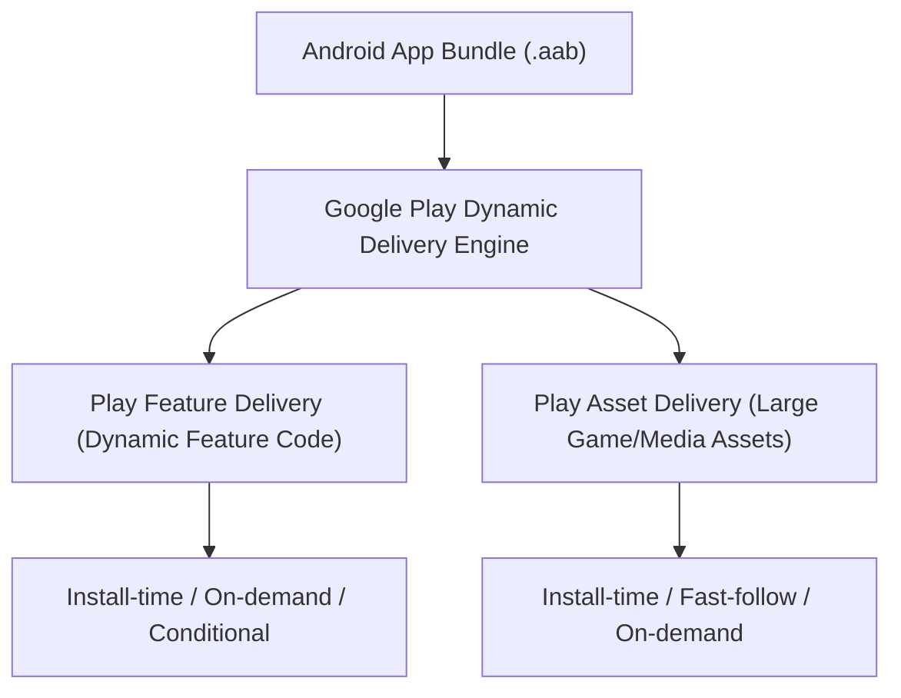

## Play Delivery 계약

상위 문서: [Android 패키징과 배포 지도](../../android-packaging-deployment.md)

### 개념 및 필요성 (What & Why)
**Play Delivery 계약(Play Delivery Contracts)** 은 Google Play의 동적 배포 엔진(Dynamic Delivery Engine)을 기반으로 앱 소스 코드 및 대용량 아셋(Asset)의 다운로드 시점을 유연하게 제어하는 기술 명세이다.
모든 기능 코드와 리소스를 초기 설치 시점에 몽땅 다운로드받게 만들면 앱 용량이 수백 MB로 커져 사용자 설치 이탈률(Drop-off Rate)이 급증한다.
Play Feature Delivery(PFD)와 Play Asset Delivery(PAD)를 통해 필요한 기능과 대용량 3D/게임 리소스를 동적으로 분율 다운로드하도록 설계한다.

### 내부 메커니즘 (How / Internal Mechanism)
1. **Play Feature Delivery (PFD)**: Dynamic Feature Module(DFM)을 구성하여 설치 시점(Install-time), 사용자 동적 요청 시점(On-demand), 또는 조건부(Conditional: 국가, HW 사양, API 레벨)로 코드를 분할 설치한다.
2. **Play Asset Delivery (PAD)**: 코드가 아닌 대용량 게임/미디어 아셋(최대 2GB 이상)을 `install-time`, `fast-follow`, `on-demand` 모드로 전달한다.
3. **SplitInstallManager API**: 런타임에 동적 모듈 다운로드 상태를 감지하고, 네트워크 확인 팝업 및 진행률 UI를 표시한다.
4. **Google Play Instant 진화**: 과거 독립된 Instant 앱 모듈 방식이 Sunset되고, 딥링크 기반 동적 설치 흐름으로 통합되었다.



### 관련 세부 계약 문서
1. [Dynamic feature module은 base에 의존하는 선택적 기능 단위다](dynamic-feature-module-is-optional-feature-unit-dependent-on-base.md)
2. [Play feature delivery는 동적 기능 설치 시점을 제어한다](play-feature-delivery-controls-dynamic-feature-install-timing.md)
3. [Delivery mode는 필요성, 조건, 그리고 런타임 요청으로 선택된다](delivery-mode-is-selected-by-necessity-condition-and-runtime-request.md)
4. [Play asset delivery는 코드가 아닌 대용량 아셋 팩을 전달한다](play-asset-delivery-delivers-large-asset-packs-not-code.md)
5. [On-demand 및 conditional delivery는 설치 상태와 실패 UX를 요구한다](on-demand-and-conditional-delivery-require-install-state-and-failure-ux.md)
6. [Google Play Instant는 sunset 되었으며 딥링크 설치 흐름으로 대체된다](google-play-instant-is-sunset-and-replaced-by-deeplink-install-flows.md)
7. [Play delivery 검증은 UX, 테스트, 그리고 Play 설치 경로를 확인한다](play-delivery-operations-validate-ux-testing-and-play-install-path.md)

### 관측 가능 증거 (Observable Evidence)
동적 모듈 분판 아티팩트 구조는 `bundletool` 및 `FakeSplitInstallManager`로 관측할 수 있다:
```bash
bundletool build-apks --bundle=app-release.aab --output=app.apks
```
