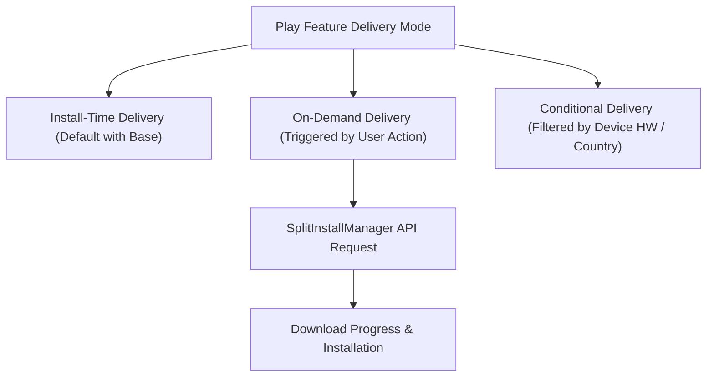

## Play feature delivery 는 동적 기능 설치 시점을 제어한다

상위 문서: [Play Delivery 계약](play-delivery.md)

### 개념 및 필요성 (What & Why)

**Play Feature Delivery(PFD)** 는 Dynamic Feature Module(DFM)이 사용자 디바이스에 다운로드되고 설치되는 **타이밍(Install Timing)** 을 제어하는 배포 메커니즘이다.

모든 사용자가 사용하지 않는 특수 기능(예: 특정 신분증 스캔 기능, 고급 영상 편집기)을 첫 앱 다운로드 시점에 포함하면 초기 설치 용량이 늘어나 이탈률이 증가한다.

PFD 를 통해 설치 시점(Install-time), 사용자 요청 시점(On-demand), 하드웨어/국가 조건 시점(Conditional)을 자유롭게 조합할 수 있다.

### 내부 메커니즘 (Internal Mechanism)
1. **Install-Time Delivery (설치 시점)**: 앱 초기 다운로드 시 Base APK 와 함께 항상 패키징되어 설치됨 (퓨징 Fusing 옵션 포함).
2. **On-Demand Delivery (온디맨드 요청 시점)**: 앱 사용 중 사용자가 해당 화면 버튼을 누르는 순간 `SplitInstallManager` 를 통해 실시간 다운로드.
3. **Conditional Delivery (조건부 설치 시점)**: 사용자의 국가, 디바이스 기능(예: 고성능 카메라, ARCore 지원), API 레벨 조건에 부합할 때만 초기 설치 시 동적 포함.



### 코드 예시 (AndroidManifest.xml Conditional Delivery)
```xml
<!-- features/ar_scanner/src/main/AndroidManifest.xml -->
<manifest xmlns:dist="http://schemas.android.com/play/delivery">
    <dist:module dist:title="@string/title_ar_scanner">
        <dist:delivery>
            <!-- ARCore 지원 기기 및 특정 국가 조건에만 설치 포함 -->
            <dist:conditional-delivery>
                <dist:device-feature dist:name="android.hardware.camera.ar" />
                <dist:user-countries dist:exclude="false">
                    <dist:country dist:code="US" />
                    <dist:country dist:code="KR" />
                </dist:user-countries>
            </dist:conditional-delivery>
        </dist:delivery>
    </dist:module>
</manifest>
```

### 관측 가능 증거 (Observable Evidence)

PFD 모듈의 조건부 배포 속성 정의는 AAB 분석으로 관측할 수 있다:

```bash
bundletool validate --bundle=app-release.aab
```

관련 노트: [Dynamic feature module은 base에 의존하는 선택적 기능 단위다](dynamic-feature-modules.md), [Play Delivery 계약](play-delivery.md)
