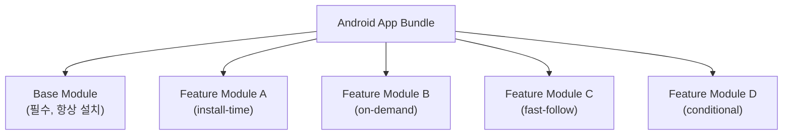

# Play Feature Delivery란?

상위 노트: [play-feature-delivery](01_inbox/mobile/android/03_packaging_deployment/distribution/play-feature-delivery.md)

Play Feature Delivery는 **Android App Bundle**을 기반으로, 앱의 특정 기능을 **사용자 기기에 언제, 어떻게 다운로드할지** 세밀하게 제어할 수
있는 Google Play의 기능입니다.

### 핵심 개념

기존 APK 방식에서는 모든 기능이 하나의 파일에 포함되어 설치되었습니다. 하지만 App Bundle + Feature Delivery를 사용하면:

- 앱을 여러 개의 **Feature Module(동적 기능 모듈)** 로 분리
- 각 모듈의 **배포 시점과 방식**을 개별 제어
- 결과적으로 **초기 다운로드 크기를 대폭 감소**

---
