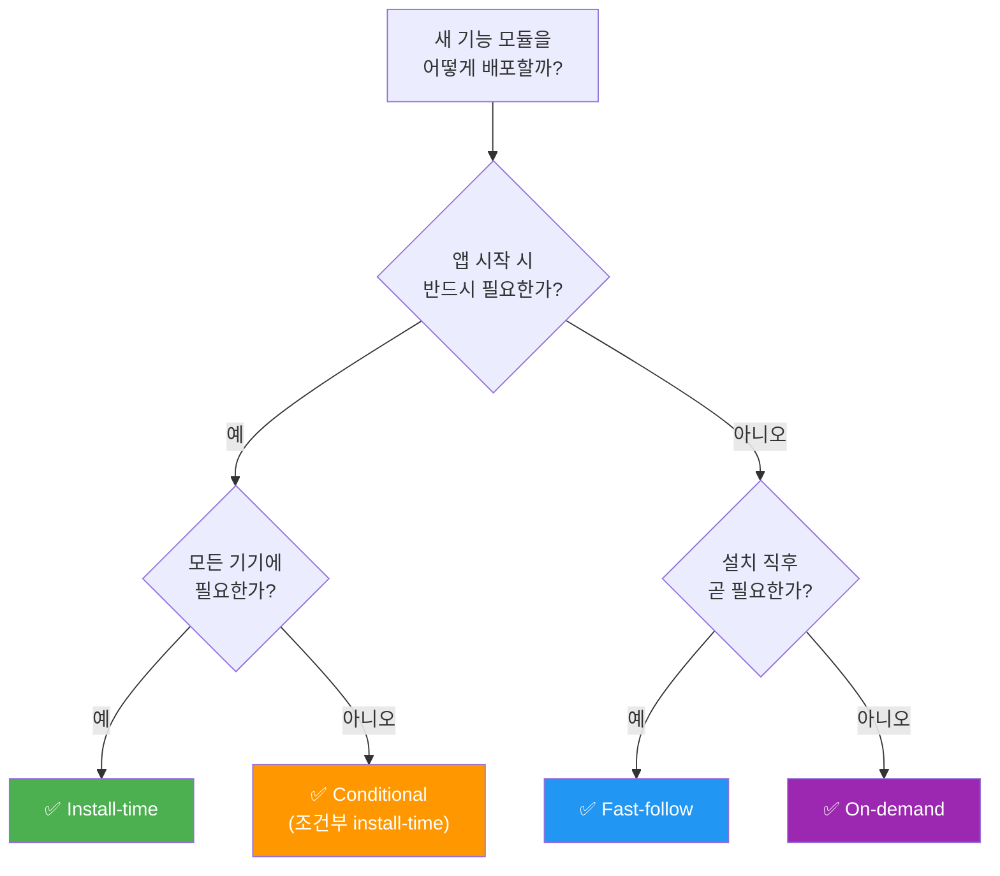

# 한 눈에 보는 의사결정 플로우차트

상위 노트: [[play-feature-delivery]]

```mermaid
graph TD
    A["새 기능 모듈을<br/>어떻게 배포할까?"] --> B{"앱 시작 시<br/>반드시 필요한가?"}
    B -->|예| C{"모든 기기에<br/>필요한가?"}
    B -->|아니오| D{"설치 직후<br/>곧 필요한가?"}
    
    C -->|예| E["✅ Install-time"]
    C -->|아니오| F["✅ Conditional<br/>(조건부 install-time)"]
    
    D -->|예| G["✅ Fast-follow"]
    D -->|아니오| H["✅ On-demand"]
    
    style E fill:#4CAF50,color:#fff
    style F fill:#FF9800,color:#fff
    style G fill:#2196F3,color:#fff
    style H fill:#9C27B0,color:#fff
```
