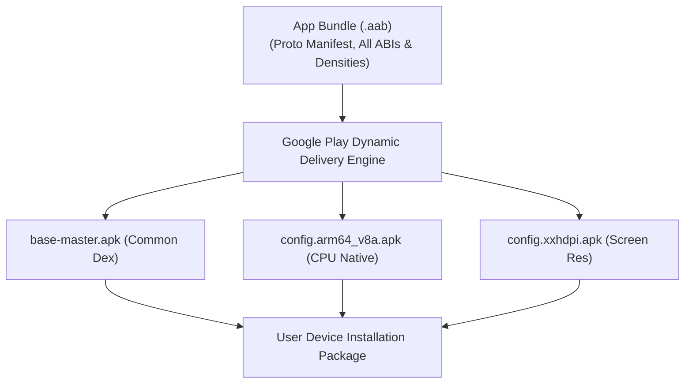

## AAB는 Play가 생성하는 APK를 위한 퍼블리싱 아티팩트다

### 내부 메커니즘 (Internal Mechanism)
AAB (Android App Bundle, `.aab`)는 기기에서 직접 실행되는 바이너리 파일이 아니라, Google Play Store 타겟 기기 맞춤형 Split APK들을 생성하기 위한 **최종 출판 산출물(Publishing Format)**이다.
AAB 내부 포맷은 Protocol Buffer 바이너리 매니페스트(`AndroidManifest.pb`), 리소스 테이블(`resources.pb`), 그리고 기기 사양별 모듈 폴더(`base/`, `feature/`)로 구조화되어 있다.
Play Store의 Dynamic Delivery 엔진은 사용자의 기기 사양(ABI Architecture: `arm64-v8a`, Screen Density: `xxhdpi`, Language: `ko`)을 감지하여 불필요한 아키텍처 및 이미지 리소스가 제거된 **최적화된 Split APK 세트**만 전송한다. (평균 APK 용량 15~35% 절감 효과)



### 코드 예시 (build.gradle.kts & BundleConfig.json)
```kotlin
// app/build.gradle.kts
android {
    bundle {
        density {
            enableSplit = true // 화면 밀도별 Split APK 생성
        }
        abi {
            enableSplit = true // CPU 아키텍처별 Split APK 생성
        }
        language {
            enableSplit = true // 언어별 Split APK 생성
        }
    }
}
```

### 관측 가능 증거 (Observable Evidence)
`bundletool` 도구를 사용하여 AAB로부터 기기별 예상 다운로드 용량(Download Size Metrics)을 산출할 수 있다:

```bash
bundletool get-size total --apks=app-release.apks --human-readable

# Output Example:
# MIN,MAX
# 14.2MB,18.5MB (Universal APK 48MB 대비 65% 용량 절감!)
```

관련 노트: [Play Delivery 계약](../play-delivery-contracts/play-delivery-contracts.md), [Play 릴리스와 배포 계약](release-distribution-contracts.md)
